<p align="center">
  
</p>

<p align="center"><strong>Apps and an SDK for Kobo e-readers.</strong></p>

<p align="center">
  <a href="https://github.com/BandarLabs/Cobalt/actions/workflows/ci.yml"></a>
  <a href="https://github.com/BandarLabs/Cobalt/actions/workflows/apps.yml"></a>
  <a href="https://github.com/BandarLabs/Cobalt/releases/latest"></a>
  <a href="LICENSE"></a>
</p>

Cobalt is an open-source application platform for Kobo. It provides a launcher,
an App Store, a Rust SDK, a runtime with capability isolation, and a Clara BW
simulator.

See the [public roadmap](ROADMAP.md) for the product outcomes Cobalt is working
toward and the principles used to choose them.

After one USB installation, users can install, update, and remove signed apps
over Wi-Fi. App releases are independent from Cobalt platform releases, so a
new app can appear in Store without reinstalling or updating Cobalt.

<p align="center">
  <a href="docs/cobalt-tour.mp4">
    
  </a><br>
  <sub>Recorded on a Kobo Clara BW at 3× speed: apps, Store discovery, and the complete Sudoku install lifecycle.</sub>
</p>

> [!IMPORTANT]
> The **Kobo Clara BW N365 (device code 391)**, **Kobo Elipsa 2E N605 (device
> code 389)**, **Kobo Clara HD N249 (device code 376)**, **Kobo Libra 2 N418
> (device code 388)**, **Kobo Clara Colour N367 (device code 393)**,
> **Kobo Libra Colour N428 (device code 390)**, and **Kobo Libra H2O N873
> (device code 384)** are
> fully hardware-tested on the firmware and kernel versions in the
> support matrix. The 2025 **Kobo Clara BW P365 (device code 395)** hardware
> refresh is also supported: its measured panel, touch, firmware, and kernel
> facts match the attended-tested N365 Clara BW.
>
> Cobalt runs on other Kobos as well. A device or a firmware branch that is not
> in the matrix is not refused: Cobalt shows what has not been tested about it
> and asks whether to continue, once. It is untested rather than unsupported,
> and the difference is worth reading in the
> [device support matrix](docs/DEVICES.md#device-support-matrix) before
> installing.
> It is an independent project and is not affiliated with Rakuten Kobo.

> [!TIP]
> **Own an untested Kobo? Help get it into the matrix.** No coding is required.
> [Join an existing device thread or create a new one](https://github.com/BandarLabs/Cobalt/issues)
> with your exact model, firmware, and whether you can run attended tests.
> Start with read-only checks; run panel tests only against the commit named
> by a maintainer. See
> [Contributing](CONTRIBUTING.md#device-testing).

## Features

- Signed Wi-Fi app installation, updates, and removal
- Shareable app pages with encrypted QR or pairing-code installation
- Separate Settings-based updates for the Cobalt platform
- Apps run as separate unprivileged processes
- Per-app capability checks for network, storage, audio, frontlight, and other
  device services
- Declarative e-ink UI toolkit and browser simulator
- Profile-driven full and partial refresh planning for supported panels
- Static ARMv7 binaries with no device-side package manager
- Recovery-safe app and catalog transactions
- Serverless folder synchronization through a private host Syncthing peer

## How it differs

[NickelMenu](https://pgaskin.net/NickelMenu/) adds actions to Kobo's stock
menu. [KOReader](https://koreader.rocks/) and
[Plato](https://github.com/baskerville/plato) are reading apps. Cobalt is a
platform for building and installing apps.

Cobalt handles the common parts: screens, app lifecycle, drawing to the e-ink
display, partial refreshes, touch input, device access, process isolation,
testing, and signed installs. App authors can focus on their app instead of
building those parts again.
See the [FAQ](https://bandarlabs.github.io/Cobalt/faq.html) for a fuller
comparison.

## Apps

Every screenshot below is a real capture from a Kobo Clara BW. Store manages
the installable applications; Settings and Terminal remain protected system
utilities.

<table>
<tr>
<td width="33%" valign="top"><a href="examples/launcher/README.md"></a><br><b><a href="examples/launcher/README.md">Launcher</a></b><br>Opens installed apps and always keeps a route back to the Kobo reader.</td>
<td width="33%" valign="top"><a href="docs/APP_STORE.md">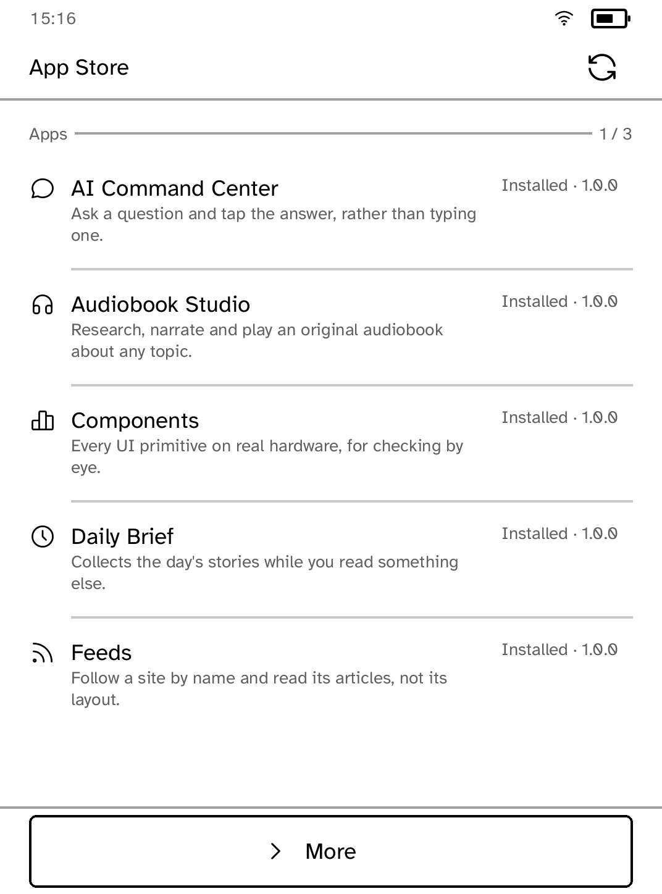</a><br><b><a href="docs/APP_STORE.md">App Store</a></b><br>Browses signed apps and installs, updates, removes, and reinstalls them over Wi-Fi.</td>
<td width="33%" valign="top"><a href="apps/sudoku/">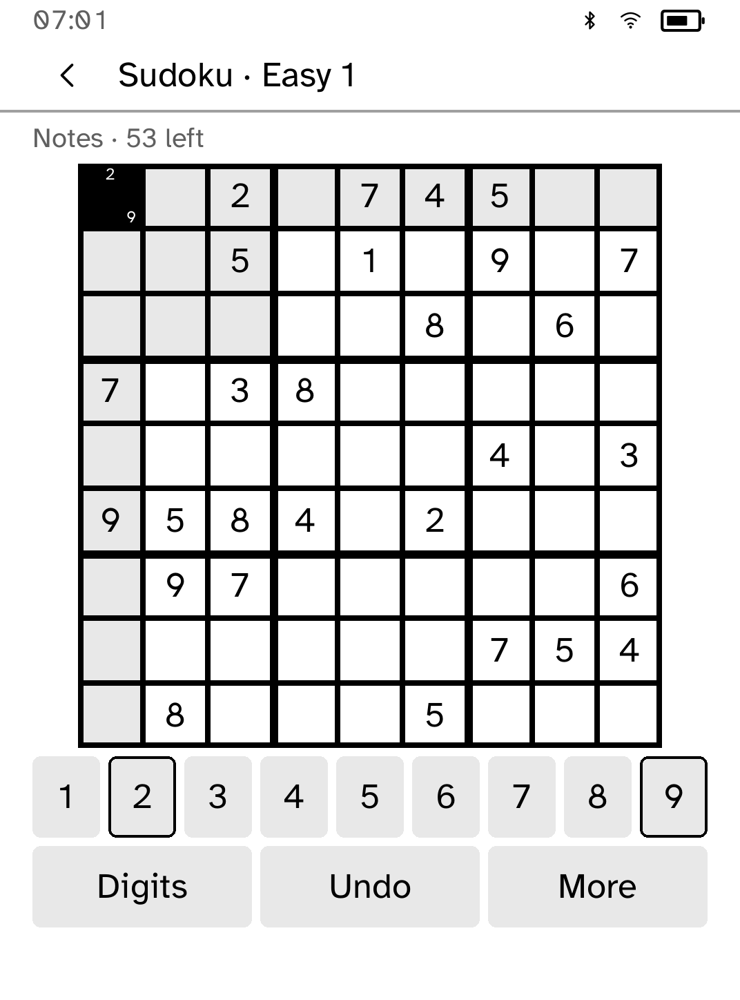</a><br><b><a href="apps/sudoku/">Sudoku</a></b><br>A Store-only touch game that also proves delivery of an app absent from the platform package.</td>
</tr>
<tr>
<td valign="top"><a href="examples/audiobook/README.md"></a><br><b><a href="examples/audiobook/README.md">Audiobook Studio</a></b><br>Researches, writes, narrates, and plays an original audiobook.</td>
<td valign="top"><a href="examples/gutenbird/README.md"></a><br><b><a href="examples/gutenbird/README.md">Gutenbird</a></b><br>Reads any OPDS library: Project Gutenberg, Standard Ebooks, Open Library, or one you add.</td>
<td valign="top"><a href="examples/hn/README.md"></a><br><b><a href="examples/hn/README.md">Hacker News</a></b><br>Top, New, Ask, and Show stories with complete comment threads.</td>
</tr>
<tr>
<td valign="top"><a href="examples/rss/README.md"></a><br><b><a href="examples/rss/README.md">Feeds</a></b><br>Discovers a site's feed and presents its articles without the browser layout.</td>
<td valign="top"><a href="examples/brief/README.md"></a><br><b><a href="examples/brief/README.md">Daily Brief</a></b><br>Collects the day's stories while the reader is using another app.</td>
<td valign="top"><a href="examples/chat/README.md"></a><br><b><a href="examples/chat/README.md">AI Command Center</a></b><br>Asks a question and turns the answer into touch-friendly reading.</td>
</tr>
<tr>
<td valign="top"><a href="examples/sidekick/README.md"></a><br><b><a href="examples/sidekick/README.md">Sidekick</a></b><br>Lets a reader approve or deny requests from coding agents.</td>
<td valign="top"><a href="examples/terminal/README.md"></a><br><b><a href="examples/terminal/README.md">Terminal</a></b><br>A panel-native shell with keys that send input immediately.</td>
<td valign="top"><a href="examples/gallery/README.md"></a><br><b><a href="examples/gallery/README.md">Components</a></b><br>Shows the UI toolkit's controls, layouts, typography, and states.</td>
</tr>
<tr>
<td valign="top"><a href="examples/settings/README.md"></a><br><b><a href="examples/settings/README.md">Settings</a></b><br>Manages connectivity and hardware, and keeps platform updates separate from Store.</td>
<td valign="top"><a href="examples/todo/README.md"></a><br><b><a href="examples/todo/README.md">Todo</a></b><br>A persistent list with touch entry and completed-item states.</td>
<td valign="top"><a href="examples/tictactoe/README.md"></a><br><b><a href="examples/tictactoe/README.md">Tic-tac-toe</a></b><br>A two-player touch game using partial refreshes for individual cells.</td>
</tr>
<tr>
<td valign="top"><a href="apps/arxiv/README.md"></a><br><b><a href="apps/arxiv/README.md">Preprints</a></b><br>Browses and searches arXiv preprints, keeps them for offline reading, and sets their mathematics as type.</td>
<td valign="top"><a href="apps/morse/README.md"></a><br><b><a href="apps/morse/README.md">Morse</a></b><br>Sends a typed message on the front light, a letter at a time, drawn across the panel as it goes.</td>
</tr>
<tr>
<td valign="top"><a href="examples/magnet/README.md"></a><br><b><a href="examples/magnet/README.md">Magnet</a></b><br>Locates the hall sensor behind the bezel and reports its changes.</td>
<td></td>
<td></td>
</tr>
</table>

### Every app in the Store

Every application published to the Cobalt App Store, generated from the same
manifests the app pages come from by `tools/generate-app-pages.mjs`.

<!-- store-apps:start -->
<table>
<tr>
<td width="33%" valign="top"><a href="apps/chat/README.md">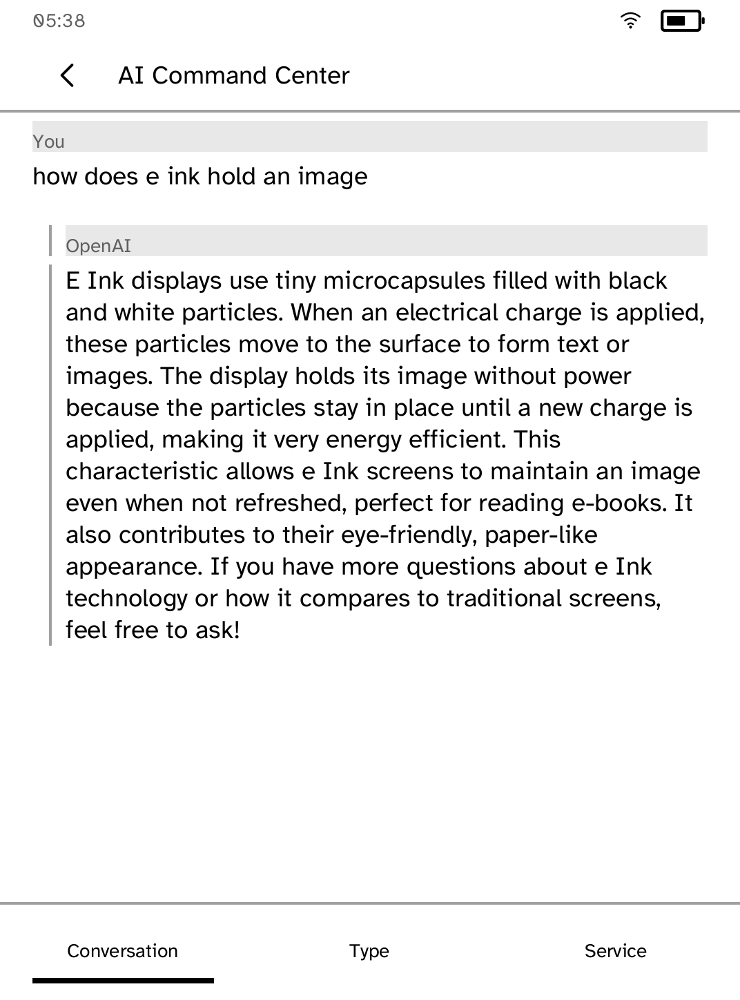</a><br><b><a href="apps/chat/README.md">AI Command Center</a></b><br>Ask a question, then read and navigate the answer with touch controls.</td>
<td width="33%" valign="top"><a href="apps/audiobook/README.md">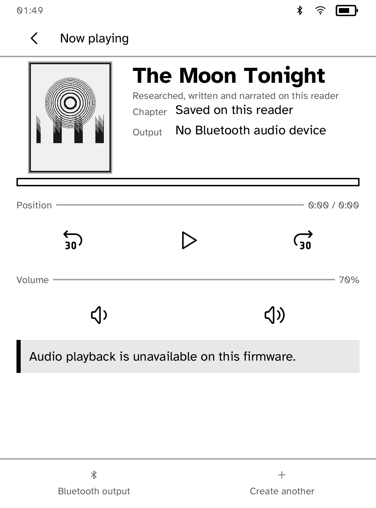</a><br><b><a href="apps/audiobook/README.md">Audiobook Studio</a></b><br>Turn a topic into an original narrated audiobook and listen on your Kobo.</td>
<td width="33%" valign="top"><a href="apps/backgammon/README.md">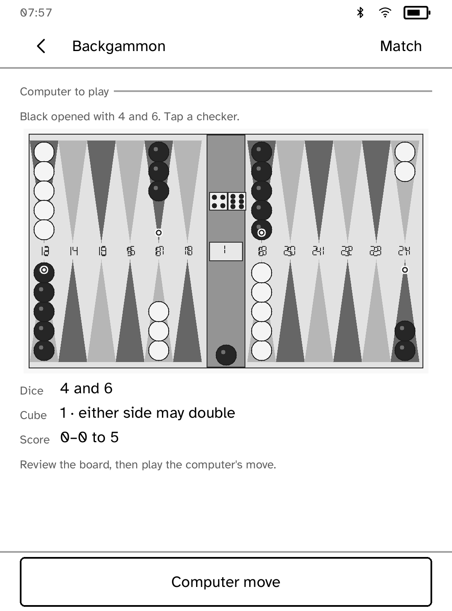</a><br><b><a href="apps/backgammon/README.md">Backgammon</a></b><br>Play complete solo or pass-and-play backgammon on one Kobo.</td>
</tr>
<tr>
<td width="33%" valign="top"><a href="apps/birds/README.md">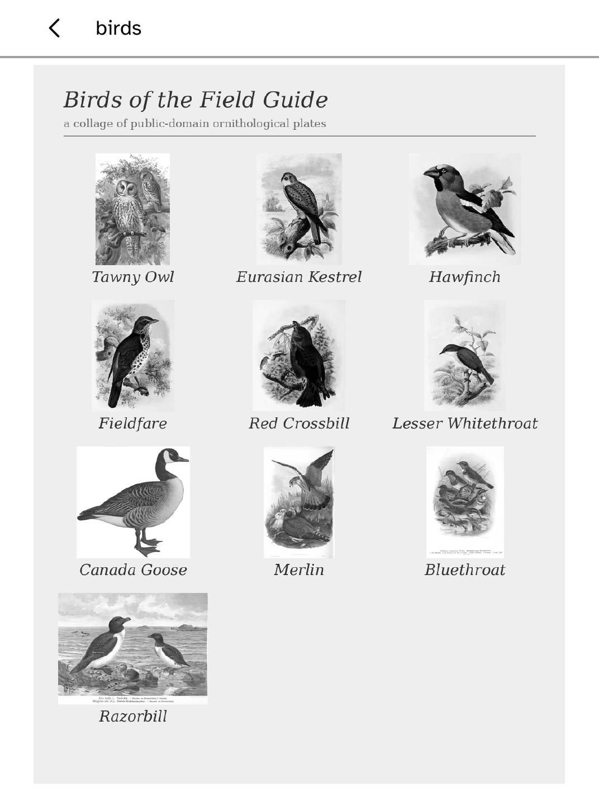</a><br><b><a href="apps/birds/README.md">Birds</a></b><br>Show the birds heard by BirdNET-Go on your Mac or Linux computer.</td>
<td width="33%" valign="top"><a href="apps/gallery/README.md"></a><br><b><a href="apps/gallery/README.md">Components</a></b><br>See every Cobalt UI component on the device in one reference app.</td>
<td width="33%" valign="top"><a href="apps/crossword/README.md"></a><br><b><a href="apps/crossword/README.md">Crossword</a></b><br>Solve a compact touch-first crossword with clue navigation.</td>
</tr>
<tr>
<td width="33%" valign="top"><a href="apps/brief/README.md"></a><br><b><a href="apps/brief/README.md">Daily Brief</a></b><br>Build a daily news brief in the background while you use other apps.</td>
<td width="33%" valign="top"><a href="apps/deck/README.md">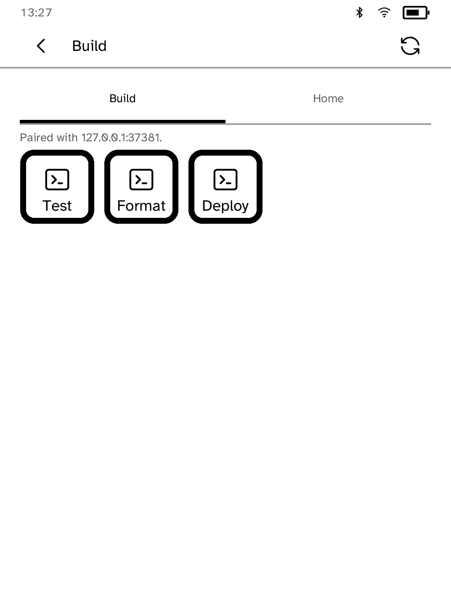</a><br><b><a href="apps/deck/README.md">Deck</a></b><br>Turn your Kobo into a remote control for your computer.</td>
<td width="33%" valign="top"><a href="apps/rss-miniflux/README.md"></a><br><b><a href="apps/rss-miniflux/README.md">Digest</a></b><br>Read your Miniflux feeds anywhere.</td>
</tr>
<tr>
<td width="33%" valign="top"><a href="apps/fanshelf/README.md">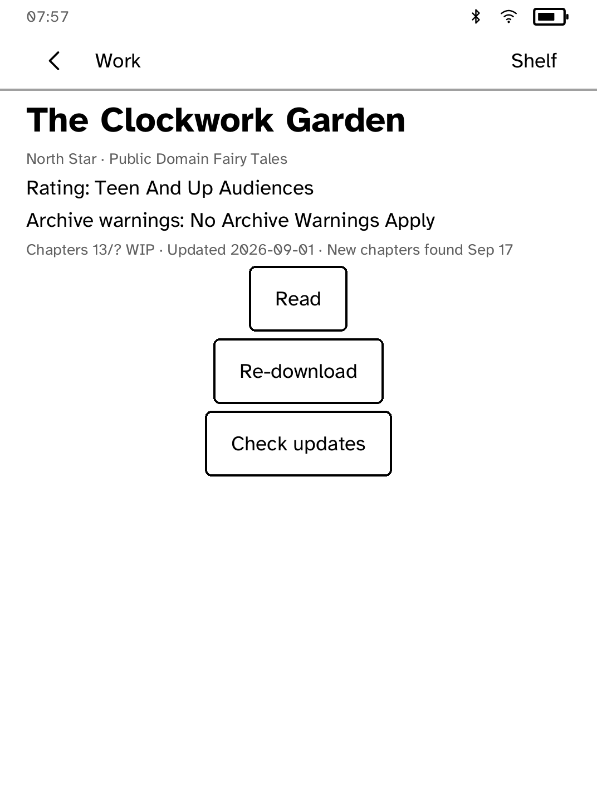</a><br><b><a href="apps/fanshelf/README.md">Fanshelf</a></b><br>Save public AO3 works to a shelf made for offline reading.</td>
<td width="33%" valign="top"><a href="apps/rss/README.md"></a><br><b><a href="apps/rss/README.md">Feeds</a></b><br>Follow feeds, search saved articles and read offline with images.</td>
<td width="33%" valign="top"><a href="apps/fieldbook/README.md">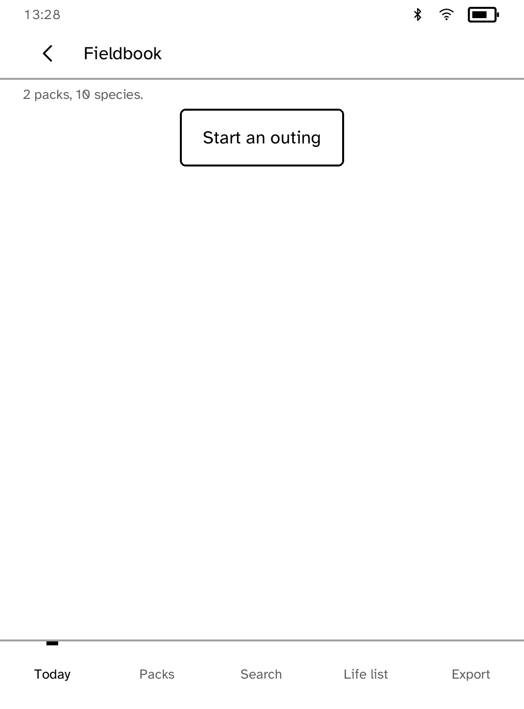</a><br><b><a href="apps/fieldbook/README.md">Fieldbook</a></b><br>Log bird sightings anywhere and build your life list.</td>
</tr>
<tr>
<td width="33%" valign="top"><a href="apps/flashcards/README.md"></a><br><b><a href="apps/flashcards/README.md">Flashcards</a></b><br>Review flashcards anywhere, even without Wi-Fi.</td>
<td width="33%" valign="top"><a href="apps/frame/README.md"></a><br><b><a href="apps/frame/README.md">Frame</a></b><br>Show computer-pushed monochrome photos in awake or scheduled slideshow modes.</td>
<td width="33%" valign="top"><a href="apps/grimoire/README.md">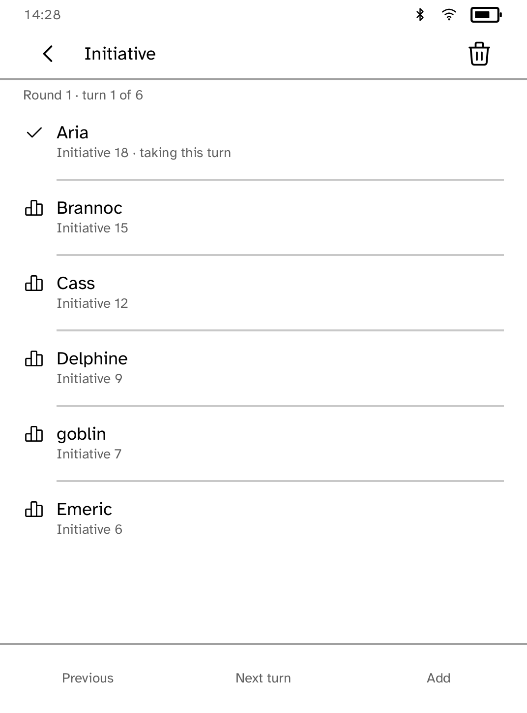</a><br><b><a href="apps/grimoire/README.md">Grimoire</a></b><br>Browse offline SRD references and manage tabletop combat.</td>
</tr>
<tr>
<td width="33%" valign="top"><a href="apps/gutenbird/README.md"></a><br><b><a href="apps/gutenbird/README.md">Gutenbird</a></b><br>Browse OPDS libraries and read their books on your Kobo.</td>
<td width="33%" valign="top"><a href="apps/habits/README.md"></a><br><b><a href="apps/habits/README.md">Habits</a></b><br>Track daily and weekday habits with local streaks.</td>
<td width="33%" valign="top"><a href="apps/hn/README.md">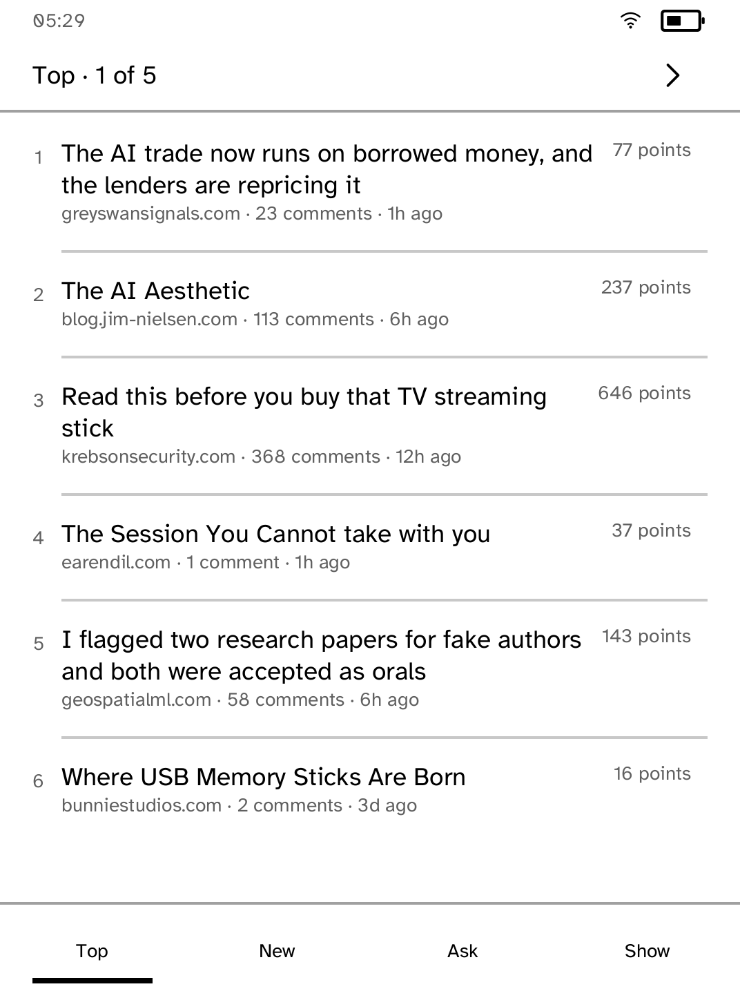</a><br><b><a href="apps/hn/README.md">Hacker News</a></b><br>Read Top, New, Ask, and Show stories with complete comment threads.</td>
</tr>
<tr>
<td width="33%" valign="top"><a href="apps/homepanel/README.md">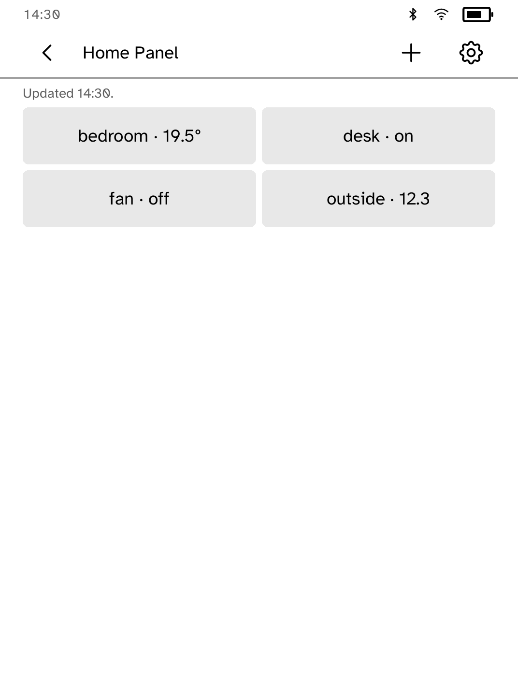</a><br><b><a href="apps/homepanel/README.md">Home Panel</a></b><br>Control saved Home Assistant tiles from a low-power panel.</td>
<td width="33%" valign="top"><a href="apps/inkling/README.md">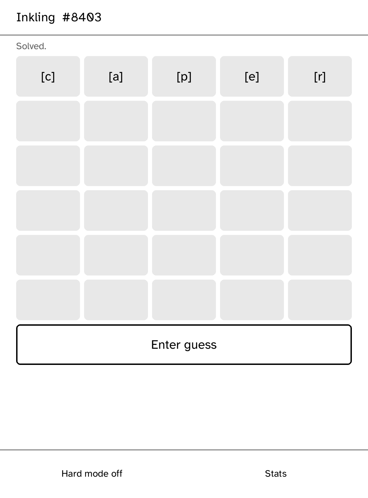</a><br><b><a href="apps/inkling/README.md">Inkling</a></b><br>Solve a fresh five-letter puzzle each day.</td>
<td width="33%" valign="top"><a href="apps/kitchencard/README.md"></a><br><b><a href="apps/kitchencard/README.md">Kitchen Card</a></b><br>Keep Mealie recipes handy in a counter-friendly cooking view.</td>
</tr>
<tr>
<td width="33%" valign="top"><a href="apps/calibre-web/README.md"></a><br><b><a href="apps/calibre-web/README.md">Library</a></b><br>Browse and read books from your calibre-web library.</td>
<td width="33%" valign="top"><a href="apps/lichess/README.md">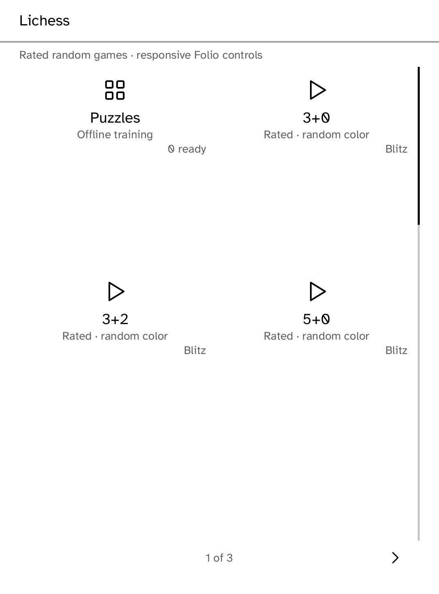</a><br><b><a href="apps/lichess/README.md">Lichess</a></b><br>Play Lichess games, challenge players, solve puzzles, or play offline.</td>
<td width="33%" valign="top"><a href="apps/logicpack/README.md">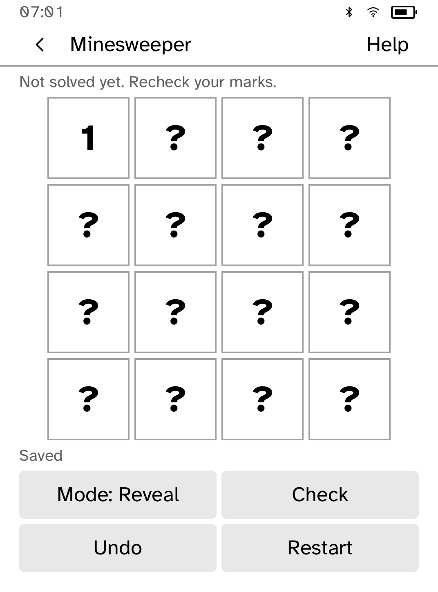</a><br><b><a href="apps/logicpack/README.md">Logic Pack</a></b><br>Play four familiar logic games offline.</td>
</tr>
<tr>
<td width="33%" valign="top"><a href="apps/magnet/README.md"></a><br><b><a href="apps/magnet/README.md">Magnet</a></b><br>Find the hall sensor behind the bezel and watch it respond to a magnet.</td>
<td width="33%" valign="top"><a href="apps/morse/README.md">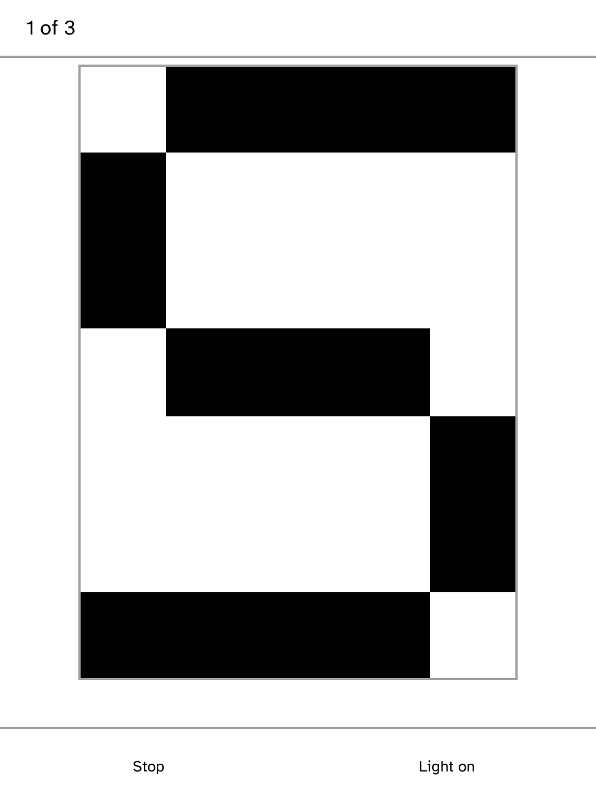</a><br><b><a href="apps/morse/README.md">Morse</a></b><br>Type a message and send it in Morse code with the front light.</td>
<td width="33%" valign="top"><a href="apps/musicstand/README.md"></a><br><b><a href="apps/musicstand/README.md">Music Stand</a></b><br>Read music scores with setlists and half-page turns.</td>
</tr>
<tr>
<td width="33%" valign="top"><a href="apps/needles/README.md">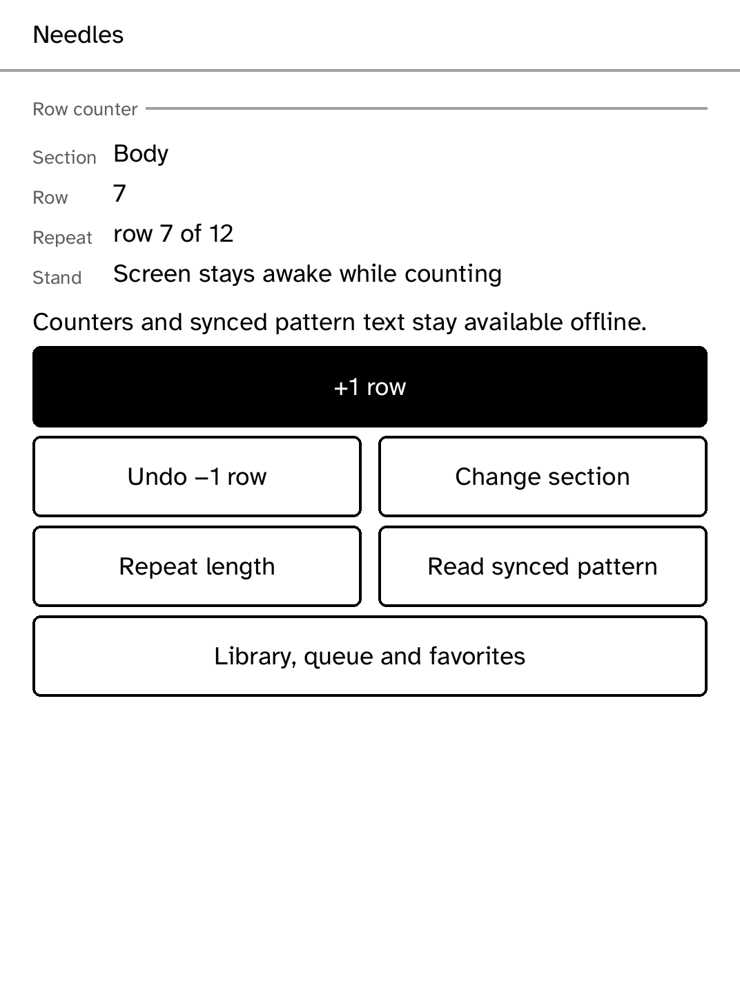</a><br><b><a href="apps/needles/README.md">Needles</a></b><br>Count rows, browse Ravelry collections, and read your synced patterns offline.</td>
<td width="33%" valign="top"><a href="apps/nonograms/README.md">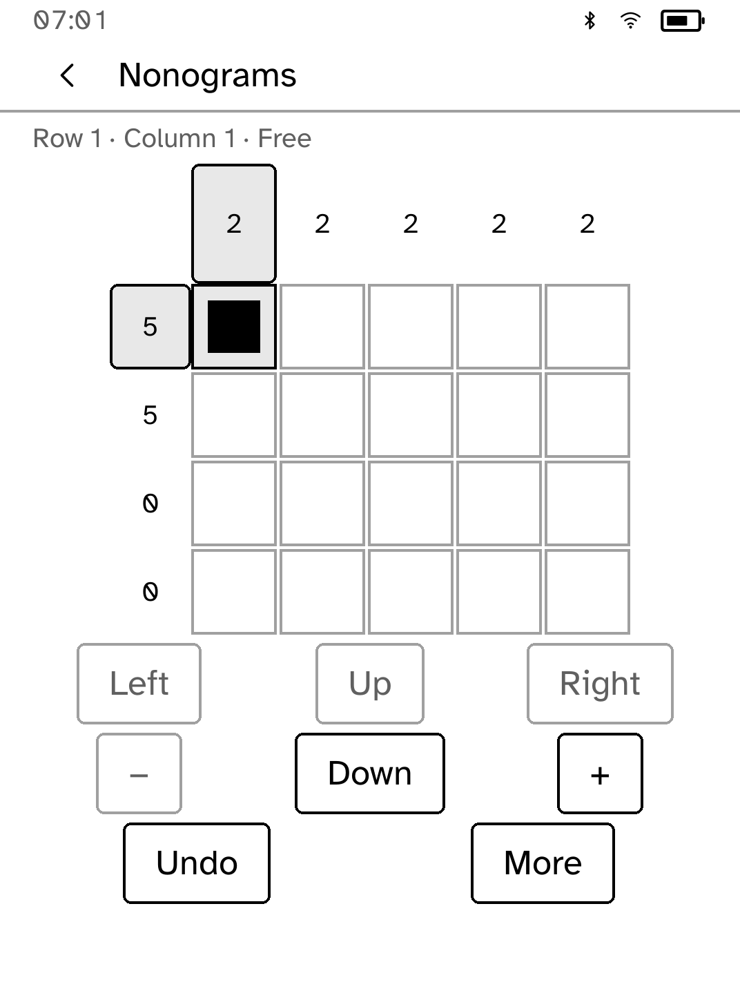</a><br><b><a href="apps/nonograms/README.md">Nonograms</a></b><br>Solve 18 original picture puzzles with attached clues, saved undo and larger grids.</td>
<td width="33%" valign="top"><a href="apps/panels/README.md">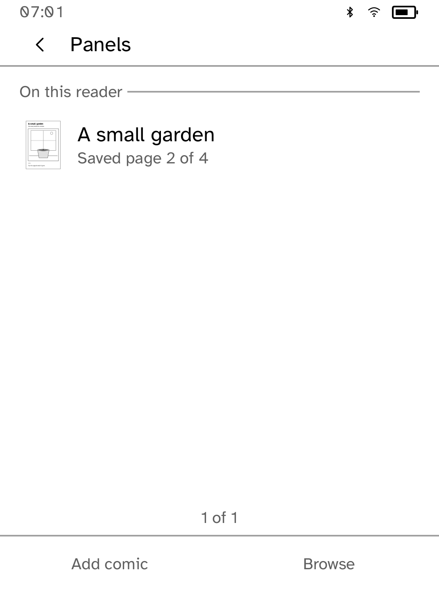</a><br><b><a href="apps/panels/README.md">Panels</a></b><br>Read comics added from your computer or Komga library.</td>
</tr>
<tr>
<td width="33%" valign="top"><a href="apps/paperterm/README.md">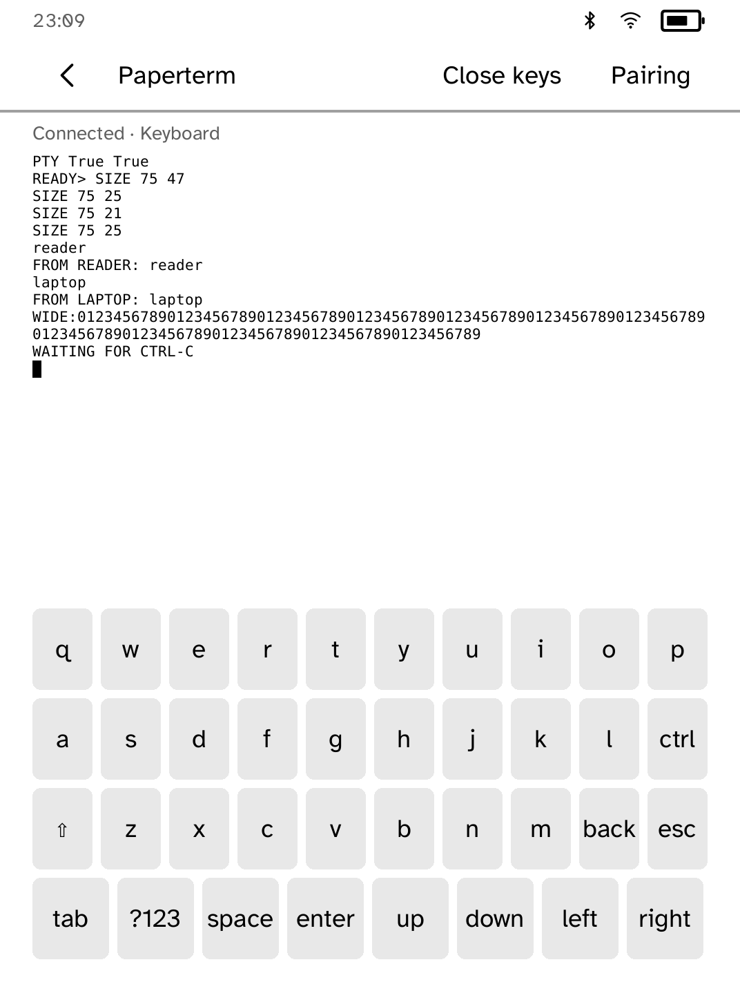</a><br><b><a href="apps/paperterm/README.md">Paperterm</a></b><br>Pair with a computer to mirror a terminal session on e-ink.</td>
<td width="33%" valign="top"><a href="apps/parlor/README.md"></a><br><b><a href="apps/parlor/README.md">Parlor</a></b><br>Play touch-first Reversi together on one Kobo.</td>
<td width="33%" valign="top"><a href="apps/parser/README.md">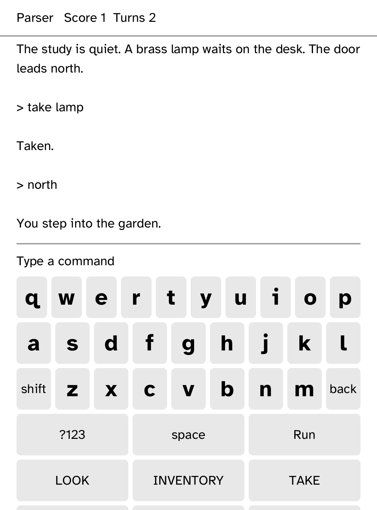</a><br><b><a href="apps/parser/README.md">Parser</a></b><br>Play an original interactive story without Wi-Fi.</td>
</tr>
<tr>
<td width="33%" valign="top"><a href="apps/post/README.md">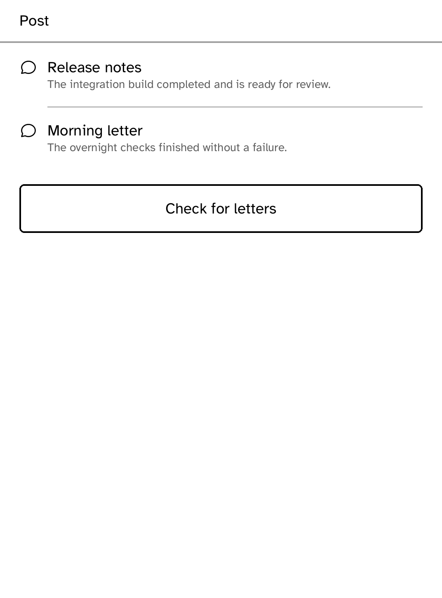</a><br><b><a href="apps/post/README.md">Post</a></b><br>Read and reply to letters from Hermes.</td>
<td width="33%" valign="top"><a href="apps/arxiv/README.md"></a><br><b><a href="apps/arxiv/README.md">Preprints</a></b><br>Browse and search arXiv, keep preprints, and read their HTML versions on your Kobo.</td>
<td width="33%" valign="top"><a href="apps/pubquiz/README.md">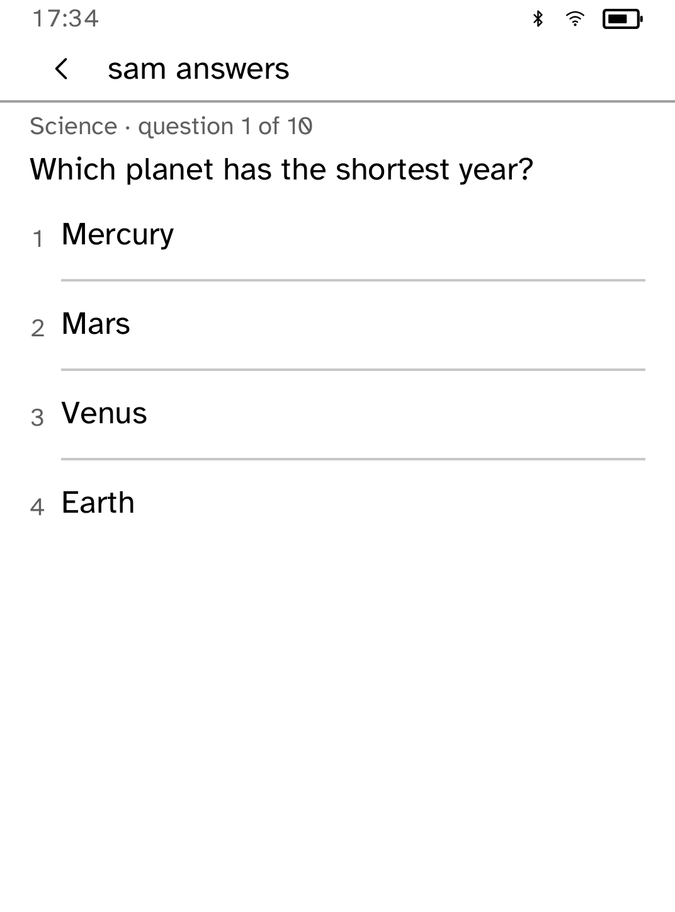</a><br><b><a href="apps/pubquiz/README.md">Pub Quiz</a></b><br>Play offline solo or pass-around trivia rounds.</td>
</tr>
<tr>
<td width="33%" valign="top"><a href="apps/readlater/README.md"></a><br><b><a href="apps/readlater/README.md">Read Later</a></b><br>Read your Wallabag articles anywhere.</td>
<td width="33%" valign="top"><a href="apps/sidekick/README.md"></a><br><b><a href="apps/sidekick/README.md">Sidekick</a></b><br>Answer coding-agent permission prompts from your Kobo.</td>
<td width="33%" valign="top"><a href="apps/zotero-reader/README.md"></a><br><b><a href="apps/zotero-reader/README.md">Stacks</a></b><br>Browse Zotero collections, read metadata and indexed paper text, and keep papers available offline.</td>
</tr>
<tr>
<td width="33%" valign="top"><a href="apps/sudoku/README.md"></a><br><b><a href="apps/sudoku/README.md">Sudoku</a></b><br>Play 36 original Sudoku puzzles with pencil notes, undo and saved games.</td>
<td width="33%" valign="top"><a href="apps/syncthing/README.md">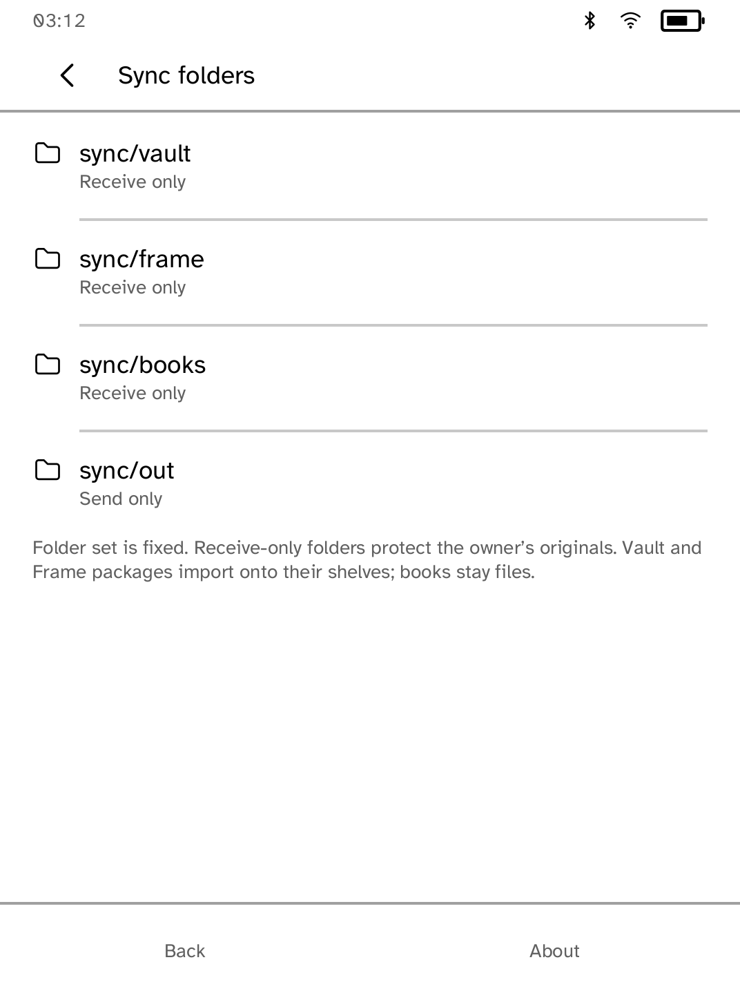</a><br><b><a href="apps/syncthing/README.md">Sync</a></b><br>Choose folders and a battery-friendly sync schedule.</td>
<td width="33%" valign="top"><a href="apps/tictactoe/README.md"></a><br><b><a href="apps/tictactoe/README.md">Tic-tac-toe</a></b><br>Play tic-tac-toe together on one Kobo.</td>
</tr>
<tr>
<td width="33%" valign="top"><a href="apps/todo/README.md">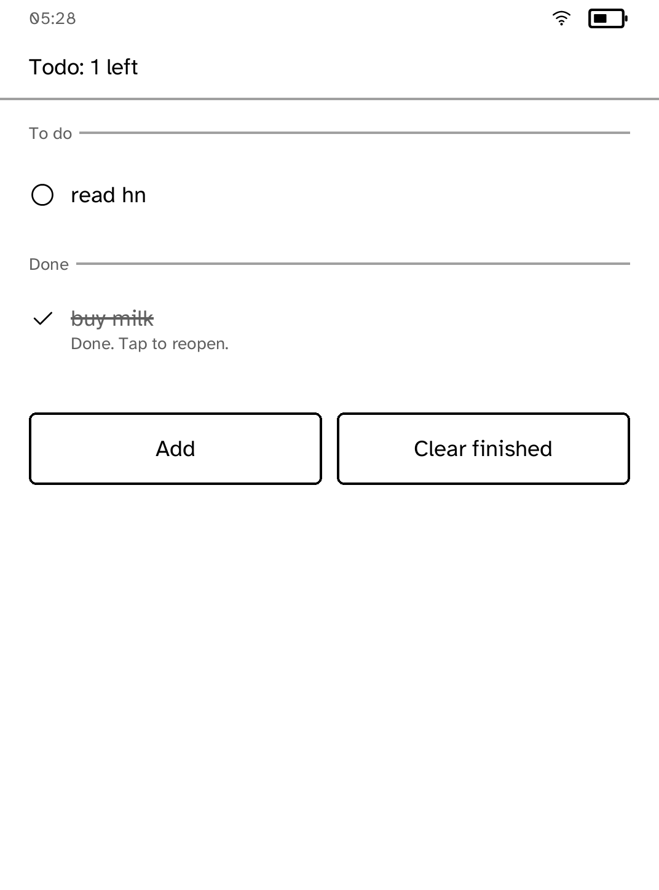</a><br><b><a href="apps/todo/README.md">Todo</a></b><br>Keep a simple to-do list that stays on your Kobo.</td>
<td width="33%" valign="top"><a href="apps/vault/README.md"></a><br><b><a href="apps/vault/README.md">Vault</a></b><br>Browse your notes by folder, tag, link, and backlink.</td>
<td width="33%" valign="top"><a href="apps/verses/README.md"></a><br><b><a href="apps/verses/README.md">Verses</a></b><br>Read a public-domain poem each day.</td>
</tr>
</table>
<!-- store-apps:end -->

### Suggest an app

What would you use on your Kobo? It could be a game, a reading tool, a
home-automation control, or a replacement for an Android or iOS app. Add it to
the [app request thread](https://github.com/BandarLabs/Cobalt/issues/41).

## Install

On macOS or Linux, install the stable release:

```sh
curl -fsSL https://bandarlabs.github.io/Cobalt/install.sh | sh
```

This canonical discovery URL is published by GitHub Pages from stable
`main:/docs`; it becomes available with the first stable promotion containing
the installer. It trusts GitHub Pages HTTPS for the bootstrap script itself.
After it starts, every downloaded executable and device package is covered by
the signed release manifest and SHA-256 checks. For pre-execution verification
of `install.sh`, use the recommended
[signed-bootstrap procedure](docs/INSTALL.md#high-assurance-signed-bootstrap).

The installer supports macOS Intel and Apple Silicon, and Linux x86_64 and
arm64. It installs the stable Kobo platform only. The platform Beta channel is
enabled exclusively in Cobalt Settings after first launch, or through the
developer/source workflow. Settings shows the installed version and current
channel, confirms channel changes explicitly, and verifies signed Beta
platform metadata. Returning to Stable needs no USB connection and preserves
installed apps, state, and secrets.

Update the installed host command independently:

```sh
kobo update
kobo update --channel beta   # explicit host CLI beta; never writes to a reader
```

The host CLI channel does not select the Kobo platform channel. Device Beta
updates remain an explicit choice in Cobalt Settings.

Rerun the same command to update. Restart the reader, wait one minute for
NickelMenu's failsafe, then open **Cobalt** from Kobo's menu. Future
applications are installed from **Store** over Wi-Fi.

If you already use NickelMenu, Cobalt is added to it; existing entries are
left alone.

See [docs/INSTALL.md](docs/INSTALL.md) for the complete walkthrough and
recovery, uninstall, and source-build instructions.

## App Store

Store reads a signed catalog from the Stable `app-catalog` GitHub release, or
the isolated `app-catalog-beta` release when the owner enables Beta updates.
Each package contains one ARM executable and a signed canonical manifest. The
runtime verifies the catalog, package, installed manifest, and binary before
launch.

Store is the only app-management surface. The applications bundled with the
first `0.2.0` platform install appear as installed, can be removed and
reinstalled in the same session, and can be updated in place without creating
a second launcher entry. Platform utilities such as Settings and Terminal are
shown as installed system apps and cannot be removed.

Open **Install links** in Store to link a phone or computer without an
account. The **Install** button on any
[Cobalt app page](https://bandarlabs.github.io/Cobalt/#apps) then sends an
encrypted request to that Kobo. If the reader is offline, reconnect it and
open Store within 72 hours to continue.

Apps are published automatically when an app PR is merged into `main`.
Publishing an app does **not** require changing the Cobalt version or creating
a platform release.

Sudoku remains Store-only and is intentionally absent from the USB platform
package, so installing it verifies delivery of an app that was not already on
the reader.

## Save an app export to your computer

When an app offers **Ready for your computer**, receive its prepared copy using
Cobalt's existing reader connection:

```sh
kobo export --app APP --device reader.local --out "$HOME/Downloads"
```

Replace `APP` with that app's ID. The command checks the complete file before
saving, preserves the reader's original, and gives conflicting local names a
numbered suffix. Retry the same command after a connection or storage failure.
App adoption is still in progress. See the [export guide](docs/quality/sdk-export-and-copy.md)
for supported formats and simulator use.

## Build an app

```sh
cargo install --path crates/kobo-cli
kobo new my-app
cd my-app
kobo dev
```

`kobo dev` runs the app in the Clara BW browser simulator. Set
`KOBO_SIM_PROFILE=libra-2-388` or `KOBO_SIM_PROFILE=elipsa-2e-389` to exercise
the larger supported panel geometries with the same renderer and diagnostics.
Start with the
[SDK documentation](https://bandarlabs.github.io/Cobalt/sdk.html); the
repository also keeps the [deep implementation guide](SDK.md).

### What the SDK provides

| Area | Application-facing support |
|---|---|
| App model | Ordinary Rust binaries with declarative screens, named actions, lifecycle callbacks, and runtime-managed Back navigation |
| E-ink UI | Measured text, rows, tiles, pictures, dialogs, keyboards, terminal views, pagination, and full or partial refresh planning |
| Network and credentials | Asynchronous HTTPS fetches and posts, ranged downloads, bounded responses, and named secrets whose values never enter the app |
| State and background work | Atomic per-app keyed storage, cancellable tasks, foreground/background lifecycle events, and scheduled wake capabilities |
| Device and media | Capability-gated battery, cover, frontlight, Wi-Fi, Bluetooth, and audio requests |
| Tooling | App scaffolding, the browser and native runtime simulators, layout diagnostics, deterministic failure scenarios, packaging, and device deployment |

Apps request services through the SDK instead of opening device resources
directly. The runtime can deny a request because it was not declared, is too
expensive for the current battery state, or is unsupported, and each refusal
is returned to the app as a value it can present or recover from.

See the SDK docs for the
[application model](https://bandarlabs.github.io/Cobalt/sdk.html#application-model),
[UI components](https://bandarlabs.github.io/Cobalt/sdk.html#ui),
[runtime services](https://bandarlabs.github.io/Cobalt/sdk.html#services),
[capabilities](https://bandarlabs.github.io/Cobalt/sdk.html#capabilities),
[developer-facing crates](https://bandarlabs.github.io/Cobalt/sdk.html#crates),
the [guided companion entry point](docs/companion-cli.md),
and the [CLI command reference](https://bandarlabs.github.io/Cobalt/sdk.html#cli).

## Contributing apps

App contributions are regular pull requests:

1. Add the app as a workspace package under `apps/<app-id>/`.
2. Add its release metadata to `apps/catalog.json`.
3. Add unit tests and layout checks for every affected supported profile.
4. Run the app in the browser and runtime simulators.
5. Run it on a physical, fully supported Kobo and attach a GIF, video, or
   photos to the pull request.
6. Include one clean panel screenshot for the app README and generated website
   install page.
7. Open a pull request.

After the PR is reviewed and merged, the `Publish apps` workflow builds every
registered app for ARM, signs the packages and catalog, and updates the fixed
Store channel. App versions are independent from the Cobalt platform version.

See [docs/CONTRIBUTING_APPS.md](docs/CONTRIBUTING_APPS.md) for metadata,
capabilities, testing, and release details.

## Repository layout

| Path | Purpose |
|---|---|
| `apps/` | Store applications and release registry |
| `examples/` | Built-in applications and SDK examples |
| `crates/kobo-sdk` | Public application SDK |
| `crates/kobod` | Device runtime |
| `crates/kobo-ui` | Layout and e-ink renderer |
| `crates/kobo-sim` | Clara BW browser/runtime simulator |
| `crates/kobo-app-store` | Signed package and catalog formats |
| `crates/kobo-cli` | Setup, build, simulation, packaging, and release tools |
| `docs/` | Installation, device, app publishing, and development guides |

## Development

```sh
cargo test --workspace --all-features
cargo clippy --workspace --all-targets --all-features -- -D warnings
cargo fmt --all --check
cargo run -p kobo-cli -- run --sim --app sudoku
```

Additional guides:

- [Roadmap](ROADMAP.md)
- [Contributing](CONTRIBUTING.md)
- [Developing Cobalt](docs/DEVELOPING.md)
- [Working with devices](docs/DEVICES.md)
- [Publishing apps](docs/APP_STORE.md)
- [Porting to another Kobo](docs/PORTING.md)
- [Security policy](SECURITY.md)

## Safety and support

Cobalt does not replace Kobo's boot chain. Device support is explicitly gated
by hardware and firmware identity, and a reboot returns to the stock reader.
The first installation still modifies files on the user storage partition and
is provided without warranty.

Normal panel-write entry points require one of the exact hardware and firmware
combinations in the
[device support matrix](docs/DEVICES.md#device-support-matrix). Do not treat a
read-only profile match as permission to install: normal use requires the
profile's owner-attended display, touch, exit, and recovery evidence to be
complete.

## License

GNU Affero General Public License v3.0. See [LICENSE](LICENSE) and
[THIRD-PARTY.md](THIRD-PARTY.md).
