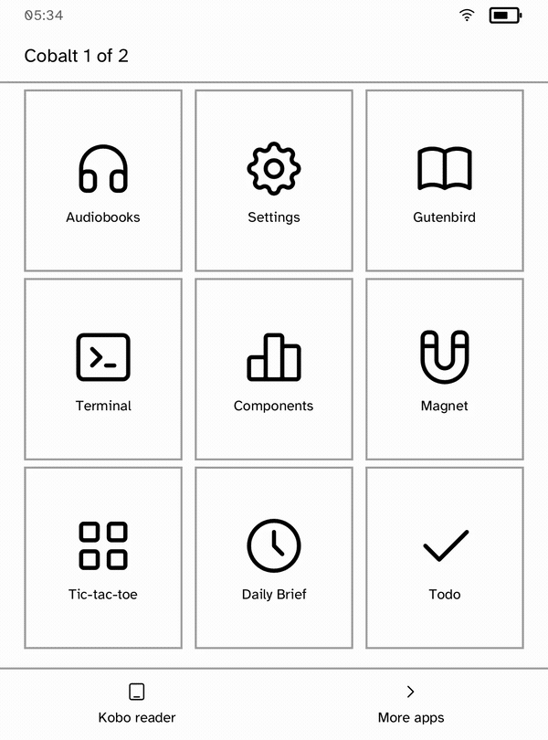
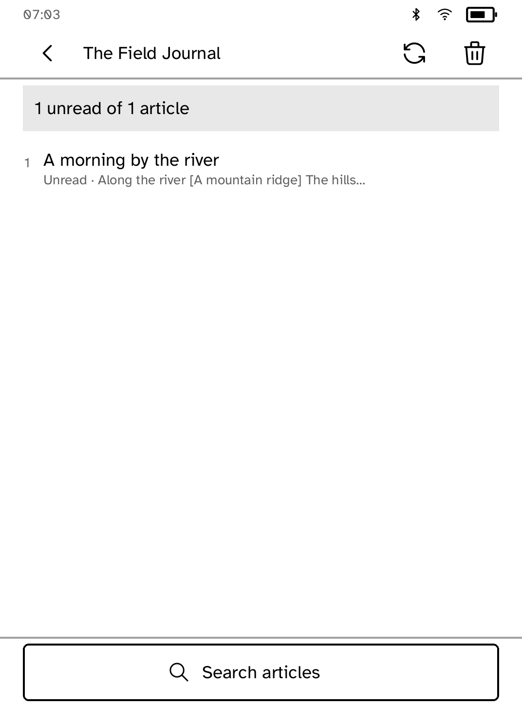
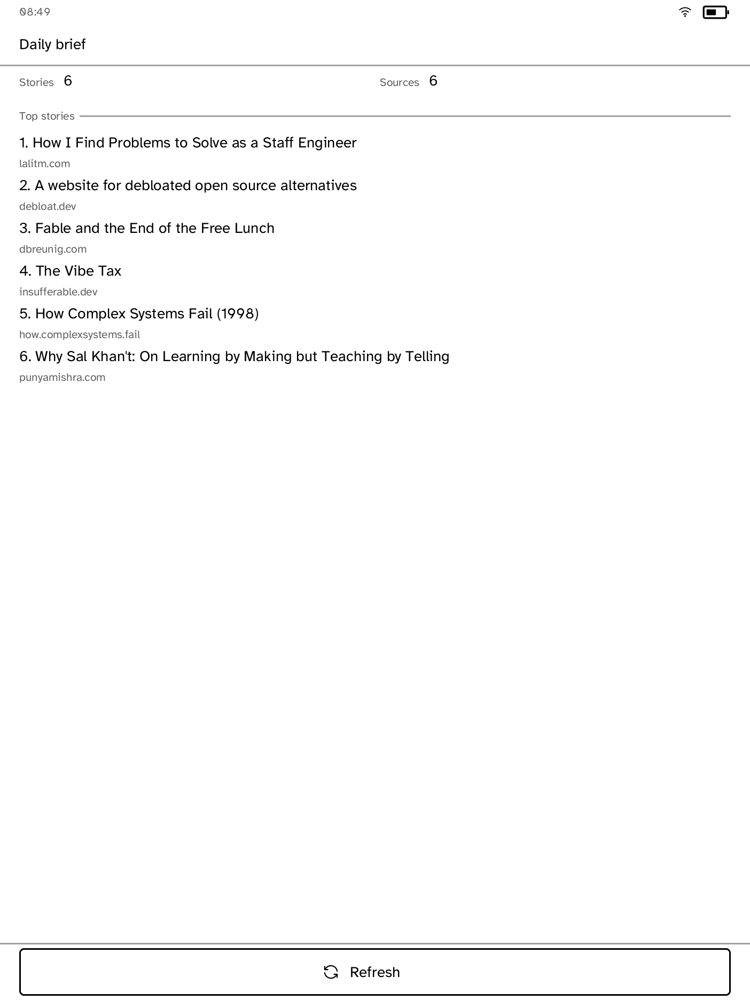
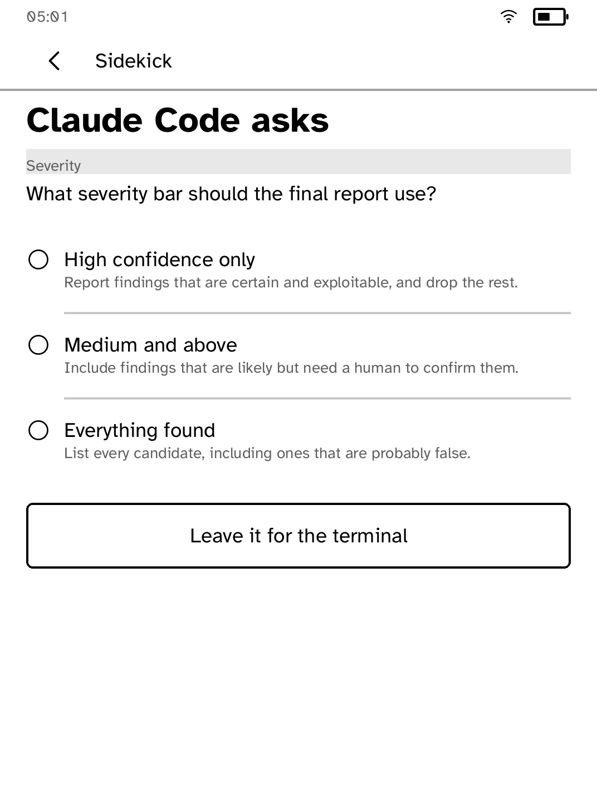
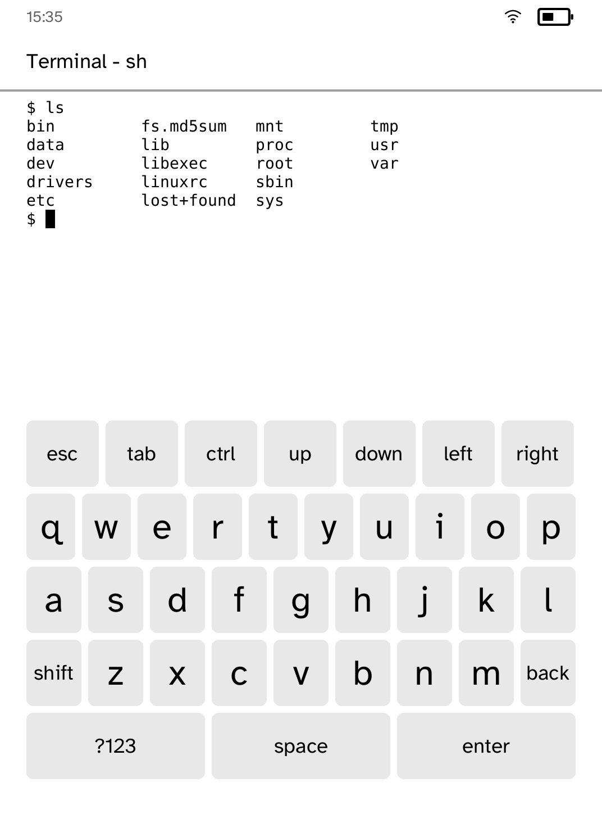
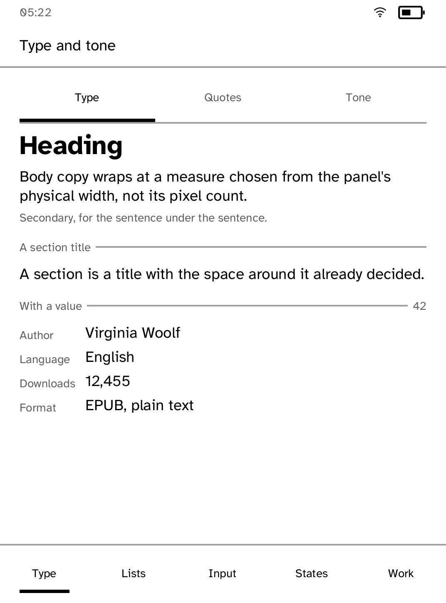
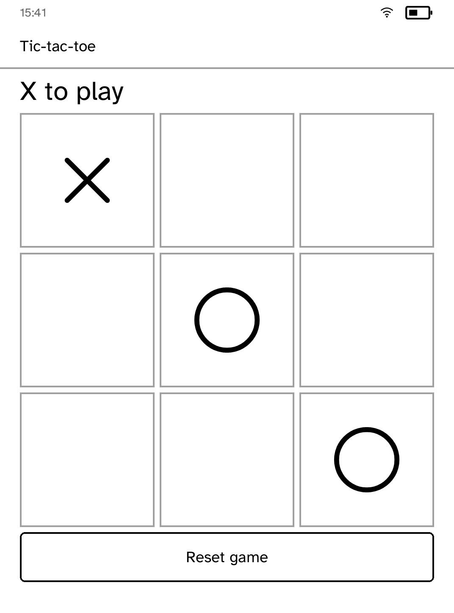

# Cobalt

**Real applications on a Kobo E Ink reader, without ever owning the boot.**

<p align="center">
  
</p>

An SDK, a declarative UI layer, a runtime that takes the hardware for the
length of a session and always gives it back, a browser simulator, and a CLI.

This is an independent, unofficial project. It is not affiliated with,
endorsed by, or sponsored by Rakuten Kobo Inc. “Kobo” and related product
names are trademarks of their respective owners.

Applications are ordinary Rust binaries. They describe whole screens and
receive named actions. They never open the framebuffer, the touch device, a
network socket or a credential; everything else is a request the runtime may
refuse, and a refusal is a value rather than a crash.

**[SDK.md](SDK.md) is the developer guide.**

## Start here

Three questions cover almost everyone who arrives. Pick yours.

| You have | You want | Go to |
| --- | --- | --- |
| A Kobo Clara BW | To run Cobalt on it | [Install it on your Kobo](#install-it-on-your-kobo) |
| A Kobo Clara BW | To write your own application for it | [Build your first application](#build-your-first-application) |
| A different Kobo | To find out what it would take | [Porting to another Kobo](docs/PORTING.md) |

Nothing in the second path needs a device: the browser simulator runs the same
layout engine, typeface and refresh planner the panel does. You can write and
finish an application before you ever plug a reader in.

## Contents

**Using it**

- [Before you install](#before-you-install)
- [Install it on your Kobo](#install-it-on-your-kobo)
- [What is here, and what is not](#what-is-here-and-what-is-not)
- [What runs on the panel](#what-runs-on-the-panel)

**How it stays safe**

- [The governing rule](#the-governing-rule)
- [Why Cobalt itself is not a `KoboRoot.tgz`](docs/DEVICES.md#why-cobalt-itself-is-not-a-koboroottgz)
- [Credentials](#credentials)
- [Verified on the hardware](docs/PORTING.md#how-to-get-the-numbers)

**Building on it**

- [Build your first application](#build-your-first-application)
- [What the UI layer draws](#what-the-ui-layer-draws)
- [Development](docs/DEVELOPING.md)
- [Layout](#layout)

**Working against a real reader**

- [Porting to another Kobo](docs/PORTING.md)
- [Connecting and talking to a device](docs/DEVICES.md)
- [Keeping a reader awake while you work](docs/DEVICES.md#keeping-a-device-reachable-while-developing)
- [Attended display smoke tests](docs/DEVICES.md#attended-display-smoke-tests)

**The project**

- [Contributing](#contributing)
- [Licence](#licence)

## Before you install

**Tested on one device: the Kobo Clara BW (N365, device code 391), firmware
4.45.23697.** Nothing here has been run on any other model. Every device write
is gated on an exact match of framebuffer identity, geometry, device code,
serial model prefix, firmware version and kernel release, so a different reader
is refused rather than guessed at. That refusal is the safety mechanism, not a
limitation to work around. On any other Kobo, Cobalt will decline to draw.

**You run this at your own risk.** It is AGPL-3.0 licensed, which means it
comes with no warranty of any kind. The design rule is that nothing survives a
reboot, and it is followed carefully (see [The governing
rule](#the-governing-rule)), but nobody here can promise your reader will be
fine. If you brick a device, that is your device and your decision. Do not run
this on a reader you cannot afford to lose.

**Other devices: pull requests welcome.** Support for another Kobo means a new
profile with its own geometry, waveforms, touch transform and identity gate.
If you have a Libra, a Sage, a Clara 2E or anything else and you are willing to
test on it, that contribution would be genuinely valuable. Open an issue first
so the profile shape can be agreed before you write it.

## Install it on your Kobo

This is the whole of it: one command over USB, one restart, and a **Cobalt**
entry appears on the reader's own menu. No SSH, no IP address, no terminal on
the device, and nothing written outside the partition your books live on.

```sh
git clone https://github.com/BandarLabs/Cobalt
cd Cobalt
rustup target add armv7-unknown-linux-musleabihf
cargo run -p kobo-cli -- setup
```

You need a charged Kobo Clara BW, a USB cable that carries data, an internet
connection, [Rust](https://rustup.rs) and an ARM cross-compiler. Setup builds
before it writes anything, so a failed build leaves the reader untouched, and
`--dry-run` shows every step without touching anything. Restart the reader
once setup finishes, wait a minute, then find **Cobalt** in the menu at the
bottom right of the home screen.

Removing it is deleting a folder: `cargo run -p kobo-cli -- setup --undo`, or
plug the reader in and delete `.adds/cobalt` from it directly.

**The full walkthrough, what to do if a step doesn't go as described, and
deploying over Wi-Fi instead of USB are in
[docs/INSTALL.md](docs/INSTALL.md).**

## Build your first application

An application is an ordinary Rust binary. It describes whole screens and
receives named actions back. It never opens the framebuffer, the touch device,
a socket or a credential, so there is nothing you can do here that damages a
reader, and **you do not need a device for any of this**: the simulator runs
the same layout engine, typeface and refresh planner the panel uses.

```sh
cargo install --path crates/kobo-cli   # once, so `kobo` is on your PATH
kobo new my-app && cd my-app
kobo dev                               # opens the browser simulator
```

That writes a working application, the same file as `examples/hello`, which
the workspace compiles and tests so it is never stale: a screen, two buttons,
and a battery reading that shows how hardware is asked for and how every
answer, including a refusal, comes back.

**[SDK.md](SDK.md) walks the whole thing end to end**, from editing
`src/main.rs` through to a tile on the reader's own launcher, over Wi-Fi or
USB.

## Porting to another Kobo

**Cobalt has only ever run on a Kobo Clara BW (N365, device code 391).** Every
device write is gated on an exact hardware match, so a different reader is
refused rather than guessed at. What a new profile has to supply, how to
measure it, and what refuses to work until it is right are in
**[docs/PORTING.md](docs/PORTING.md)**.

## What is here, and what is not

Verified on the physical Clara BW unless stated otherwise.

**Working on the device**

| | |
|---|---|
| Runtime | Sessions with guaranteed teardown, screen snapshot and restore, watchdog, exclusive touch grab, idle and ceiling limits |
| Display | Full and partial refresh, GC16 and DU waveforms, measured layout at 1072×1448 |
| Input | Touch with the panel's own transform, verified against a physical tap |
| UI | Bars, tiles, picture tiles, grids, rows, checklists, keyboard, terminal, prose pagination, skeletons, banners, dialogs |
| Pictures | Chunked upload, an LRU cache, greyscale conversion, glyph fallback |
| Network | HTTPS `Fetch` and `Post`, ranged downloads, a 24 MB transfer, named credentials the application never sees |
| Audio | Bounded MP3/MP3Z decode, A2DP playback, shared album-art player, Bluetooth output handoff |
| Storage | Per-application keyed state under its own directory |
| Navigation | A runtime-owned Back the application may answer first (see below) |
| Tooling | `devices`, `doctor`, `package`, `deploy`, `inspect`, `verify`, `session`, `wait`, `logs`, `touch-probe`, `record`, and a Clara BW simulator in the browser |
| Applications | `launcher`, `audiobook`, `settings`, `hn`, `rss`, `gutenbird`, `chat`, `todo`, `terminal`, `tictactoe`, `magnet`, `gallery`, `brief` |

**Not here yet, stated plainly**

- **`schedule_wake` has no device backend.** The runtime does not own suspend
  or the RTC alarm, so a scheduled wake is refused rather than silently
  dropped. This costs the entire ambient genre, which is arguably E Ink's
  native one: `brief` is the shape of it and on a device it only collects while
  it is in the foreground. Making it real means `kobod` owning suspend on the
  only device there is.
- **One device.** Clara BW N365, device code 391. Everything else is refused
  rather than mapped to a similar model, so there is no second profile to test
  against and no evidence any of this holds elsewhere.
- **No install without SSH.** Deploying over Wi-Fi needs an SSH server the
  platform does not ship. The USB route (`kobo package`, copy to
  `.kobo/KoboRoot.tgz`) always works and needs nothing.
- **The simulator draws the chrome but not the reader's hands.** It attaches
  the same status band and back bar the runtime does, which is how the band
  overlapping the top bar was found. It still cannot exercise the grace period
  behind Back, or a finger arriving mid-refresh.
- **Nothing is signed or verified at rest.** `kobo deploy` checksums what it
  uploads end to end, but a package already on the drive is trusted.
- **No power budget.** Nothing measures or bounds what a session costs the
  battery beyond the idle and ceiling timers.

## The governing rule

**Nothing that cannot be undone by a reboot.**

The platform never owns boot, so a power cycle always lands in the stock
reader. Everything else follows from that:

- The screen is snapshotted before a session and restored on every exit path,
  including every error path.
- An exclusive touch grab belongs to an open file description, so the kernel
  drops it even on `SIGKILL`.
- Stopping the stock reader arms a detached watchdog first, which restarts it
  unconditionally after a deadline even if this process is killed outright.
- Nothing is written to the rootfs, the bootloader, the kernel, a partition,
  or any startup script.
- Every device write is gated on an exact match of framebuffer identity,
  geometry, device code, serial model prefix, firmware version and kernel
  release.

## Layout

```
crates/    kobo-sdk       what an application imports
           kobo-ui        layout, rendering, pagination, vector icons
           kobo-protocol  the bounded wire format between the two
           kobo-policy    capabilities, task runner, device services, storage
           kobo-net       HTTPS; carries TLS and nothing else does
           kobo-json      a small JSON reader and object builder
           kobo-image     JPEG and PNG decoding, scaling and halftoning
           kobo-text      typeface loading and measurement
           kobo-shell     one terminal per application, hosted by the runtime
           kobo-term      the vt100 screen a terminal's output is parsed into
           kobo-hal       display, touch, battery, reader handoff
           kobo-abi       the only unsafe in the workspace
           kobo-profile   exact hardware identity
           kobod          the runtime
           kobo-sim       the browser simulator, same renderer
           kobo-cli       scaffolding, simulation, building, diagnostics
           kobo-doctor    read-only device probe
           kobo-smoke     owner-attended display writes
           kobo-handoff   stopping and restarting the stock reader
           kobo-guard     screen capture and restore around a session
examples/  launcher, audiobook, settings, terminal, todo, brief, chat,
           gutenbird, gallery, tictactoe, hn, rss
```

External dependencies are kept behind narrow crates: `kobo-net` (HTTP and
TLS), `kobo-text` (glyph rasterisation), `kobo-term` (a vt100 parser),
`kobo-image` (JPEG and PNG decoding), `kobo-doc` (document parsing) and
`kobo-abi` (libc/kernel calls). Their interfaces keep applications independent
of the particular implementations.
Device binaries are statically linked ARMv7 and need nothing installed on the
device.

## Development

```sh
cargo test --workspace --all-features
cargo run -p kobo-cli -- dev --builtin      # browser simulator
cargo run -p kobo-cli -- run --sim          # the real runtime, host socket
```

The simulator runs the same renderer, layout engine, policy, typeface and
refresh planner as the panel, so an application can be written and finished
before a reader is ever plugged in. The rest, including the loop that drives an
application and photographs what it drew, is in
**[docs/DEVELOPING.md](docs/DEVELOPING.md)**.

## Working against a real reader

Connecting over Wi-Fi, the two ways to install, what the runtime does with the
radio and the three watchdogs, keeping a reader awake while you work, and the
attended display tests are in **[docs/DEVICES.md](docs/DEVICES.md)**.

## Verified on the hardware

The read-only doctor matches the physical N365 on device tree, framebuffer
identity, touch device and firmware/kernel/device-code identity; the exact
report is in [docs/PORTING.md](docs/PORTING.md#how-to-get-the-numbers). What
has been proven on the device, waveform by waveform, is under
[Attended display smoke tests](docs/DEVICES.md#attended-display-smoke-tests).

## What the UI layer draws

A closed set of nodes, no free-form drawing, no colour, no font choice and no
pixel positioning: headings and paragraphs, buttons, rows and checklists, tile
grids with icons or pictures, a picture on its own, a tap-first `choose` with
an optional freeform row, threaded `quote` paragraphs for replies, banners,
progress and activity, skeletons, dividers and spacers, a paged list, an
on-screen keyboard, and a terminal grid.

Everything that varies is *state* rather than styling. A finished row is
finished, a chosen answer is chosen, a reply has a depth; the renderer decides
what each looks like. That is what makes a badly proportioned screen
unexpressible rather than merely discouraged, and it is also what stops an
application marking its own state with a character the installed face has no
glyph for. In debug builds `set_screen` refuses a screen carrying one, so an
application's own tests fail instead of the panel showing an empty box.

### Back belongs to the reader, and can be lent

The Back control in the top bar is drawn by the runtime, on top of whatever the
application asked for. It cannot be removed, cannot be forged, and always ends
at the launcher, which is what makes it the reliable way out of anything. A
screen may ask for first refusal instead with `owns_back(true)`, so an
application can have its own history without ever being able to trap a reader
in it; [SDK.md](SDK.md#3-building-a-screen) covers the mechanism and the
two-second deadline behind it.

Pictures are decoded by `kobo-image`, halftoned to the sixteen greys this panel
resolves, and scaled to the cell they will occupy, including *up*, bounded, so
a book cover published at 190 by 300 fills a tile on a 300 pixel-per-inch panel
instead of sitting in the middle of it like a stamp.

## Credentials

An application never holds a key. It names one, and the runtime attaches it
from `/mnt/onboard/.adds/cobalt/secrets/<name>` — as a bearer token or under
the header the service expects — so a request goes straight to the provider
rather than through a proxy that would have to be trusted with the key. The
value never enters the application's memory, its logs or its crash dump.

```sh
kobo secret set openai --from ~/.openai --device 192.168.1.5
kobo secret list --device 192.168.1.5      # names only, never values
```

The full API, the CLI's lookup order, and how a key is kept out of git
entirely are in [SDK.md's Credentials section](SDK.md#credentials).

## What runs on the panel

Fourteen applications, every one an ordinary Rust binary against the same SDK.
Each picture is a real capture from a Kobo Clara BW, and each one links to that
application's own notes on why it is built the way it is.

<table>
<tr>
<td width="33%" valign="top"><a href="examples/launcher/README.md"></a><br><b><a href="examples/launcher/README.md">Launcher</a></b><br>The home screen, and an ordinary SDK application like the rest.</td>
<td width="33%" valign="top"><a href="examples/audiobook/README.md"></a><br><b><a href="examples/audiobook/README.md">Audiobooks</a></b><br>Research any topic with Exa, write it with OpenAI, narrate it with ElevenLabs, then play it over Bluetooth.</td>
<td width="33%" valign="top"><a href="examples/gutenbird/README.md"></a><br><b><a href="examples/gutenbird/README.md">Gutenbird</a></b><br>Sixty thousand free books, downloaded and read on the panel.</td>
</tr>
<tr>
<td valign="top"><a href="examples/hn/README.md"></a><br><b><a href="examples/hn/README.md">Hacker News</a></b><br>Top, New, Ask and Show, with whole threads laid out by reply depth.</td>
<td valign="top"><a href="examples/rss/README.md"></a><br><b><a href="examples/rss/README.md">Feeds</a></b><br>Any site's feed, found by typing its address, read without a browser.</td>
<td valign="top"><a href="examples/brief/README.md"></a><br><b><a href="examples/brief/README.md">Daily Brief</a></b><br>Background work: stories collected while the reader is elsewhere.</td>
</tr>
<tr>
<td valign="top"><a href="examples/chat/README.md"></a><br><b><a href="examples/chat/README.md">AI Chat</a></b><br>An answer that can be tapped rather than typed.</td>
<td valign="top"><a href="examples/sidekick/README.md"></a><br><b><a href="examples/sidekick/README.md">Sidekick</a></b><br>Your coding agent stops to ask; the reader on the desk answers.</td>
<td valign="top"><a href="examples/terminal/README.md"></a><br><b><a href="examples/terminal/README.md">Terminal</a></b><br>A shell, with keys that send a byte rather than collect a word.</td>
</tr>
<tr>
<td valign="top"><a href="examples/gallery/README.md"></a><br><b><a href="examples/gallery/README.md">Components</a></b><br>Every UI primitive at once, for checking by eye on real hardware.</td>
<td valign="top"><a href="examples/settings/README.md"></a><br><b><a href="examples/settings/README.md">Settings</a></b><br>Join Wi-Fi, pair Bluetooth, and read eleven facts off the fuel gauge.</td>
<td valign="top"><a href="examples/todo/README.md"></a><br><b><a href="examples/todo/README.md">Todo</a></b><br>State that survives a restart, and a row that can be struck through.</td>
</tr>
<tr>
<td valign="top"><a href="examples/tictactoe/README.md"></a><br><b><a href="examples/tictactoe/README.md">Tic-tac-toe</a></b><br>Two players, one panel, and partial repaints of single cells.</td>
<td valign="top"><a href="examples/magnet/README.md"></a><br><b><a href="examples/magnet/README.md">Magnet</a></b><br>The hall sensor behind the bezel, and where to find it.</td>
<td valign="top"></td>
</tr>
</table>

Leaving an application does not end it. It is put behind the launcher rather
than stopped, so a download or a build that was running keeps running and
coming back is a repaint rather than a restart.

That is what the recording at the top is arranged around: the audiobook is
started in its first minute and left, everything else happens while it is being
researched, written and narrated, and the last thing on screen is the finished
book on the shelf.

### Feeds and Feedsearch

`rss` finds feeds with [Feedsearch](https://feedsearch.dev), which takes a site
address and answers with the feeds it has: you type `arstechnica.com` rather
than hunting for a link with `rss` in it. Their terms ask for an attribution
visible to the reader on the search and results screens, so both carry one and
a test asserts it on both. That is not decoration: it has been lost once
already, silently, to a full page of results pushing it off the bottom of the
panel, which is why it now lives in the results screen's top bar where the
layout cannot discard it.

Feeds arrive as RSS 2.0, Atom or JSON Feed and are read into one shape. An
answer that stops at the fetch budget is reported as too large rather than as
not a feed: a cut XML feed keeps every item that arrived whole, but half a JSON
document is not a document at all and yields nothing, and sending somebody to
look for a different address does not help when the address was right.

## Contributing

The most valuable contribution is a second device. Everything here is measured
against one panel, and there is no evidence any of it holds elsewhere. Adding a
reader means a profile with its own geometry, waveform table, touch transform
and identity gate, and somebody willing to run it on hardware they own. Open an
issue before writing one so the profile shape can be agreed.

Beyond that:

- Every change is expected to keep `cargo test --workspace`,
  `cargo clippy --workspace --all-targets`,
  `cargo clippy -p kobod --features device-write --all-targets` and
  `cargo fmt --all --check` clean.
- `unsafe` is forbidden outside `kobo-abi`, which is where the kernel structs
  live.
- Anything that touches the device has to keep the governing rule: nothing a
  reboot cannot undo.
- A test that asserts intention rather than a measured result is not worth
  much here. Most of the defects in this project were found by rendering
  something and looking at it, against real captured data, and the tests that
  survived are the ones written that way.

## Licence

GNU Affero General Public License, version 3. See [LICENSE](LICENSE). What
ships inside the binary, and what its authors ask for in return, is in
[THIRD-PARTY.md](THIRD-PARTY.md).
