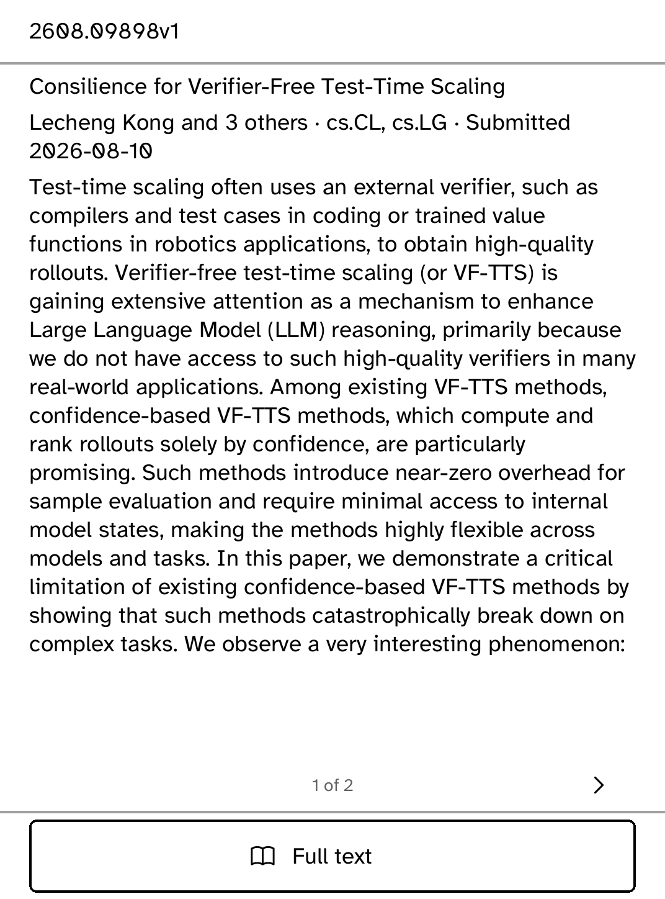

# arXiv

Browse a subject's newest preprints or search the archive, and read what comes
back on the panel rather than downloading it.

 

## The abstract is the document

A paper on arXiv is a PDF, and this platform's reader does not read PDFs. That
could have made this a catalogue with nothing behind it — a list that ends at a
title.

It does not, because arXiv has served an HTML rendering of every paper
submitted since December 2023. So a paper opens on its abstract, which always
exists, and offers **Full text** when arXiv has a rendering to give. A paper too
old for one says so plainly instead of opening an empty page.

## The rendering is a web page before it is a paper

Ahead of the paper in arXiv's HTML sit a fundraising banner, a hidden "report
an issue" form complete with its own field labels, a row of site links and the
whole table of contents; behind it, a site footer. Converted wholesale that
came out as a full first page of furniture — "Submit without GitHub", "Back to
arXiv" — before a word of the paper.

LaTeXML wraps the document itself in `<article class="ltx_document">` and puts
every one of those outside it, so the article is where the cut is made. A
rendering with no article in it is used whole: furniture is worse than the
paper, but nothing is worse than both.

## Newest first, always

A preprint server sorted by relevance is a search engine; sorted by date it is
a periodical, which is what browsing a subject means. Every listing asks for
`sortBy=submittedDate&sortOrder=descending`.

Results arrive twenty-five at a time — about four screens of rows, which is as
far as anybody goes before opening something or changing the query. **Older
papers** appears on the last page, and only when arXiv says there are more
behind it.

## Subjects

Twenty of them, named as arXiv names them so the identifier on a paper's page
matches the list it was found in. arXiv has upwards of a hundred and fifty
categories and no reader wants to scroll them; search reaches the rest.

## Capabilities

`network`, and nothing else.
