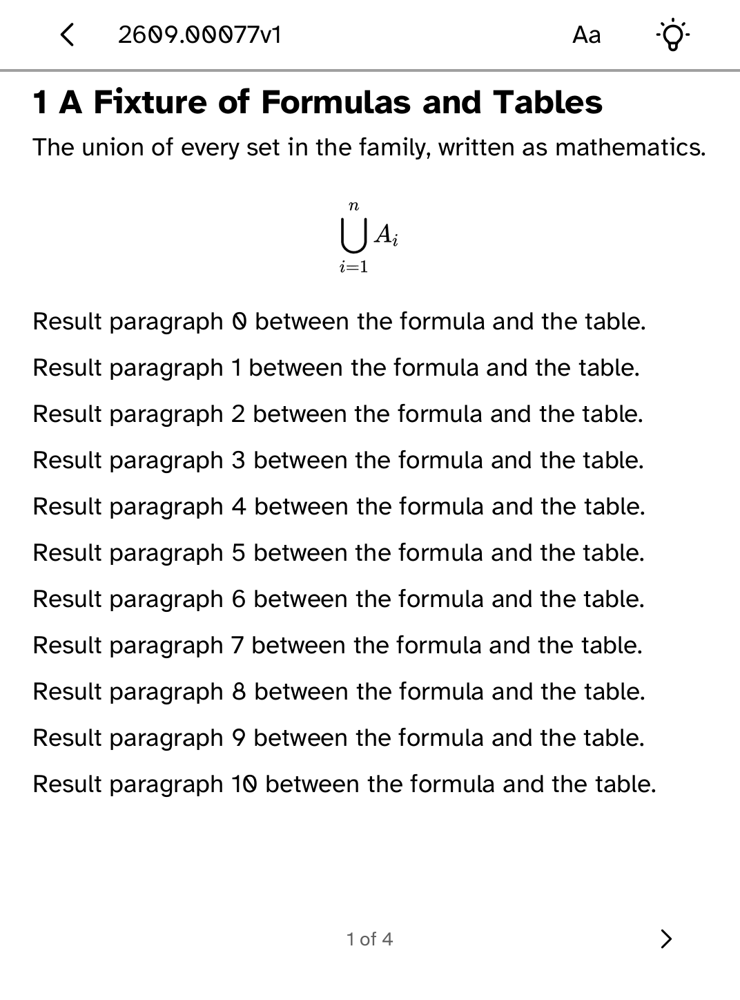
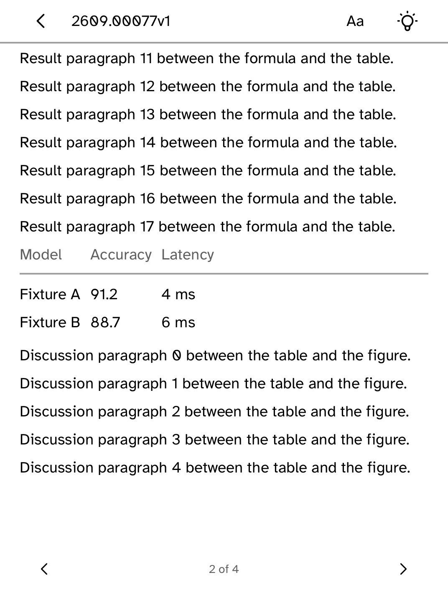

# Preprints

Browse and search arXiv preprints, and read them on your Kobo.

<table>
<tr>
<td width="50%" valign="top"><br>A subject's newest preprints</td>
<td width="50%" valign="top"><br>A paper's abstract</td>
</tr>
<tr>
<td width="50%" valign="top"><br>Typeset mathematics</td>
<td width="50%" valign="top"><br>A results table in columns</td>
</tr>
<tr>
<td width="50%" valign="top"><br>A figure with its caption</td>
<td width="50%" valign="top"><br>Saved searches and followed subjects</td>
</tr>
</table>

## Features

- Browse twenty subjects, newest first, or search the whole archive.
- Papers open on their abstract. **Full text** opens arXiv's HTML version,
  available for papers submitted since December 2023. Older papers say that no
  full text is available.
- Mathematics is typeset at the size of the surrounding text, inline or on its
  own line. Very long papers type the first formulas and show the rest as text
  so the paper still opens quickly.
- Tables keep their columns. When a table is too wide for the screen, each row
  is stacked with its headings. Long tables repeat their headings on each
  page.
- Figures load after the text, fitted to the screen with their captions.
- **Keep for offline** saves a paper to **Library**, where it opens without a
  connection. **Remove from library** undoes it.
- **Save this search** and **Follow this subject** add shortcuts to **Saved**.
  Followed subjects move to the top of the subject list.
- Results come 25 at a time. **Older papers** appears when there are more.

## Permissions

- `network`: fetches listings, papers and figures from arXiv.

## Development

```sh
cargo test -p kobo-arxiv
python3 scripts/check-apps-sim.py arxiv
```

The simulator check builds the app, opens it in a fresh simulator and plays
`drive.kobo`.

## Credits

Preprints is an unofficial reader built on the public arXiv API. It is not
affiliated with, endorsed by or connected to arXiv, and at arXiv's request it
does not use the arXiv name. Thank you to arXiv for use of its open access
interoperability.
