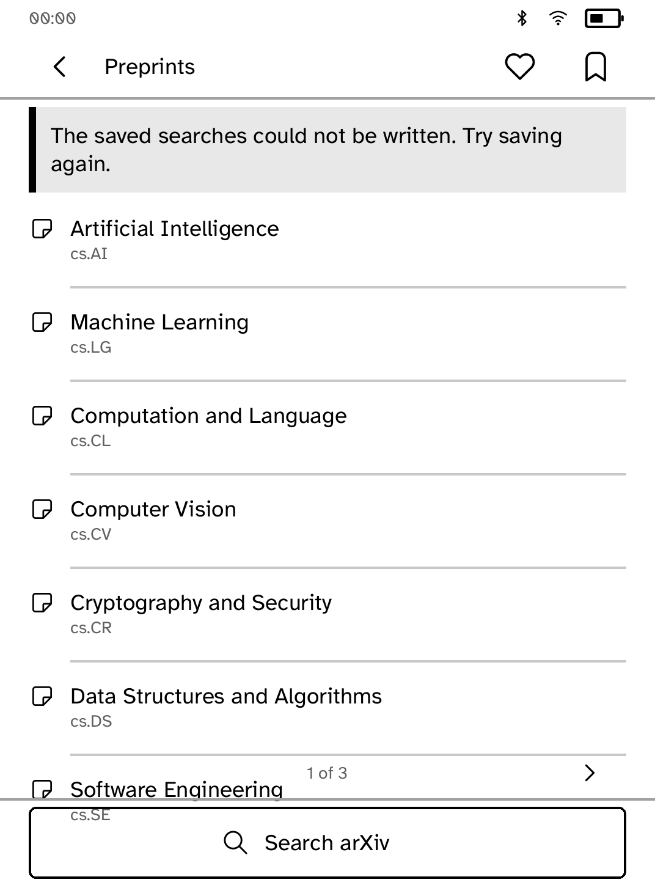
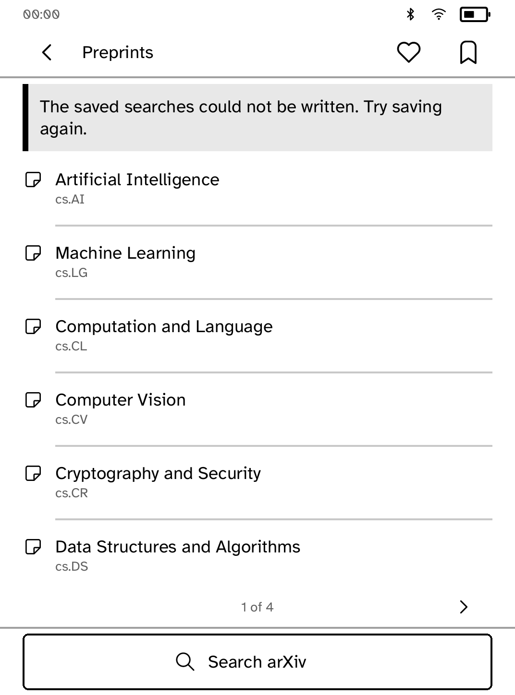
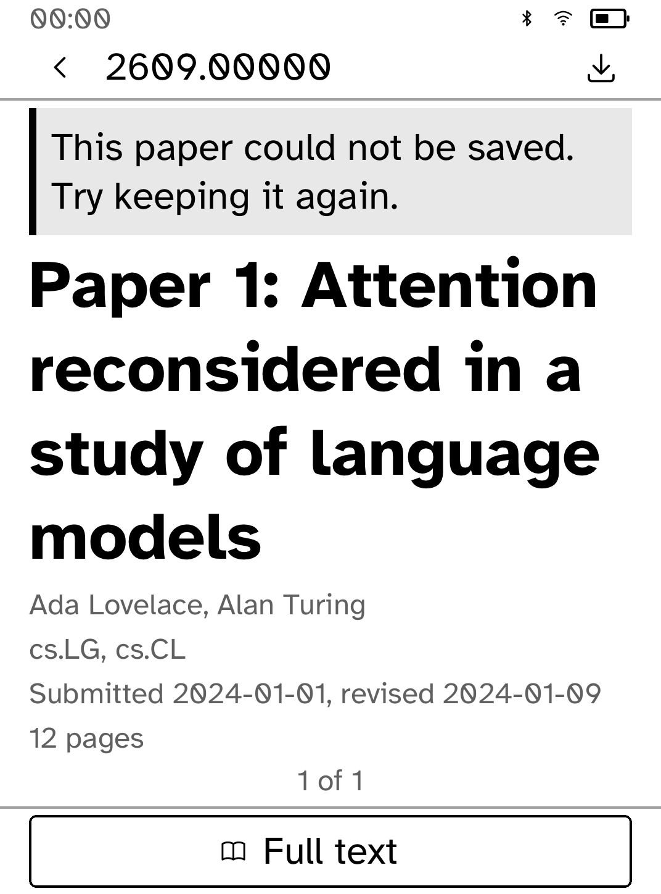
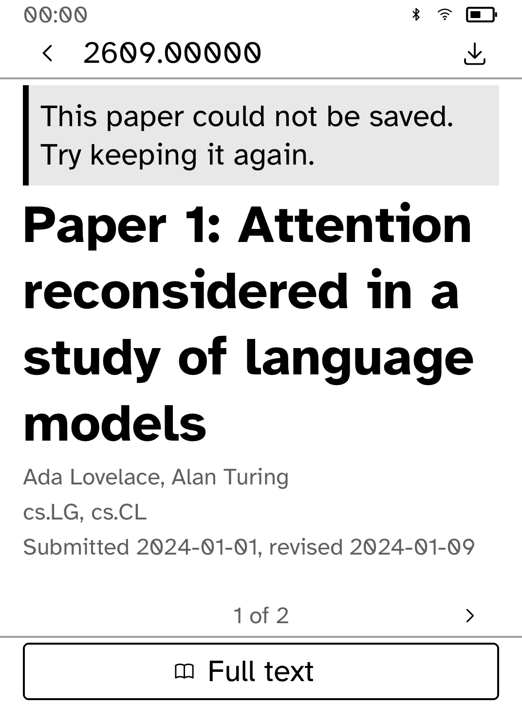
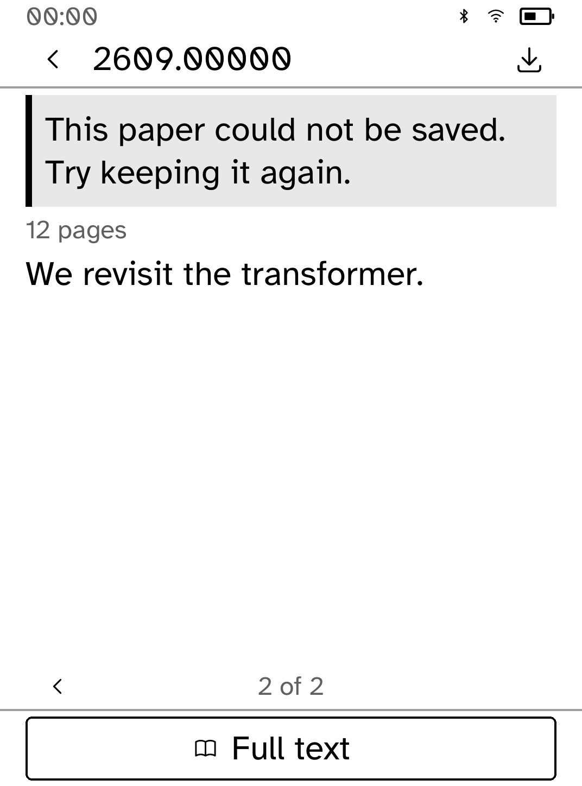

# Notice-aware lists and complete abstracts

These are **native renderer snapshots, not interactive simulator or device
screenshots**. Original app builders/callbacks and synthetic paper fixtures feed
the real Cobalt renderer/fonts at Clara BW metrics. Device status uses the
SDK's representative measuring values. No live arXiv request was made.

Before, recovery notices pushed subject/paper/library rows into the pager or
bottom action. A long paper title at the largest text size also left metadata
and the abstract hidden after a save failed. The fix measures list prefixes,
and paginates the title, facts and abstract as typed blocks using the real
layout. Their separate type levels remain; no title or abstract is shortened.
Long blocks can continue onto later pages, including unbroken UTF-8 titles.

<table>
<tr><td><br>Before: notice pushes a row below the page</td><td><br>After: notice space is reserved</td></tr>
<tr><td><br>Before: metadata and abstract are clipped</td><td><br>After: every block has a page</td></tr>
</table>



The next page now exposes the remaining fact and abstract that the original
one-page layout hid. Page turns are also bounded so repeated Next at the end
never adds invisible pages to traverse with Previous.

## Reproduce

After building the checkout's locked dependencies:

```sh
python3 apps/arxiv/screenshots/ui-review/capture.py --root . --app arxiv \
  --scenario apps/arxiv/screenshots/ui-review/scenario.rs --scope-tests \
  --output target/preprints-native-review
```

Use detached revision `9715304831eae95566758fd0aa6b8e6fc87ee3ee` as `--root`
for the baseline. The audit crate only adapts original module/fixture paths
and appends the scenario inside the existing test module. Source/image hashes
are in `provenance.json`.

## Validation and limits

- All 62 app tests, formatting and strict clippy pass
- Added coverage checks every subject/paper/saved-item touch target at all text
  sizes, complete title/fact/abstract words under a notice, long UTF-8 titles,
  and repeated page turns
- Captured updated screens have no layout diagnostics. The exhaustive subject
  test permits the pre-existing `StateInLabel` heuristic warning for the
  taxonomy name “Machine Learning (Statistics)”; it permits no layout errors
- Interactive simulator proof remains pending: its Unix-domain socket is
  denied with EPERM even after reviewed escalation
- Native callbacks do not prove simulator process transport, transformed touch
  coordinates, live arXiv API/HTML/figure requests or physical E Ink behavior


## Dependency compatibility follow-up

The test-only renderer dependency was removed from the app manifest. Tests
now walk every supported size through the SDK's exported display metrics, and
the existing isolated capture project continues to own its renderer dependency.
All 105 Node tooling tests, 62 app tests and strict app clippy pass. The 16 native
captures are byte-for-byte identical to the prior implementation;
`dependency-followup-provenance.json` records the final source hash and comparison.
The protocol baseline and shared runtime are unchanged.
