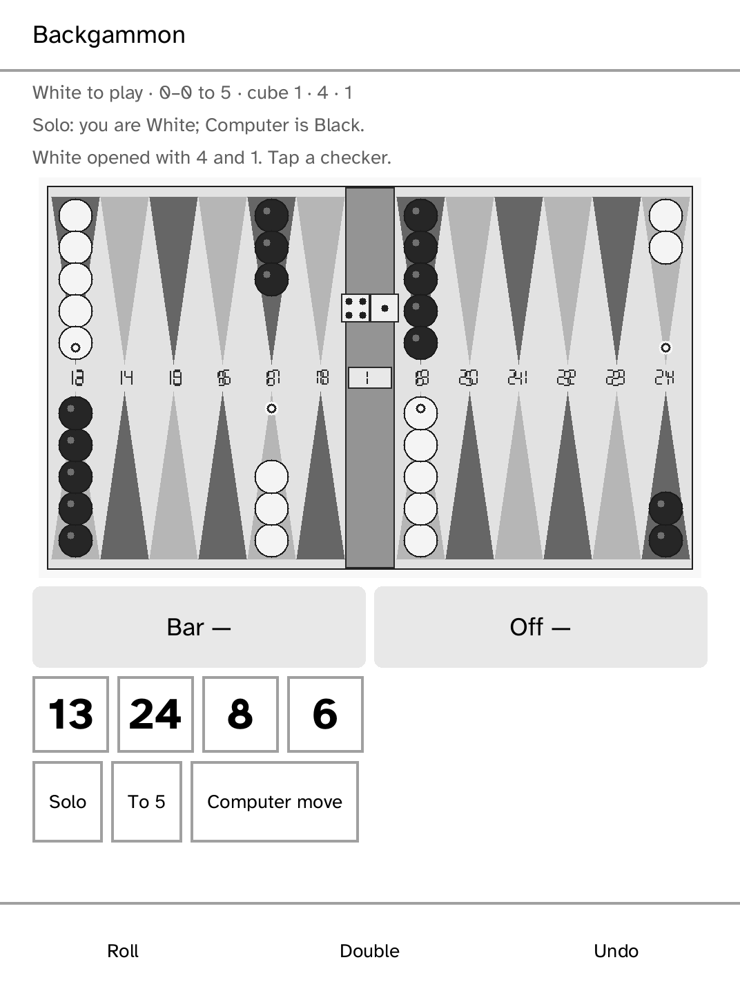

# Backgammon

This is a portrait 24-point board for the 1072×1448 Clara BW. The board, opposing triangular points, grayscale checker stacks, central bar, dice, and doubling cube are one app-owned picture, so it needs no backgammon-specific runtime primitives. Legal checker or destination point controls appear below it only when they can be tapped; hollow markers show the same legal choices on the board. Pass-and-play reverses the board so the active player is nearest the reader. Tap **Roll**, a numbered legal checker (or the active bar), then a numbered hollow destination or **Off**. Legal-turn generation enforces forced moves, maximum dice use, the higher-die rule, bar-entry priority, blocks, hits, doubles, exact and oversize bear-offs, and automatic no-move turns.

Matches may be 1, 3, 5, or 7 points. The doubling cube has an explicit offer/take/drop sequence, owner discipline, and Crawford-game restriction; beavers remain off. Games score singles, gammons, and backgammons. Every action is autosaved and a move may be undone before the turn ends. Solo mode includes a deliberately modest positional computer player; pass-and-play reverses the board for the next player.

The dice cycle visits every ordered pair equally and is checked by `deterministic_dice_has_equal_ordered_pair_counts`. Runtime entropy is pending a platform RNG API. GNU Backgammon is deliberately not used. The computer is a modest one-ply heuristic, not a bot-market GM.
