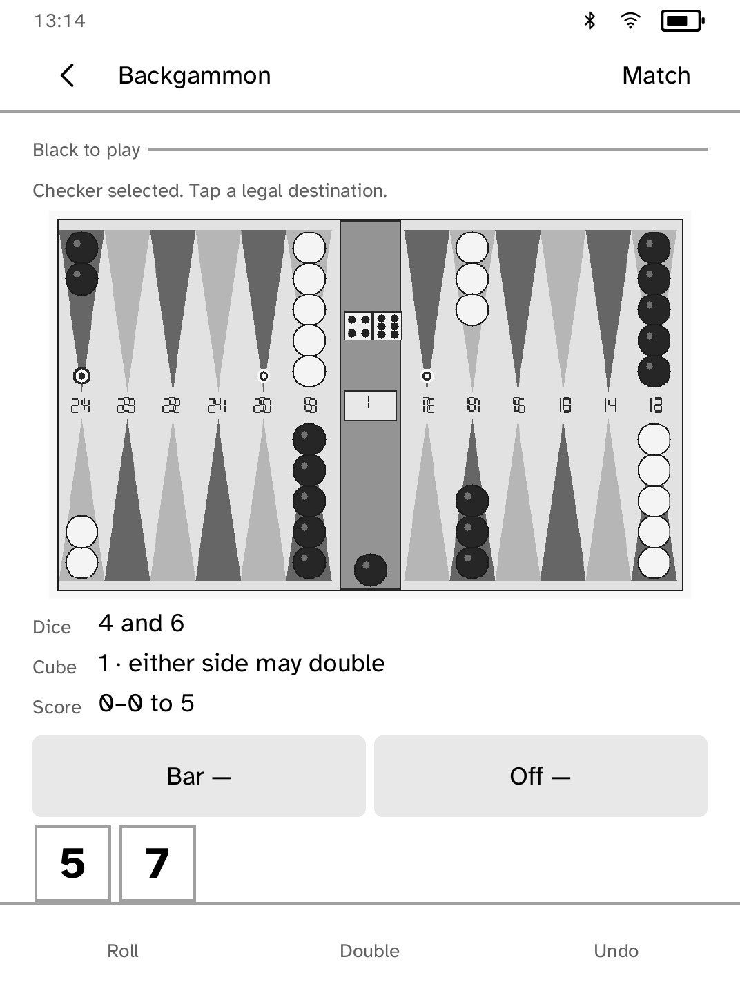
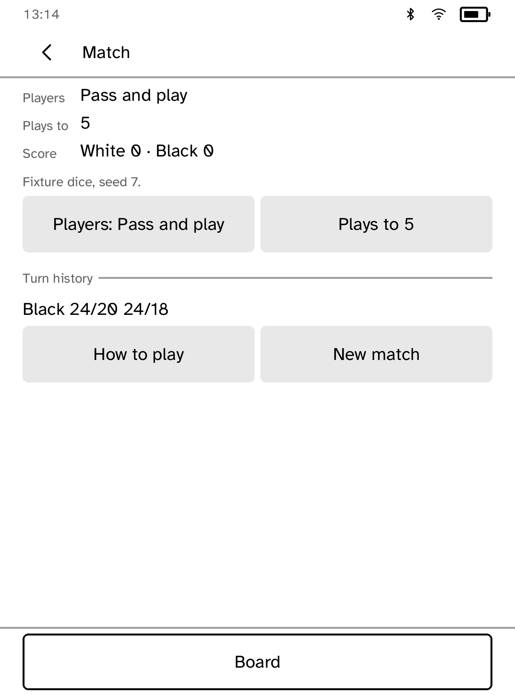

# Backgammon

Solo or pass-and-play backgammon on one Kobo, with full match rules.

<table>
<tr>
<td width="50%" valign="top"><br>The opening board</td>
<td width="50%" valign="top"><br>A checker in hand, with its legal destinations ringed</td>
</tr>
<tr>
<td width="50%" valign="top"><br>The match screen, with dice, cube and the record of play</td>
</tr>
</table>

## Features

- A portrait 24-point board with the bar, dice and doubling cube.
- Full move rules: forced moves, maximum dice use, the higher-die rule, bar
  entry, blocks, hits, doubles, exact and oversize bear-offs, and automatic
  passes when no move is possible.
- Matches of 1, 3, 5 or 7 points, with gammons and backgammons. The doubling
  cube supports offer, take and drop, cube ownership and the Crawford rule.
  Beavers are not used.
- Solo play against a modest one-ply computer player, or pass-and-play with the
  board turned towards the active player.
- The Match screen sets the players and match length, and keeps the last eight
  turns in board notation, such as "White 8/5 6/5" or "bar/20".
- Every action is saved. A move can be undone until the turn ends.

## Playing

Tap **Roll**, then a numbered checker (or the bar), then a ringed destination
or **Off**. The checker in hand is drawn solid and its destinations are
ringed. The side to move is named above the board, and the dice and cube are
written out under it as well as drawn.

## Dice

Dice come from the operating system's entropy source. If that source cannot
be opened, the board says so and does not roll. For tests and screenshots,
`KOBO_BACKGAMMON_SEED` fixes the sequence, and the Match screen shows that a
seed is in use.

## Permissions

None. Backgammon runs offline.

## Development

```sh
cargo test -p kobo-backgammon
python3 scripts/check-apps-sim.py backgammon
```

The simulator check builds the app, opens it in a fresh simulator and plays
`drive.kobo`.
