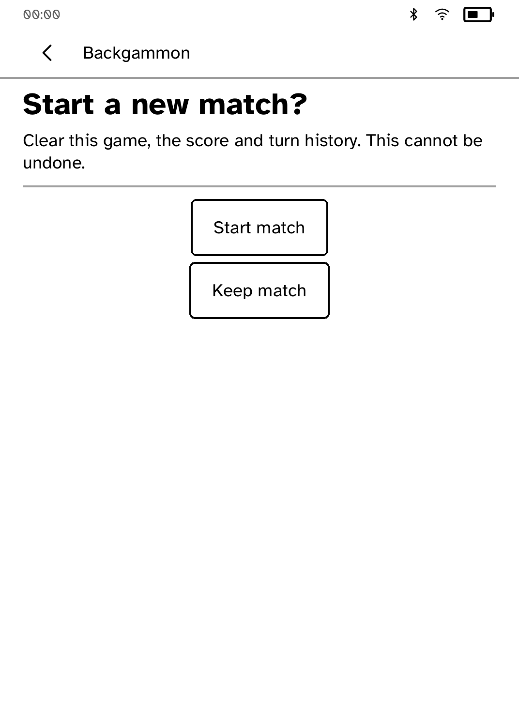
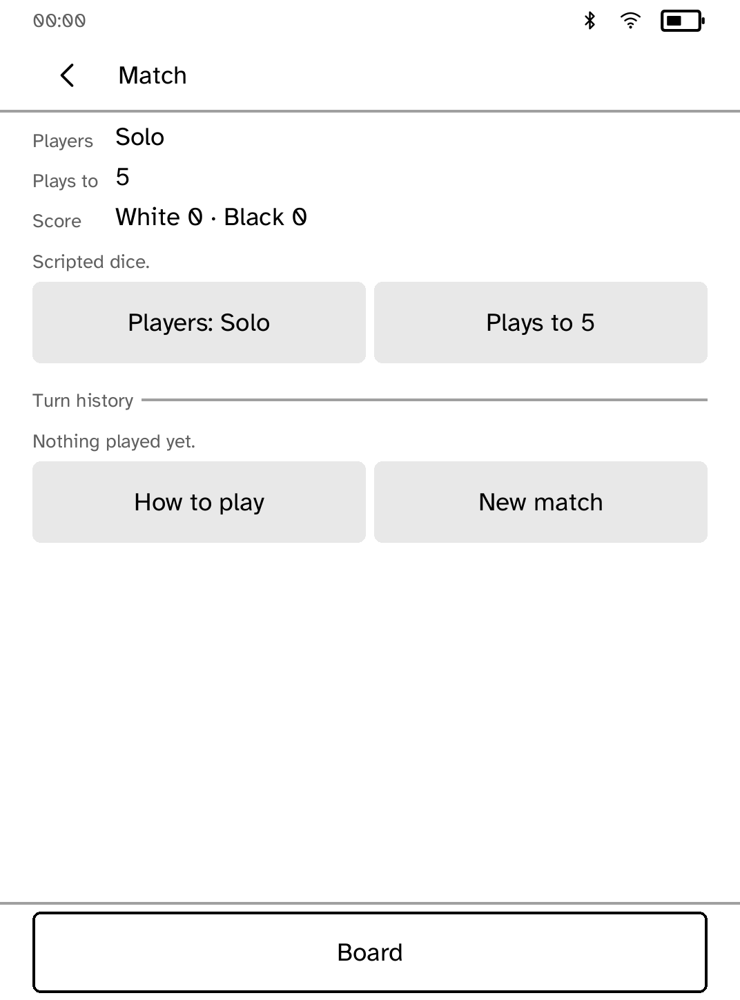
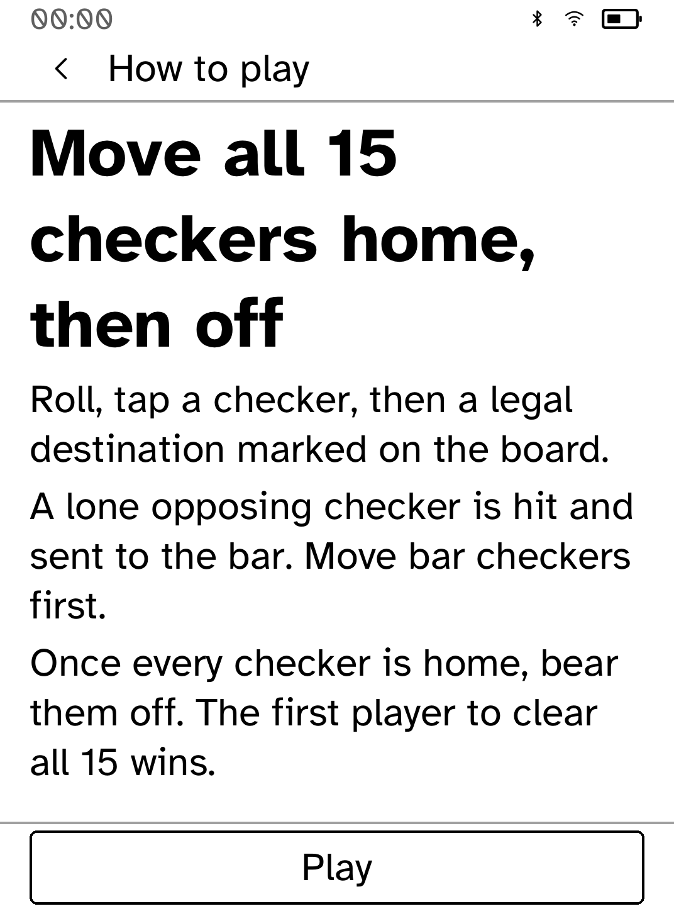
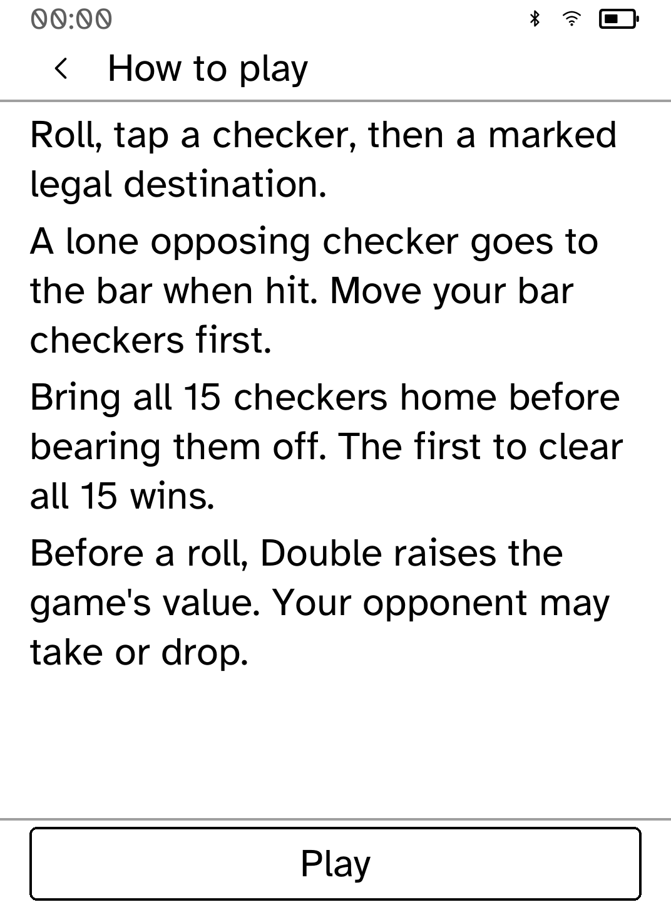
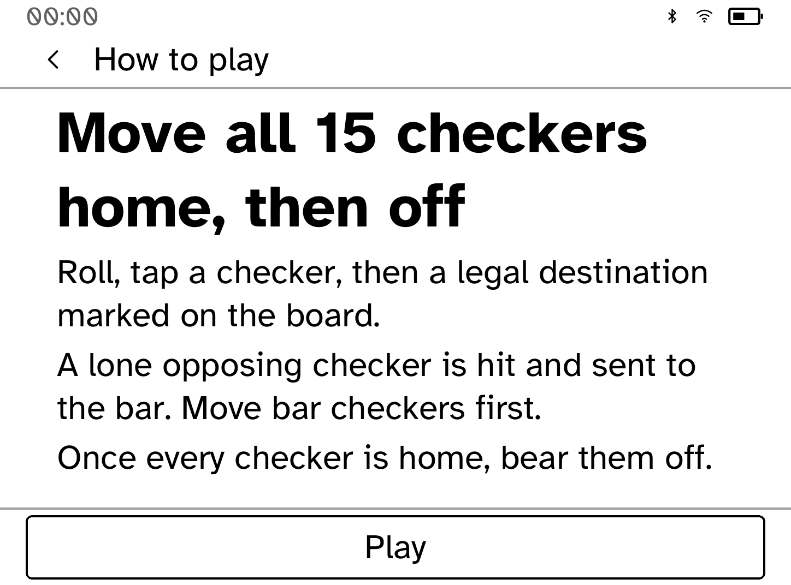
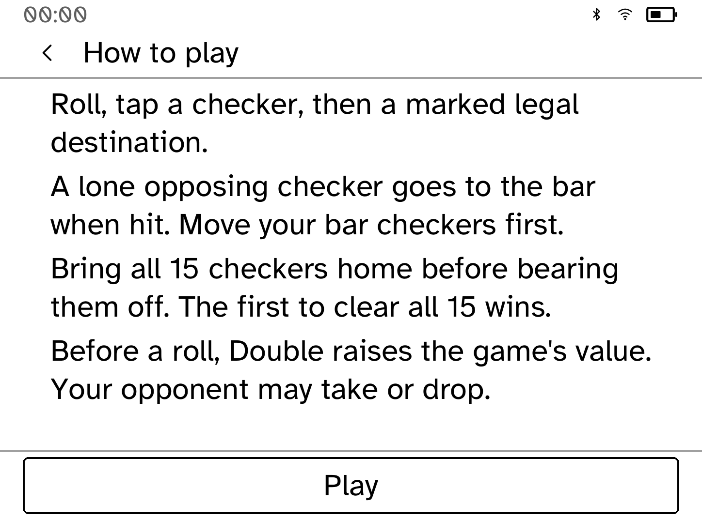

# Backgammon match controls and Help review

These are real in-process Cobalt renderer snapshots, **not interactive
simulator captures or hardware photographs**. Before captures used the original
app at Beta `9715304831eae95566758fd0aa6b8e6fc87ee3ee`, with only a test fixture
added. The fixture opened Match and invoked its visible New match action.

| Before tapping New match | After tapping New match |
| --- | --- |
|  |  |

Previously the Match screen offered New match while the action handler ignored
it during play. It now opens a confirmation. Back or Keep match returns to the
same Match screen without changing any progress, score, dice, or history.
Confirmation starts a match once, clears the match score and turn history,
and preserves the chosen player mode and match length. Repeated confirmation
cannot reset the new match again.



## Complete Help at large text sizes

The existing Help screen lost its doubling rule at 170% text size. Its large
heading repeated the goal already explained in the body, using three lines in
portrait. Four concise paragraphs now preserve every rule and both ways back
to the game, including in landscape.

| Before, 170% portrait | After, 170% portrait |
| --- | --- |
|  |  |

| Before, 170% landscape | After, 170% landscape |
| --- | --- |
|  |  |

Help before captures use `9a68f2118b9a75078ae20b01720184a43ca0db5c`,
whose Help builder is unchanged from the original beta. Only the capture
fixture and test font initialization were added before these snapshots.
The same app fixture, bundled font, 300 ppi and synthetic chrome produce both
sides; metrics are 1072 × 1448 and 1448 × 1072 at 170%.

The older layout test could pass using the fallback font if it ran before
another test installed the real font. Running it alone with explicit font
initialization reproduces the exact CI overflow. The common layout-test helper
now initializes the bundled font before measuring. A regression test checks
every rule, hit-tests Back and Play at all nine sizes and both poses, and
verifies that either exit preserves the game and ignores gameplay taps while
Help is open. Both parallel and serial test runs pass.

## Capture provenance

- Original app screen builders, callbacks, and `kobo_ui::render_all`
- Font installed by `AppRunner`; Clara BW 1072 × 1448, 300 ppi, default text size
- `Chrome::for_screen` plus `ensure_way_back`; 00:00, radios, and 50% battery are
  synthetic measurement values
- The fixture explicitly uses scripted dice, as disclosed on the Match screen
- Raw grey8 pixels saved to PGM, then converted losslessly to PNG with Pillow;
  no retouching or compositing

The executor denied the simulator AF_UNIX socket (`Operation not permitted`),
including a reviewed elevated launch. Interactive `kobo drive` and physical
reader testing remain pending; no simulator or runtime transport was changed.

## Reproduce after snapshots

```sh
COBALT_REVIEW_OUT="$PWD/target/ui-review" COBALT_REVIEW_PHASE=after \
  cargo test -p kobo-backgammon capture_review_screens -- --ignored
COBALT_REVIEW_OUT="$PWD/target/ui-review" COBALT_REVIEW_PHASE=after \
  cargo test -p kobo-backgammon capture_help_screens -- --ignored
python3 - <<'PY'
from pathlib import Path
from PIL import Image
for source in Path('target/ui-review/backgammon/after').glob('*.pgm'):
    Image.open(source).save(source.with_suffix('.png'))
PY
```

Normal tests also cover the visible action through layout hit testing,
Back/cancel preservation, confirmation during a computer turn, saved-state
round-trip, repeated taps, and every text size in portrait and landscape.
