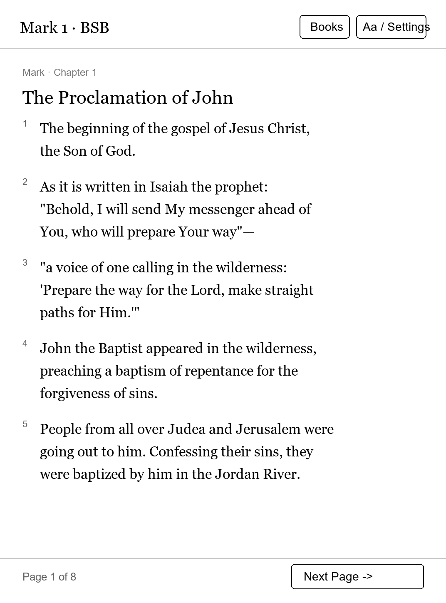

# Holy Bible

A clean, distraction-free Holy Bible reader designed for touch navigation and large e-ink typography.

## Features

- **Offline-First Reading**: Bundles foundational Scripture offline (Genesis 1-3, John 1-3, Psalm 23, Proverbs 3, and the complete Gospel of Mark).
- **On-Demand Caching**: When connected to Wi-Fi, chapters across all 66 books are fetched asynchronously and cached to the device storage for subsequent offline reading.
- **Fast Navigation**: Quick book selector partitioned by Old and New Testaments, followed by a grid of chapter numbers.
- **Adjustable Typography**: Supports comfortable reading with four text scale presets (100%, 120%, 140%, 180%) tuned for 300 PPI panels.
- **Hardware Page Turns**: Seamlessly turn pages and transition across chapter boundaries using the physical turn buttons.

## Text Licence & Attribution

The bundled Scripture text is the **Berean Standard Bible (BSB)**.

The text of the Berean Standard Bible (BSB) is dedicated to the **Public Domain** under the [Creative Commons Zero (CC0 1.0 Universal) Public Domain Dedication](https://creativecommons.org/publicdomain/zero/1.0/), effective April 30, 2023.

> The Holy Bible, Berean Standard Bible, BSB is in the Public Domain.  
> Copyright ©2016, 2020 by Bible Hub.  
> Dedicated to the Public Domain under CC0 1.0 Universal.  
> Further information is available at https://berean.bible.

Additional translation text fetched over Wi-Fi adheres to the respective public-domain and open-access distribution terms of the individual translations (including the World English Bible, WEB, which is also in the Public Domain).
