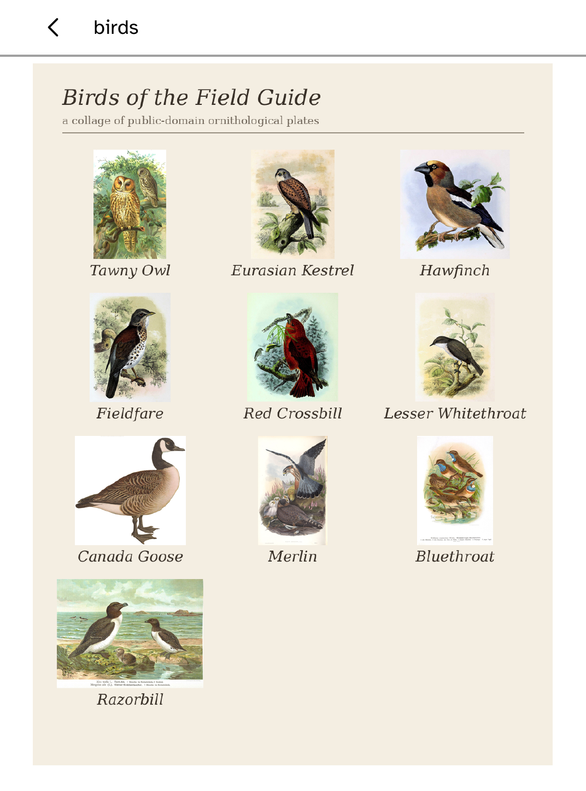

# Birds

Inspired by the awesome [fugleramme](https://github.com/arnegiacomo/fugleramme) project by Arne Giacomo Munthe-Kaas. Its artwork-first, quiet e-ink design is the reason this companion exists.

Birds is an offline Kobo viewer for a microphone and BirdNET-Go running on a Mac or Linux computer. The Kobo has no microphone and never runs the model. The collage fills the reading surface; its bird names are part of Fugleramme's rendered plate. On a colour Kobo, Birds keeps and paints the source RGB through Cobalt's colour-picture path; greyscale models decode only luminance.

```sh
kobo setup --enable-ssh
kobo birds listen --source http://garden-computer.local:8080 --device 192.168.1.42
kobo birds status
kobo birds stop
```

## The two programs that must be running first

That `--source` is not something Cobalt starts. Three programs are involved and only the last is ours: BirdNET-Go owns the microphone and the classifier, Fugleramme polls BirdNET-Go and renders the collage, and the companion polls Fugleramme and carries the picture to the reader. Install them in that order, because each is silent until the one before it answers.

Both projects default to port 8080, so a computer running them side by side has to move one. Fugleramme's own appliance install expects the detector on 8090 and serves the frame on 8080, and following that here means the `--source` above is the one every other document already assumes.

**BirdNET-Go** ([releases](https://github.com/tphakala/birdnet-go/releases)) publishes a build per platform, and not for every platform Birds runs against. There is `darwin-arm64`, `linux-amd64` and `linux-arm64`, and no Intel Mac build at all: an Intel Mac has to build it from source or run it in a container, neither of which is described here. Take the archive matching the computer that has the microphone.

Each archive carries two shared libraries beside the binary, and the binary will not start until the dynamic linker can find them. On Apple Silicon macOS, which is where the steps below were run:

```sh
tar xzf birdnet-go-darwin-arm64-*.tar.gz
DYLD_LIBRARY_PATH="$PWD" ./birdnet-go serve
```

Linux is the same shape with the loader variable Linux uses, and upstream's own README covers installing the libraries properly rather than per session:

```sh
tar xzf birdnet-go-linux-amd64-*.tar.gz     # or linux-arm64
LD_LIBRARY_PATH="$PWD" ./birdnet-go serve
```

It writes its configuration to `~/.config/birdnet-go/config.yaml` on the first run, wherever it was started from, and that is the copy to edit for the 8090 move and for your location. On macOS it also asks the terminal it was started from for microphone permission, and until that is granted it analyses silence and says nothing about it. `curl http://127.0.0.1:8090/api/v2/health` answers `healthy` once it is up, and the log names every sound it classifies, which is the quickest proof the microphone is really arriving.

**Fugleramme** ([source](https://github.com/arnegiacomo/fugleramme)) is a Python project. Its `install.sh` and `run.sh` set up a Raspberry Pi appliance through systemd and do not apply here; on a Mac or a desktop Linux machine, run the service directly and let it find no panel:

```sh
uv sync
uv run fugleramme-check --detector http://127.0.0.1:8090
uv run fugleramme-frame --detector http://127.0.0.1:8090 --host 127.0.0.1 --port 8080
```

`fugleramme-check` is worth running first: it reports whether the detector answers everything the frame needs, and separates "BirdNET-Go is not reachable" from "no bird has been heard yet". The frame logs `Inky library unavailable; running web-only`, which is the expected and wanted outcome on a computer, and Birds reads the same web endpoints the panel would have drawn. Once `curl http://127.0.0.1:8080/state` returns a token, that address is the `--source` the companion wants.

**Turn the frame on its side before looking at the reader.** Fugleramme takes the page shape from the panel it is driving, and with no panel attached it composes for a landscape one. A Kobo is portrait, so a landscape collage arrives at a portrait screen and the app fills the panel with the middle of it: the outer birds lose their heads and their names lose their first letters. Nothing reports this, because a cropped picture is still a picture. Set `rotation` to 90 in Fugleramme's `detector/data/settings.json`, or from its admin page at `/admin`, and it lays the birds out for a tall page instead. A 1080x1440 collage against a 1072x1448 panel is the difference between losing four tenths of the picture and losing one hundredth of it.

No bird has to have been heard for any of this to work. With an empty detection window Fugleramme still renders and the companion still publishes, so the whole path can be proved indoors before it is left running near a window.




`--source` is Fugleramme's local web endpoint. Fugleramme polls BirdNET-Go, renders the collage, and exposes `/state` plus `/collage.png`; the companion pushes a new snapshot only when that state token changes. Transfer uses Cobalt's established owner-attended SSH route. Each publication writes the collage to a content-addressed image file first and commits `current.json` last as the pointer, so the app sees either the old complete snapshot or the new one; an interrupted publish never overwrites the image the old snapshot still names, and orphaned images are pruned by the next successful publish.

If the host, microphone or network disappears, the last complete page remains. A snapshot older than one day is marked stale. Refresh reopens local shelf files; it does not turn on Wi-Fi. Fugleramme does not expose recent detections as machine-readable JSON, so the automatic bridge leaves that optional list empty; a manually prepared `kobo birds push SNAPSHOT.json IMAGE.png` snapshot may include it.

Native Windows is out of scope. Cobalt's host CLI currently relies on Unix process and filesystem behavior.

## Licenses

No Fugleramme source, artwork, fonts, BirdNET-Go binary, or BirdNET model is bundled in this app. The companion is an API client and transfer tool written for Cobalt.

- Fugleramme code is MIT. If downstream work copies its code, retain the notice in `licenses/FUGLERAMME-MIT.txt`.
- Fugleramme classic artwork is CC BY-SA 4.0 and is not bundled. Users who add it to a distribution must carry its per-image manifest and attribution.
- The checked-in fixture collage and screenshots are a composite of public-domain 19th-century ornithological plates from Wikimedia Commons; `THIRD-PARTY.md` lists every source plate, and `scripts/fixtures/birds/build-collage.py` rebuilds the fixture.
- BirdNET-Go and its BirdNET model are separately distributed under CC BY-NC-SA 4.0 for non-commercial use. They are not part of the Cobalt package.

See `THIRD-PARTY.md` and `licenses/`.

## Validation

The real model-to-screen acceptance chain is recorded in [`docs/quality/birds-e2e.md`](../../docs/quality/birds-e2e.md). Default and extra-large text-scale screenshots are checked in under `screenshots/`. Physical-Kobo acceptance remains open.
