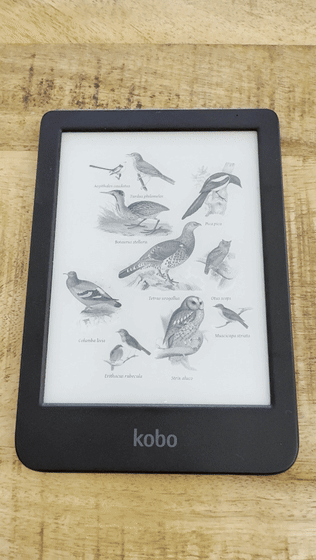
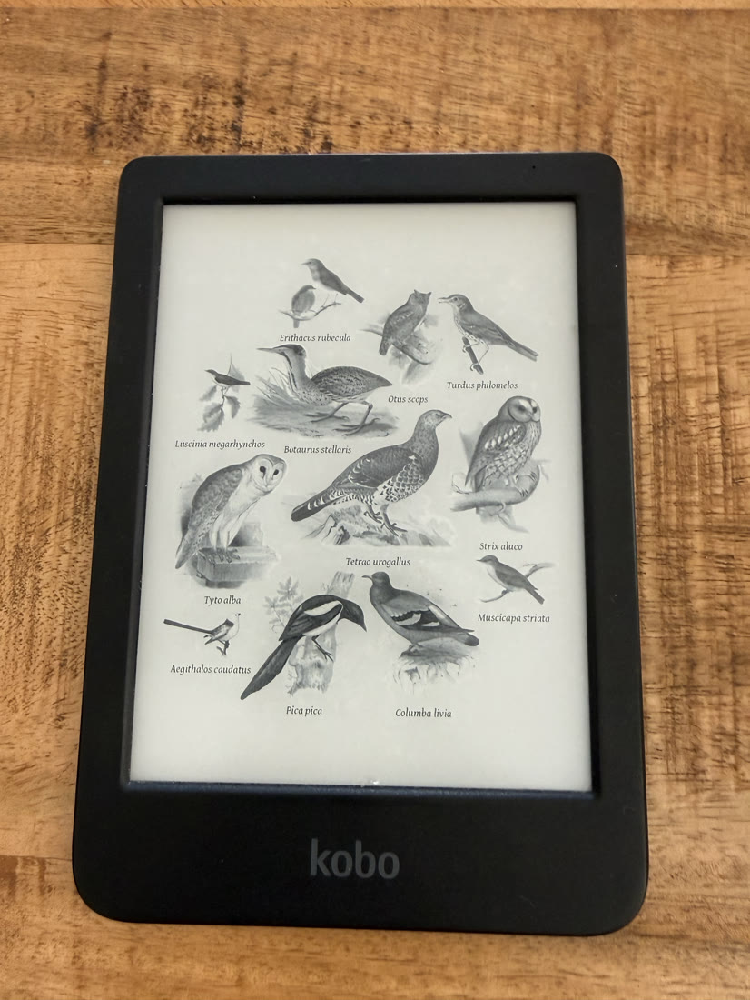

# Birds

Show the birds [BirdNET-Go](https://github.com/tphakala/birdnet-go) hears on
your computer, drawn as [Fugleramme](https://github.com/arnegiacomo/fugleramme)'s
labelled plates.

<p>
  <a href="../../docs/media/apps/birds/birds-on-a-clara-bw.mp4">
    
  </a>
  
</p>

A Clara BW showing twelve species heard in one afternoon. [The video](../../docs/media/apps/birds/birds-on-a-clara-bw.mp4)
has sound.

## How it works

Your computer listens and classifies. The Kobo only displays the result. It
has no microphone and never runs the model.

1. BirdNET-Go listens to your computer's microphone and identifies birds.
2. Fugleramme draws the recent detections as a collage.
3. The `kobo birds` companion sends each new collage to the reader.

On the reader, the collage fills the screen. Touch the top edge to show the
title bar. Colour Kobos show the collage in colour. If the computer or network
goes away, the last collage stays on screen, and one older than a day is
marked as stale.

## Requirements

| | |
| --- | --- |
| A computer with a microphone | macOS on Apple Silicon, or Linux on x86-64 or arm64 |
| [BirdNET-Go](https://github.com/tphakala/birdnet-go/releases) | Listens and identifies birds |
| [Fugleramme](https://github.com/arnegiacomo/fugleramme) | Draws the collage |
| A Kobo running Cobalt | With SSH enabled: `kobo setup --enable-ssh` |

BirdNET-Go has no Intel Mac build. Windows is not supported.

## Setup

Install in this order. Each step depends on the one before.

### 1. BirdNET-Go

Each release archive includes two shared libraries that the binary needs:

```sh
tar xzf birdnet-go-darwin-arm64-*.tar.gz
DYLD_LIBRARY_PATH="$PWD" ./birdnet-go serve      # LD_LIBRARY_PATH on Linux
```

Then, in `~/.config/birdnet-go/config.yaml` (created on first run):

- Set the web port to **8090**. BirdNET-Go and Fugleramme both default to
  8080.
- Set your location, so only local species are reported.

Allow microphone access when macOS asks. `curl http://127.0.0.1:8090/api/v2/health`
returns `healthy` once it is running.

### 2. Fugleramme

Fugleramme's `install.sh` and `run.sh` are for a Raspberry Pi. On a computer,
run it directly:

```sh
uv sync
uv run fugleramme-check --detector http://127.0.0.1:8090
uv run fugleramme-frame --detector http://127.0.0.1:8090 --host 127.0.0.1 --port 8080
```

The message `Inky library unavailable; running web-only` is expected.

Set `rotation` to **90** in `detector/data/settings.json`, or from `/admin`.
Without it the collage is landscape and the reader crops the outer birds.

When `curl http://127.0.0.1:8080/state` returns a token, that address is your
`--source` below.

### 3. Birds

Install Birds from the Store on the reader, then start the companion:

```sh
kobo birds listen --source http://garden-computer.local:8080 --device 192.168.1.42
kobo birds status
kobo birds stop
```

This works before any bird has been heard, so you can test the whole chain
indoors.

## Limits

Fugleramme does not publish recent detections in a machine-readable form, so
the automatic companion leaves the detection list empty. A snapshot sent by
hand with `kobo birds push SNAPSHOT.json IMAGE.png` can include one.

## Permissions

None. Birds reads the collages sent to the reader and does not use the
network.

## Development

```sh
cargo test -p kobo-birds
python3 scripts/check-apps-sim.py birds
```

The simulator check builds the app, opens it in a fresh simulator and plays
`drive.kobo`.

## Credits

Birds exists because of [Fugleramme](https://github.com/arnegiacomo/fugleramme)
by Arne Giacomo Munthe-Kaas, whose artwork-first e-ink design it follows.

- Birds bundles no Fugleramme code, artwork or fonts, and no BirdNET-Go binary
  or model.
- Fugleramme's code is MIT, with the notice in
  [licenses/FUGLERAMME-MIT.txt](licenses/FUGLERAMME-MIT.txt). Its artwork is
  CC BY-SA 4.0. The photo and video above show that artwork, so they carry the
  same licence.
- The screenshots use public-domain 19th-century plates from Wikimedia
  Commons, rebuilt by `scripts/fixtures/birds/build-collage.py`.
- BirdNET-Go and the BirdNET model are CC BY-NC-SA 4.0 and are not part of
  Cobalt.

See [THIRD-PARTY.md](THIRD-PARTY.md) for every source.

Birds is unofficial and not affiliated with or endorsed by the BirdNET-Go or
Fugleramme projects.
