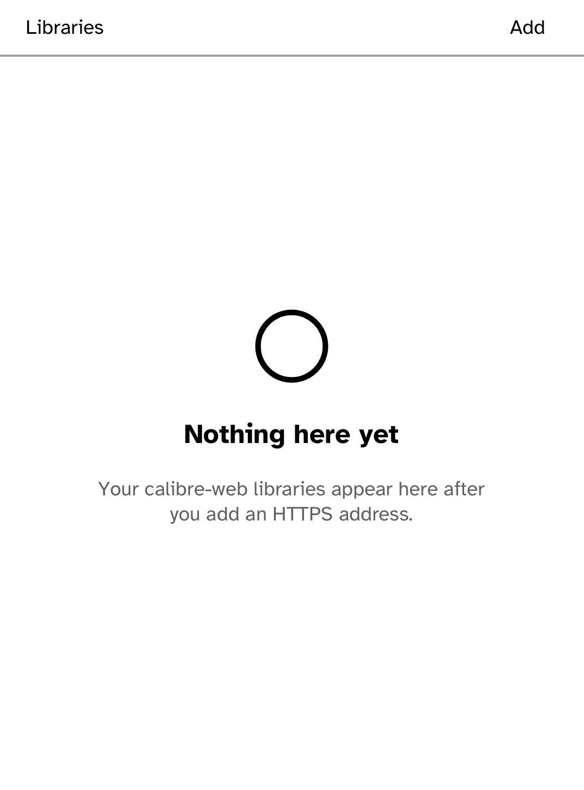

# calibre-web library

An authenticated OPDS library MVP for calibre-web. Add an HTTPS instance root,
then optionally name a device secret. The app attaches `Credential::basic(name)`
to the catalog request: the runtime alone turns the secret's `username:password`
value into an HTTP Basic header, so the app never receives a password.

Install a Basic secret from the computer:

```sh
kobo secret set calibre --device <ip>
```

Use a reverse proxy with a real certificate, or install a self-signed
certificate with `kobo trust set calibre --device <ip>`. Plain HTTP is refused
before any request. For `calibre serve`, use `--auth-mode=basic`; Digest and the
calibre-web Kobo-sync endpoint are out of scope.

This app provides the secure catalog-registration and root-fetch path. Full
OPDS navigation, covers, search and EPUB reading remain Gutenbird features;
the binding request calls for those shared changes, which cannot appear in this
app-only delivery.



## Simulator

```sh
cargo run -p kobo-cli -- run --sim --app calibre-web
cargo run -p kobo-cli -- drive --ideal --script apps/calibre-web/drive.kobo --shots apps/calibre-web/screenshots
```
