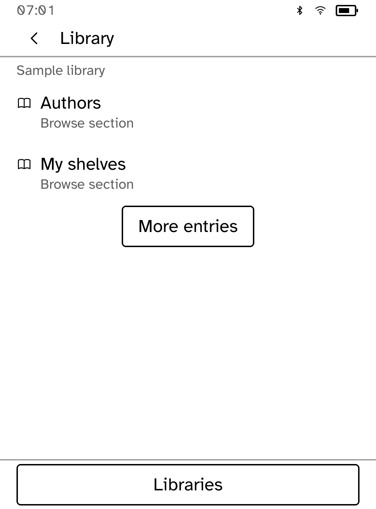
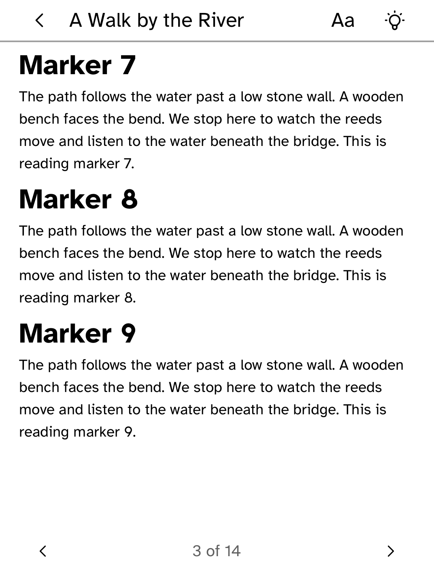
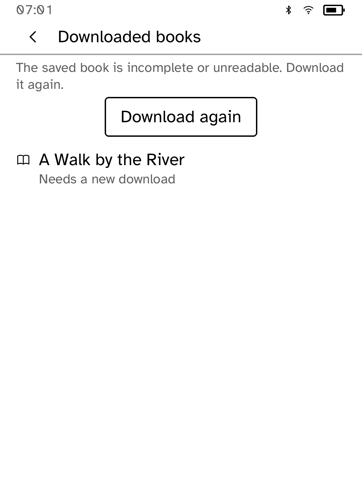

# Library

Browse an OPDS book catalog, such as calibre-web, and read downloaded books
offline.

<table>
<tr>
<td width="50%" valign="top"><br>Catalog sections</td>
<td width="50%" valign="top"><br>A private library</td>
</tr>
<tr>
<td width="50%" valign="top"><br>Reading a downloaded book</td>
<td width="50%" valign="top"><br>Replacing a damaged download</td>
</tr>
</table>

## Features

- Works with any OPDS server, including calibre-web and `calibre serve`.
- Browse the server's sections, authors and shelves. **Back** returns to the
  previous page at the same position.
- Download EPUB and plain-text books and read them offline, with page
  navigation, text size, bookmarks and saved position.
- **Downloaded books** opens without contacting the server.
- Downloads can be cancelled and restarted. Every file is checked before it
  opens, and a damaged file offers **Download again**.
- Up to 64 books of up to 16 MB each.

## Setup

1. Choose **Add library** and enter the HTTPS address of the OPDS catalog. A
   bare server address opens `/opds`. A full path is used as entered.
2. Choose **Sign in** for a private library, or **Use public library**.

Your username and password are stored by the runtime for that server only,
used only to read from it, and never shown to the app. Changing servers means
signing in again.

For a private certificate authority, install its root with
`kobo trust set calibre --from ROOT.pem --device <address>`. For `calibre serve`, use Basic
authentication.

If you set up an earlier version with `kobo secret set calibre`, sign in again
on the reader. The old credential only reaches the catalog's first page.

## Limits

Digest authentication and calibre-web's Kobo sync endpoint are not supported.

## Permissions

- `network`: reads the catalog and downloads books.

## Development

```sh
cargo test -p kobo-calibre-web
python3 scripts/check-apps-sim.py calibre-web
```

The simulator check builds the app, opens it in a fresh simulator and plays
`drive.kobo`. `scripts/quality/check-calibre-sim.py --output /tmp/calibre-check` runs a longer check against a local HTTPS test server using the catalog in `fixtures/`.

## Credits

Library is unofficial and not affiliated with or endorsed by the calibre-web
or calibre projects.
