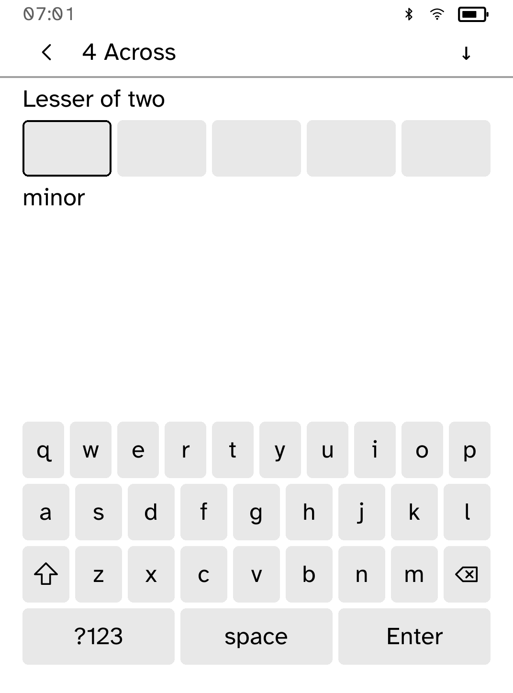
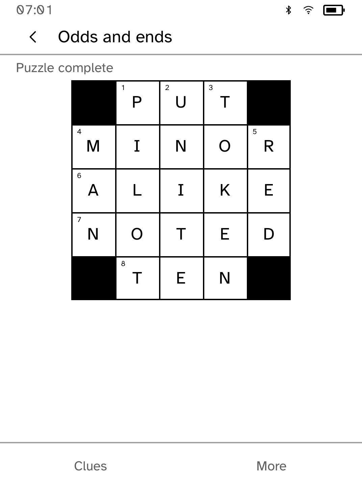
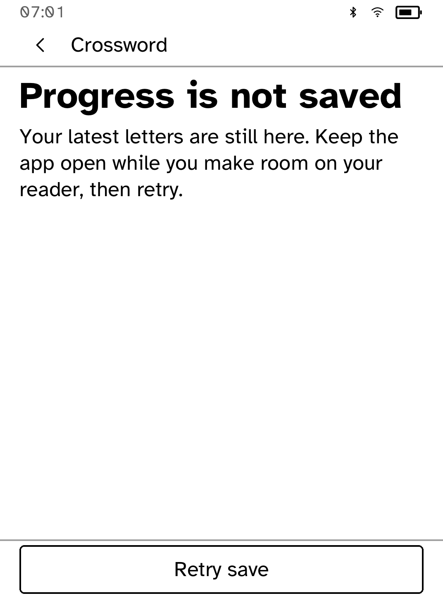

# Crossword

Four offline mini crosswords, each with its own saved progress.

<table>
<tr>
<td width="50%" valign="top"><br>A numbered grid with the active word shaded</td>
<td width="50%" valign="top"><br>Entering an answer below its clue</td>
</tr>
<tr>
<td width="50%" valign="top"><br>A completed puzzle</td>
<td width="50%" valign="top"><br>Retrying a save that failed</td>
</tr>
</table>

## Puzzles

- **Odds and ends**: a grid with black blocks and corner clue numbers.
- Three word squares at Starter, Easy and Medium difficulty. Difficulty is an
  editorial guide, not a measured solving time.
- **Heart of the matter**: the earlier 5×5 puzzle, with its saved letters kept.

All clues were written for Cobalt.

## Playing

Tap a square, or choose an Across or Down clue. The active word is shaded, and
while you type the full clue stays above the word and keyboard. The arrow in
the top bar switches direction. Type one letter to move through the word, or
the whole word to fill it from the first square. **Back** cancels text you
have not entered.

**More** holds Undo, Clear, Check, Reveal and Restart:

- **Check** marks wrong and empty letters in the active word without changing
  them.
- **Reveal** fills one square, after confirmation.
- **Restart** asks first. Reveal and Restart can both be undone.

Each puzzle keeps up to 32 undo steps, its position and direction, and its
check and reveal counts. A puzzle stays marked Completed once solved, even
after a restart.

## Saving

Progress is marked saved only once storage confirms it. If storage is full,
keep the app open, free some space and choose **Retry save**. Your latest
letters stay in memory, and the reader will not suspend until they are saved.
Saves that cannot be read are left untouched.

## Limits

`.puz` and `.ipuz` imports, rebuses and large Sunday grids are not supported.

## Permissions

None. Crossword runs offline.

## Development

```sh
cargo test -p kobo-crossword
python3 scripts/check-apps-sim.py crossword
```

The simulator check builds the app, opens it in a fresh simulator and plays
`drive.kobo`. `scripts/quality/check-crossword-sim.py --output /tmp/crossword-check` also covers completion, reopening, undo, failed saves and both clue directions.
