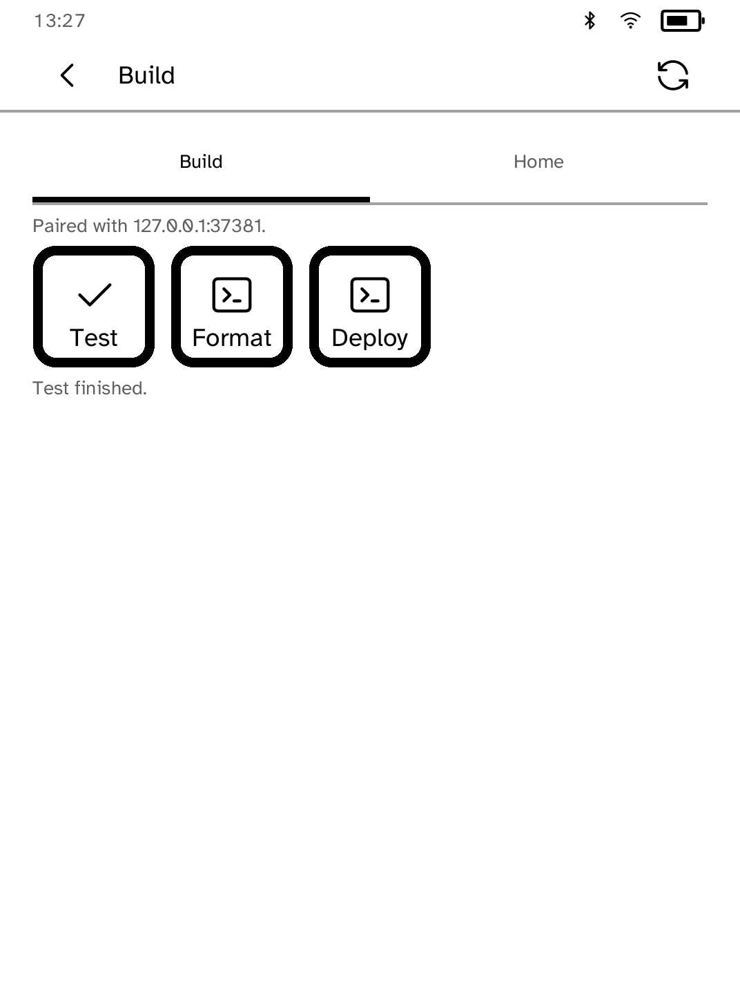
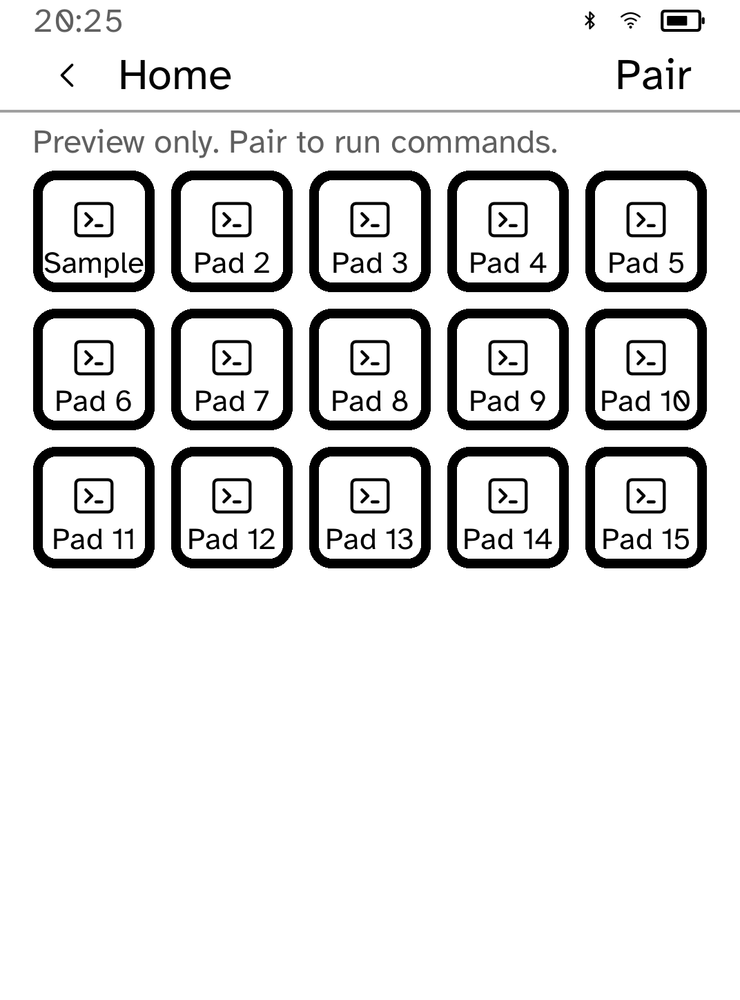

# Deck

Run commands, open apps and open links on your computer from your Kobo.

<table>
<tr>
<td width="50%" valign="top"><br>A Build page with Test, Format and Deploy</td>
<td width="50%" valign="top"><br>A command's result after it runs</td>
</tr>
<tr>
<td width="50%" valign="top"><br>A full page of fifteen pads</td>
</tr>
</table>

## Features

- Up to six pages of up to fifteen pads each.
- A pad can run a shell command, open an app or open a link on the paired
  computer.
- The top bar names the current page. A status line says which computer the
  deck is talking to and whether it answered.
- Unassigned pads are drawn faintly so they do not look like controls.
- After a command runs, Deck shows its result, whether it succeeded or not.
- If the computer stops answering, the last working layout stays on screen.

## Setup

Deck uses the same computer helper and pairing as [Sidekick](../../examples/sidekick/).

1. Create a layout from a preset, or pad by pad:

   ```sh
   kobo deck init --preset build   # test, format, lint, build, status, pull, deploy
   kobo deck init --preset home    # music, lights, a timer, lock the screen

   kobo deck set 1 --launch todo
   kobo deck set 2 --url https://example.com
   kobo deck set 3 --label Test --detail "cargo test" --run "cd ~/src/project && cargo test"
   kobo deck ls
   ```

2. Send the layout to the reader, or to the simulator with `--sim`:

   ```sh
   kobo deck push --device IP
   ```

3. Start `kobo-sidekickd run` on the computer. Open Deck and enter the
   computer's address and six-character pairing code.

`--launch` opens an app with `open -a` on macOS or `gtk-launch` elsewhere.
`--url` uses `open` or `xdg-open`. `--run` runs a shell command from your home
directory. Add `--confirm` to ask before a pad runs, or `--no-confirm` to
stop asking. New pads do not ask.

The layout lives in `~/.config/kobo/sidekick/deck.toml` and can be edited by
hand:

```toml
[[page]]
name = "Build"

[[page.key]]
label = "Test"
detail = "cargo test"
run = "cd ~/src/project && cargo test"
confirm = false

[[page.key]]
label = "Deploy"
run = "~/bin/deploy-staging.sh"
confirm = true
```

Saving the file refreshes a paired deck. If the file has an error, the deck
keeps the last working layout and shows the problem.

A layout pushed to an unpaired simulator shows a preview whose pads do not
run anything. Choose **Pair** to connect it.

## Security

Deck lets the reader run commands on the paired computer, so:

- Every request uses Sidekick's TLS connection and pairing code.
- Commands come only from `deck.toml`, which the reader cannot change.
- Commands run as your user, from your home directory. Use `confirm = true`
  for anything destructive or visible to others.
- At most four commands run at once. Each is stopped after ten minutes, and
  only the last 2 KB of output is kept.

## Permissions

- `network`: talks to the paired computer.

## Development

```sh
cargo test -p kobo-deck
python3 scripts/check-apps-sim.py deck
```

The simulator check builds the app, opens it in a fresh simulator and plays
`drive.kobo`.
