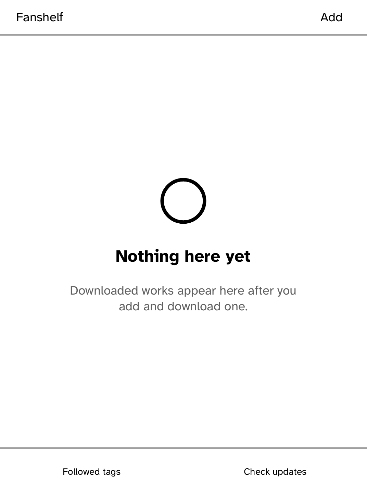

# Fanshelf

Fanshelf is an unofficial reader for [Archive of Our Own](https://archiveofourown.org/),
not affiliated with the OTW. A reader enters a work URL or numeric ID; the app
then makes one device-originated lookup request. It is a user agent, not a
crawler: no search scraping, prefetching, mirroring, background polling, or
training use. Every request follows a reader action and identifies
`kobo-fanshelf` in its User-Agent.

The app requests one work-navigation page at a time. The intended next step is
chunked EPUB storage and the shared EPUB reader. This MVP stores looked-up work
metadata and renders its offline-reading entry point, but does not yet persist
an EPUB because the required Gutenbird reader machinery is not Store-app
public API. Logged-in work and removed-work failures use plain, explicit text.

OTW can request that this behaviour change or stop. AO3 works remain copyrighted
by their authors and are never redistributed by this app. FanFicFare is
reference-only; no FanFicFare code is used.



## Simulator

```sh
cargo run -p kobo-cli -- run --sim --app fanshelf
cargo run -p kobo-cli -- drive --ideal --script apps/fanshelf/drive.kobo --shots apps/fanshelf/screenshots
```
