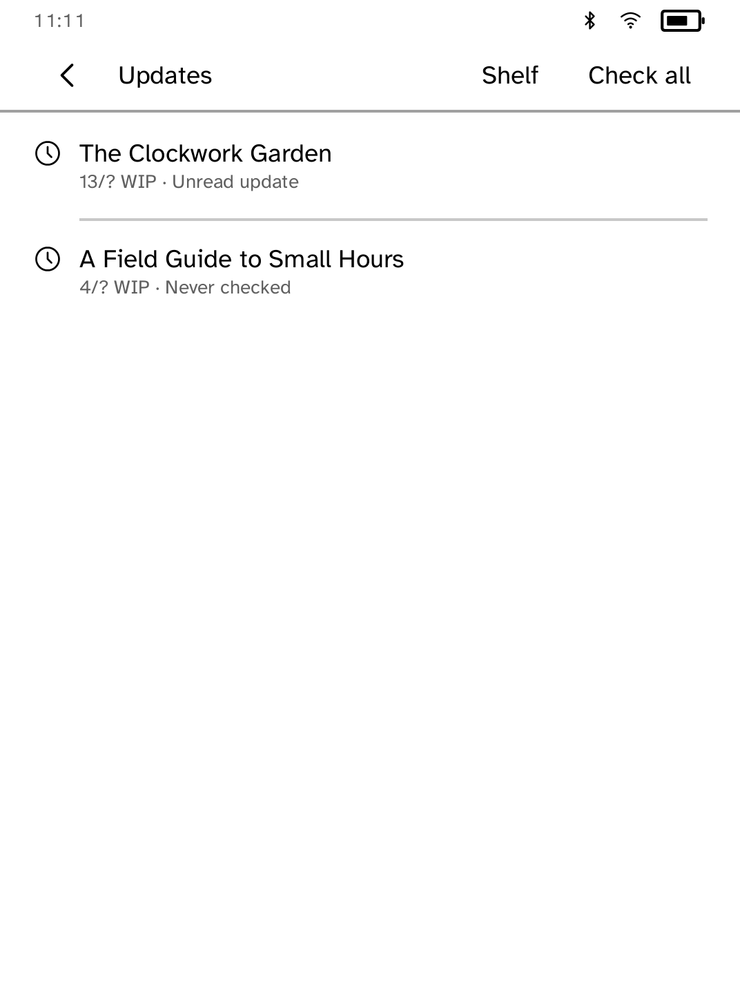
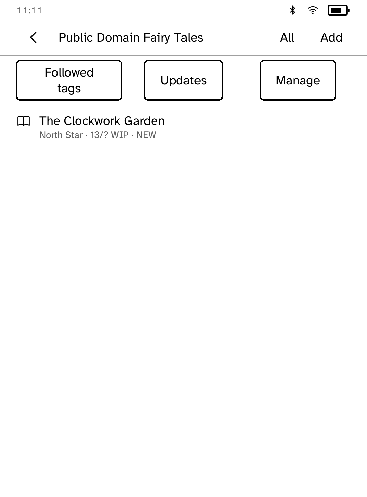
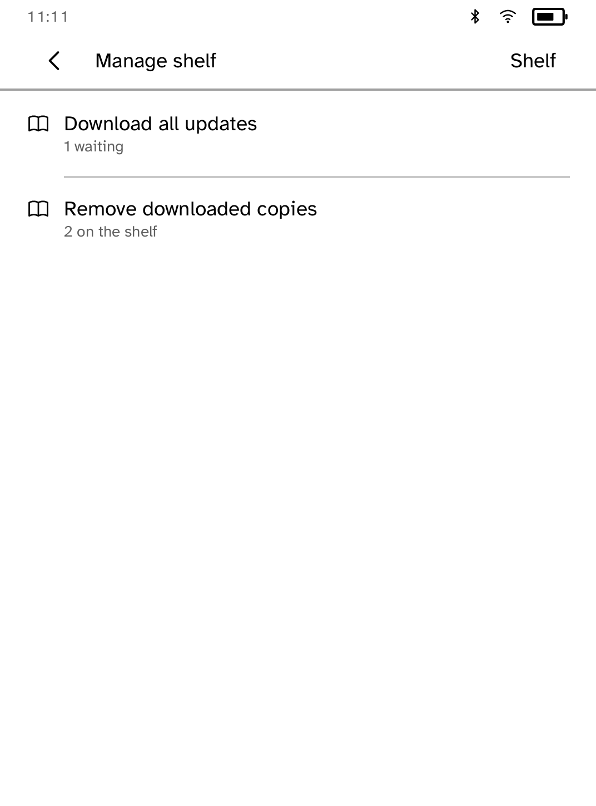

# Fanshelf

Save [Archive of Our Own](https://archiveofourown.org/) works to a shelf and
read them offline.

<table>
<tr>
<td width="50%" valign="top"><br>The shelf, with an unread update</td>
<td width="50%" valign="top"><br>A work, with its last update check</td>
</tr>
<tr>
<td width="50%" valign="top"><br>Works with unread updates</td>
<td width="50%" valign="top"><br>The shelf filtered to one fandom</td>
</tr>
<tr>
<td width="50%" valign="top"><br>Managing the shelf</td>
<td width="50%" valign="top"><br>Reading a downloaded EPUB</td>
</tr>
</table>

## Features

- Add a work by pasting its link. Rating and archive warnings are shown before
  you download.
- Download works as EPUB and read them offline. Your place, highlights and
  notes survive a re-download.
- Up to 96 works. The shelf marks works you have started.
- **Filter** narrows the shelf by fandom.
- **Manage** downloads every waiting update, or removes downloaded copies
  while keeping the works and your place.
- **Check updates** and **Check all** look for new chapters on works in
  progress, and mark them unread.
- Follow up to 24 AO3 tags through their public feeds.
- Adult content needs an explicit confirmation. Works restricted to logged-in
  users cannot be downloaded, and the app says so.

## How it uses AO3

Fanshelf is a personal reading tool, not a crawler.

- Every request follows something you did: opening a work, downloading it,
  opening a tag or checking for updates. There is no background checking,
  prefetching, search scraping or mirroring.
- One request at a time, at least one second apart, identified as
  `kobo-fanshelf/0.2.0 (+https://github.com/BandarLabs/Cobalt)`.
- When AO3 asks it to slow down, it waits as long as AO3 says, up to an hour.
- EPUBs over 12 MiB are refused. A new copy replaces the old one only after it
  has fully downloaded.

If the Organization for Transformative Works asks for this behaviour to change
or stop, it will.

## Limits

- AO3 has no public API, so work details come from its public web pages and
  may break when AO3 changes them.
- No sign-in, so locked works, bookmarks, subscriptions, kudos, comments and
  Marked for Later are not available.
- No free-text search, recommendations or automatic update checks.
- Not yet tested on a physical Kobo.

## Permissions

- `network`: fetches works, feeds and EPUBs from AO3.

## Development

```sh
cargo test -p kobo-fanshelf
python3 scripts/check-apps-sim.py fanshelf
```

To capture the screenshots with made-up data:

```sh
cd apps/fanshelf
FANSHELF_DEMO=1 cargo run -p kobo-cli -- dev 127.0.0.1:8787
cd ../..
cargo run -p kobo-cli -- drive --ideal \
  --script apps/fanshelf/drive.kobo \
  --shots apps/fanshelf/screenshots
```

`scripts/quality/check-fanshelf-epub-sim.py` covers downloading and reading
against a local test server. Without `FANSHELF_DEMO`, the simulator makes real
requests to AO3.

## Credits

Fanshelf is unofficial and not affiliated with the Organization for
Transformative Works. Works belong to their authors and Fanshelf never
republishes them. [FanFicFare](https://github.com/JimmXinu/FanFicFare) was a
behaviour reference; none of its code is used.
