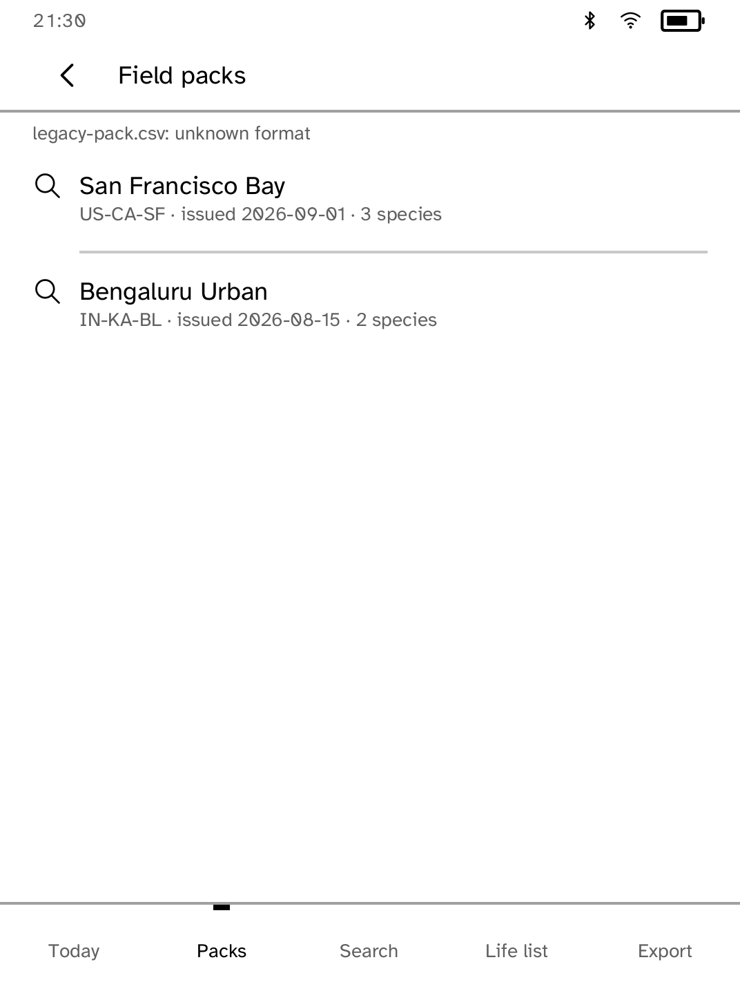
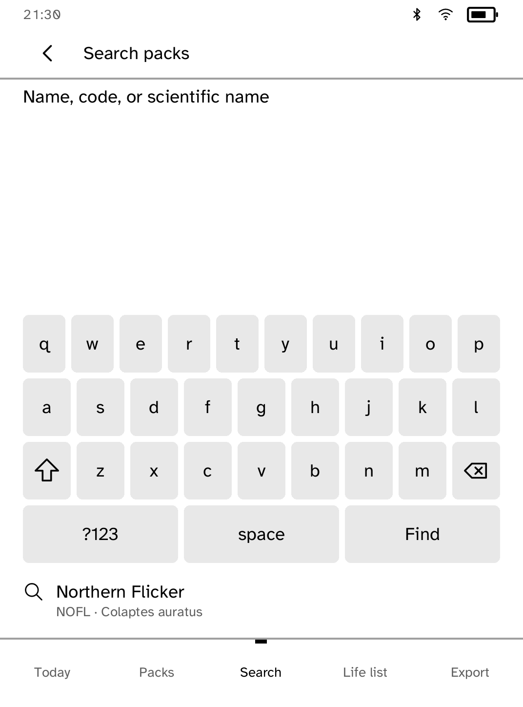
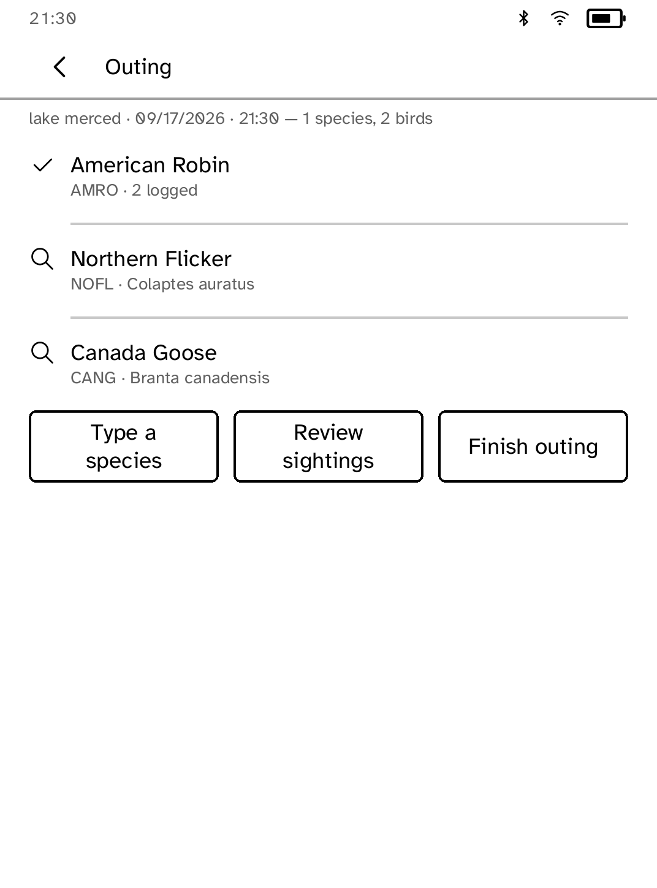
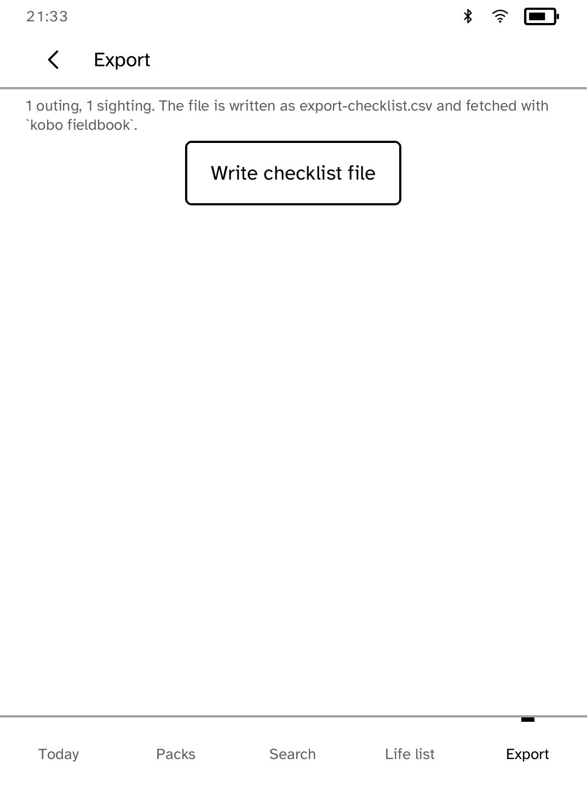
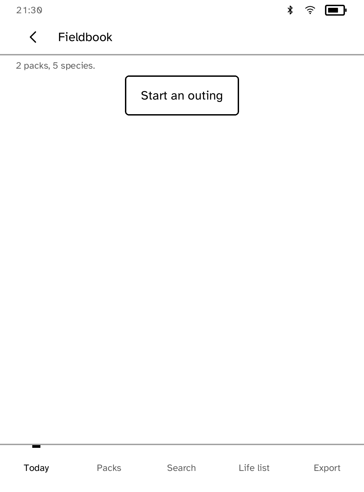

# Fieldbook

Log bird sightings offline and keep a life list on the reader. Field packs pushed from a computer give species lookup by common name, scientific name or banding code. A sighting is one tap during an outing, and finished outings export as an eBird Checklist Format CSV.

## Field packs

A pack is a regional species list prepared on a computer and published to the reader with `kobo fieldbook push`. Packs live on the shelf, so logging works with no connection and even with no pack at all: type the species name and it joins the outing by name. A pack that fails to import is named on the packs screen with the reason.

## Logging an outing

**Start an outing** asks for a place name, then stamps the date and start time from the reader's clock. Tapping a species tallies it; **Review sightings** lists the outing's log, where a tap removes an entry and **Undo delete** restores it. **Finish outing** files it on Today. The life list totals every species on the reader.

## Export

**Write checklist file** prepares one CSV in eBird's published Checklist Format: one column per outing, effort rows on top, counts per species. `kobo fieldbook export` fetches it to a computer. The layout follows the published format; eBird-side import acceptance is not verified.

eBird and the Cornell Lab of Ornithology are credited trademarks; Fieldbook is an unofficial companion.
