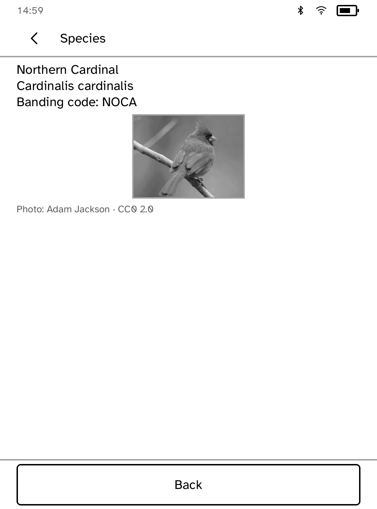

# Fieldbook

Log bird sightings offline and keep a life list on your Kobo.

<table>
<tr>
<td width="50%" valign="top"><br>Today, with recent outings</td>
<td width="50%" valign="top"><br>Field packs on the reader</td>
</tr>
<tr>
<td width="50%" valign="top"><br>Searching a pack</td>
<td width="50%" valign="top"><br>A species with its licensed photo</td>
</tr>
<tr>
<td width="50%" valign="top"><br>Tallying during an outing</td>
<td width="50%" valign="top"><br>Exporting a checklist</td>
</tr>
</table>

## Features

- Look up species by common name, scientific name or banding code from a field
  pack.
- Log a sighting with one tap during an outing. Species not in a pack can be
  typed by name.
- Review an outing's log, remove entries and undo a removal.
- A life list of every species logged on the reader.
- Export finished outings as a CSV in eBird's Checklist Format.

## Setup

Field packs are regional species lists prepared on a computer and sent to the
reader:

```sh
kobo fieldbook push      # send a field pack
kobo fieldbook photos    # add licensed species photos to a pack
kobo fieldbook export    # fetch the checklist CSV
```

Packs are stored on the reader, so logging works without a connection. A pack
that fails to import is listed with the reason.

## Logging an outing

1. **Start an outing** and enter a place name. The date and start time come
   from the reader's clock.
2. Tap a species to add it to the tally.
3. **Review sightings** lists the log. Tap an entry to remove it, or
   **Undo delete** to restore it.
4. **Finish outing** files it under Today.

**Write checklist file** prepares the CSV, with one column per outing. The
file follows eBird's published format. Importing it into eBird has not been
tested.

## Permissions

None. Fieldbook runs offline.

## Development

```sh
cargo test -p kobo-fieldbook
python3 scripts/check-apps-sim.py fieldbook
```

The simulator check builds the app, opens it in a fresh simulator and plays
`drive.kobo`.

## Credits

Species photos come from Avicommons and are included only when their licence
allows redistribution. Each pack carries attribution for its photos, and the
detail screen shows the credit. The photo above is a Northern Cardinal by Adam
Jackson (CC0), via Avicommons.

eBird and the Cornell Lab of Ornithology are trademarks of their owners.
Fieldbook is an unofficial companion.
