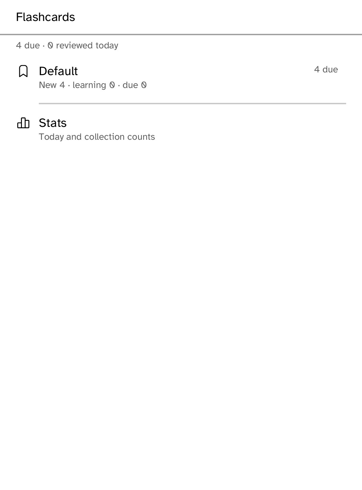

# Flashcards

An offline, e-ink card-review MVP. It persists due progress in app storage and
keeps review controls finger-sized: reveal once, then choose Again, Hard, Good,
or Easy. The screen redraws once for reveal and once for the next card.

This is an unofficial Anki-compatible direction, not an Anki product. The
requested rslib collection and host transfer integration could not be included
in this Store-only app because the binding request requires new shared host
crates and CLI commands, while this delivery forbids final changes outside the
app directory. The present MVP deliberately does not claim rslib scheduling,
APKG import, sync, or AnkiWeb support.



## Simulator

```sh
cargo run -p kobo-cli -- run --sim --app flashcards
cargo run -p kobo-cli -- drive --ideal --script apps/flashcards/drive.kobo --shots apps/flashcards/screenshots
```
