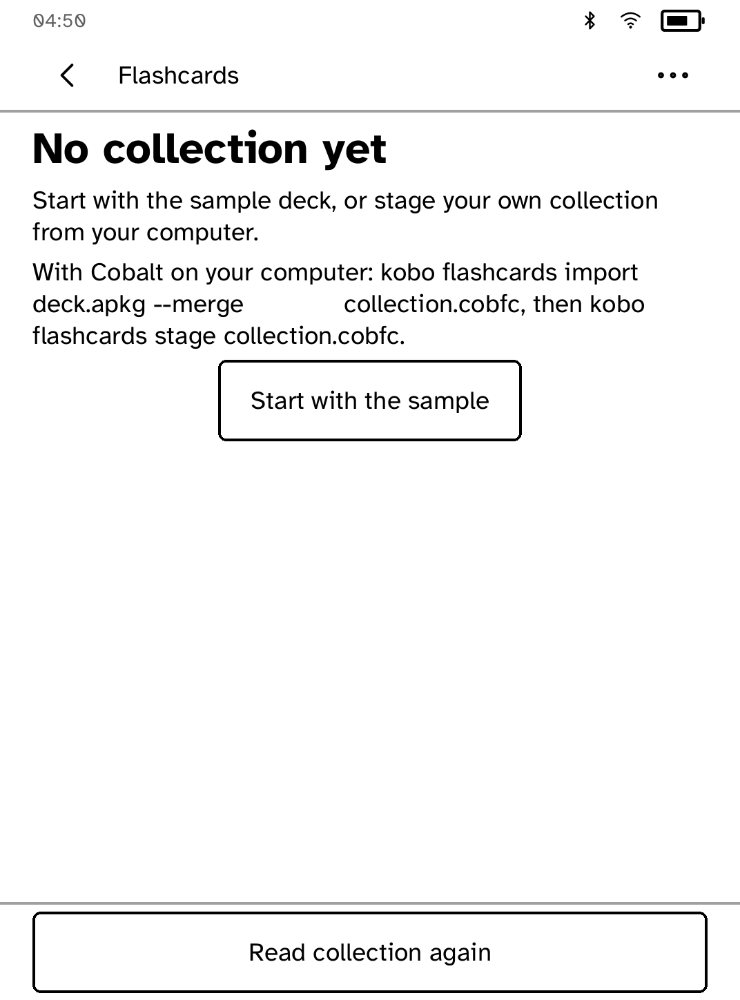
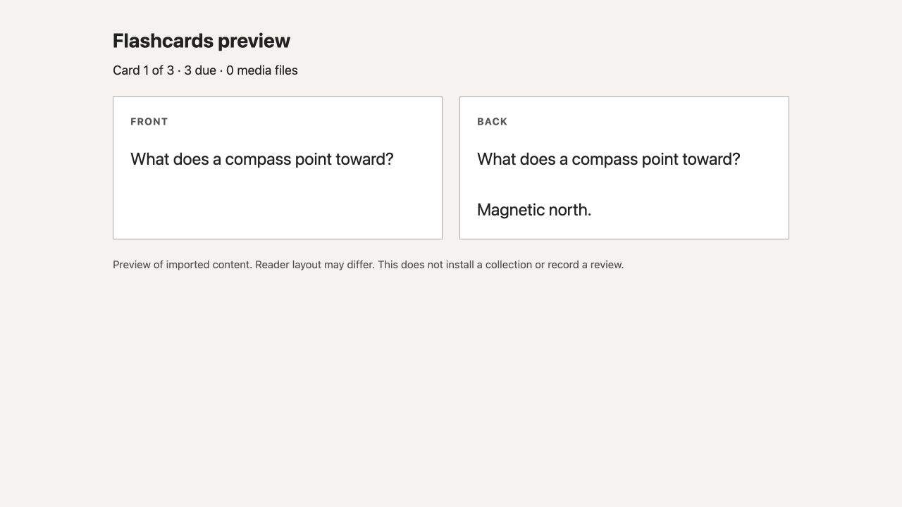

# Flashcards

Review flashcard decks on your Kobo, offline. Import Anki packages on your
computer and send them to the reader.

<table>
<tr>
<td width="50%" valign="top"><br>First launch offers a sample deck</td>
<td width="50%" valign="top"><br>A finished review</td>
</tr>
<tr>
<td width="50%" valign="top"><br>A Japanese card</td>
<td width="50%" valign="top"><br>A long answer, with controls in place</td>
</tr>
<tr>
<td width="50%" valign="top"><br>A card with an image</td>
<td width="50%" valign="top"><br>Previewing a collection on the computer</td>
</tr>
</table>

## Features

- Choose a deck with cards due, reveal each card and grade it Again, Hard,
  Good or Easy. The buttons never move.
- Long cards turn page by page without covering the controls.
- Images (PNG, JPEG and SVG converted on the computer), cloze cards and
  Japanese text.
- Audio and video attachments are listed but do not play.
- A built-in sample deck to try it without importing anything.
- Grades are kept in a review log on the reader. A card you have graded is not
  shown again after a restart.

## Importing a collection

Import runs on your computer with a separate helper, `flashcards-import`. With
the Kobo connected over USB at `MOUNT` and Flashcards closed:

```sh
kobo flashcards status                                   # check the helper
kobo flashcards formats                                  # supported package types and limits
kobo flashcards import deck.apkg --merge collection.cobfc
kobo flashcards verify collection.cobfc
kobo flashcards preview collection.cobfc --out preview.html
kobo flashcards stage collection.cobfc --kobo-root MOUNT
```

- `--replace` replaces the collection from a `.colpkg`.
- `--merge NEW.cobfc --merge-into EXISTING.cobfc` adds an `.apkg` to an
  existing collection.
- `preview` writes an HTML page showing each card's front and back, counts
  and media. It does not reproduce the reader's page layout.
- `stage` copies the collection to the reader and resumes if interrupted. The
  reader's review log is kept.

To copy the review log back to your computer:

```sh
kobo flashcards export-review-log --kobo-root MOUNT reviews.ndjson
```

Grades on the reader are not applied to Anki's scheduling.

### Installing the import helper

The helper is a separate program so the reader app contains no Anki code. Put
it next to `kobo` or on your `PATH`, or set `KOBO_FLASHCARDS_IMPORT` to its
path. To build it from source you need Rust 1.88 or newer and `protoc`:

```sh
cargo +1.88.0 build --locked --manifest-path crates/kobo-flashcards-import/Cargo.toml
```

## Limits

- Only the package formats in
  [FLASHCARDS_COMPATIBILITY.md](../../docs/FLASHCARDS_COMPATIBILITY.md) are
  supported. Modern `collection.anki21b` packages are not, whatever the file
  name.
- Collections from earlier versions of this app must be imported again.
- GIF and WebP images are not supported, and a card side may have one image.
- Template styles and scripts are not applied.

## Permissions

None. Flashcards runs offline.

## Development

```sh
cargo test -p kobo-flashcards
python3 scripts/check-apps-sim.py flashcards
```

The simulator check builds the app, opens it in a fresh simulator and plays
`drive.kobo`. `scripts/quality/check-flashcards-sim.py` produced the screenshots above, and `screenshots/states/` holds a capture of every screen state.

## Credits

The interface uses Atkinson Hyperlegible. Japanese text uses a subset of Noto CJK
under the SIL Open Font License. **Licences & about**, in the app's
menu, lists every notice. The import helper uses Anki's `rslib` under AGPL-3.0
and carries its own notices, shown by `kobo flashcards --licenses`. See
[THIRD-PARTY.md](THIRD-PARTY.md).
