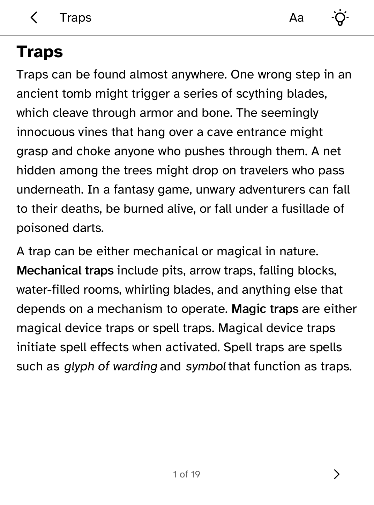
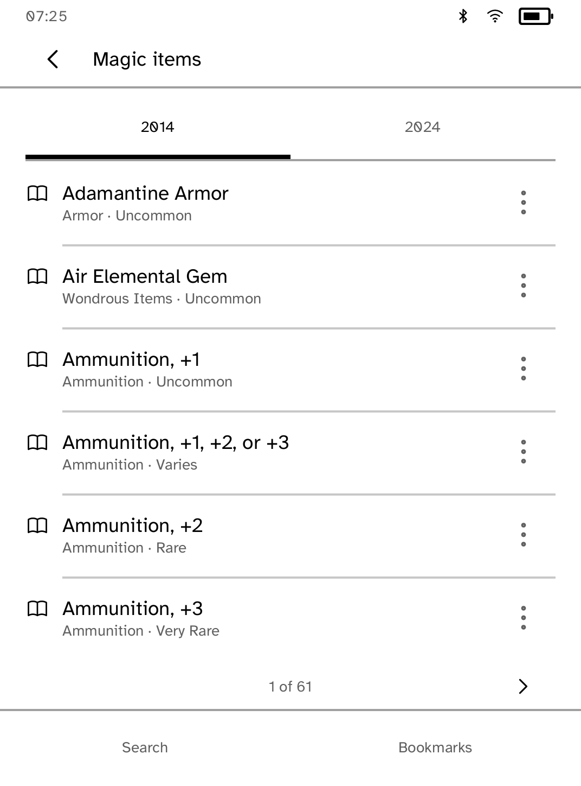

# Grimoire

An unofficial, fully offline tabletop reference compatible with the
fifth-edition SRD (5.1/5.2), published by Wizards of the Coast under CC-BY-4.0.
It is not endorsed by Wizards of the Coast. It requests **no capabilities**.

Grimoire ships a checked-in, deterministic index of 1,349 permitted SRD
records: spells, monsters, conditions, rules, rule sections and magic items.
Every one of them has a way in from the home screen, and About counts what
this build holds rather than claiming it. The Kobo never requests a network capability. `tools/build_corpus.py`
builds the index only from the reviewed snapshots in `data/source/`; it does
not fetch at build time. Prefix search, edition selection, bookmarks,
initiative state and party HP persist in the app store.

The 2014 source covers all six indexed record types. The 2024 snapshot
currently has conditions, monsters and magic items; the 5e-bits repository
does not publish its 2024 spells or rule sections. They are not fabricated or
silently substituted. See `data/SOURCES.md` for the source ledger and the
release blocker.

This work includes material taken from the System Reference Document 5.1 and System Reference Document 5.2 by Wizards of the Coast LLC, available under the Creative Commons Attribution 4.0 International License.

## At the table

Spells can be narrowed by class, level, school, ritual, and concentration.
Monster lookup narrows by CR range and type. Both filters operate only on tags
present in the checked-in SRD corpus; unavailable 2024 records remain absent.
Prefix search and the edition switch remain available from each compendium.

References open in the shared document reader, so a stat block keeps its named
abilities and a rule section its headings, and the twenty pages of the longest
one can be read to the last word. A table in the source is written out one row
at a time, labelled by its headings: columns cannot hold their text at the
larger interface sizes, and there is nothing smaller to fall back on.

Initiative starts empty and accepts typed names and values or a monster from
its own reference. It sorts combatants, keeps the active turn through re-sorts,
and persists the round and the order. A turn passed by accident is taken back
with Previous, which takes the round with it rather than leaving the count a
round ahead. Tapping a combatant opens their own screen, where the turn can be
handed to them, their roll corrected, or they can be removed.

Party holds up to six independent members. A member's health, death saves and
nine spell slots are two pages: what a turn asks for, and what the end of a
long rest asks for. Six members and six combatants are each measured for the
panel, so nobody falls off the foot of a list at the larger text sizes. All
table state saves locally after each change and is there after a restart.
