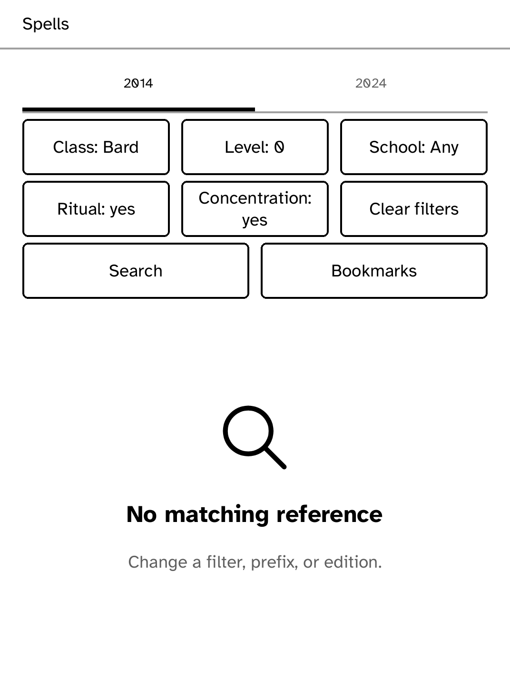
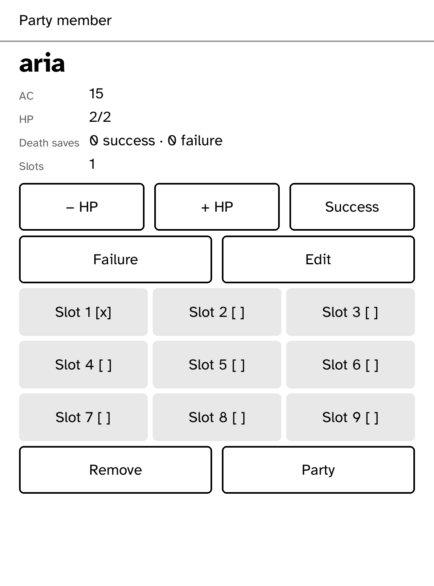

# Grimoire

An unofficial, fully offline tabletop reference compatible with the
fifth-edition SRD (5.1/5.2), published by Wizards of the Coast under CC-BY-4.0.
It is not endorsed by Wizards of the Coast. It requests **no capabilities**.

Grimoire ships a checked-in, deterministic 1.32 MiB index of 1,349 permitted
SRD records: spells, monsters, conditions, rules, rule sections and magic
items. The Kobo never requests a network capability. `tools/build_corpus.py`
builds the index only from the reviewed snapshots in `data/source/`; it does
not fetch at build time. Prefix search, edition selection, bookmarks,
initiative state and party HP persist in the app store.

The 2014 source covers all six indexed record types. The 2024 snapshot
currently has conditions, monsters and magic items; the 5e-bits repository
does not publish its 2024 spells or rule sections. They are not fabricated or
silently substituted. See `data/SOURCES.md` for the source ledger and the
release blocker.

This work includes material taken from the System Reference Document 5.1 and System Reference Document 5.2 by Wizards of the Coast LLC, available under the Creative Commons Attribution 4.0 International License.

## At the table

Spells can be narrowed by class, level, school, ritual, and concentration.
Monster lookup narrows by CR range and type. Both filters operate only on tags
present in the checked-in SRD corpus; unavailable 2024 records remain absent.
Prefix search and the edition switch remain available from each compendium.

Initiative starts empty and accepts manual names and values or a monster from a
stat block. It sorts combatants, keeps the active turn through re-sorts, and
persists the round and order. Party holds up to six independent members. Each
member has AC, maximum/current HP, individual HP controls, death-save pips, and
nine selectable spell slots. All table state saves locally after each change.
