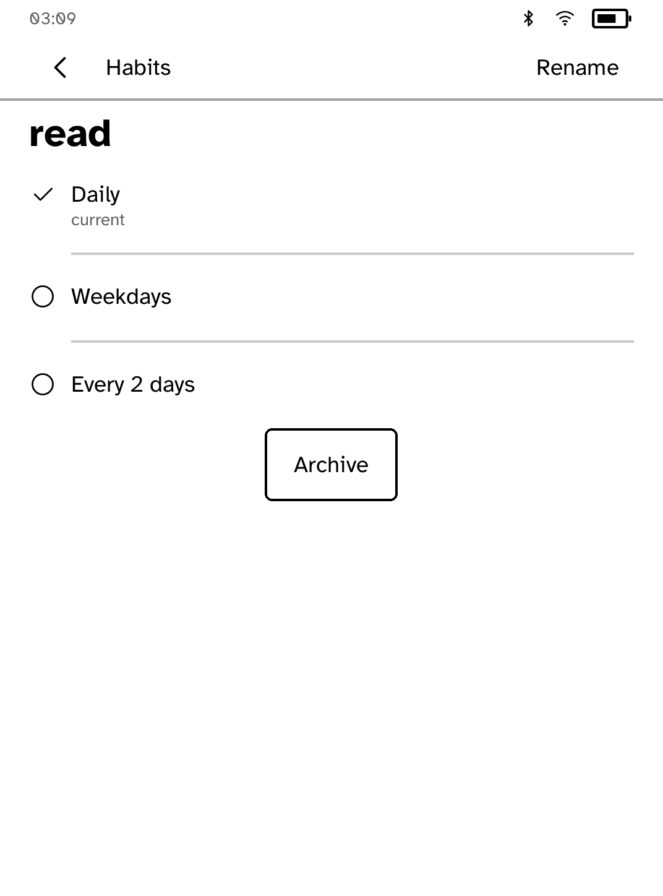
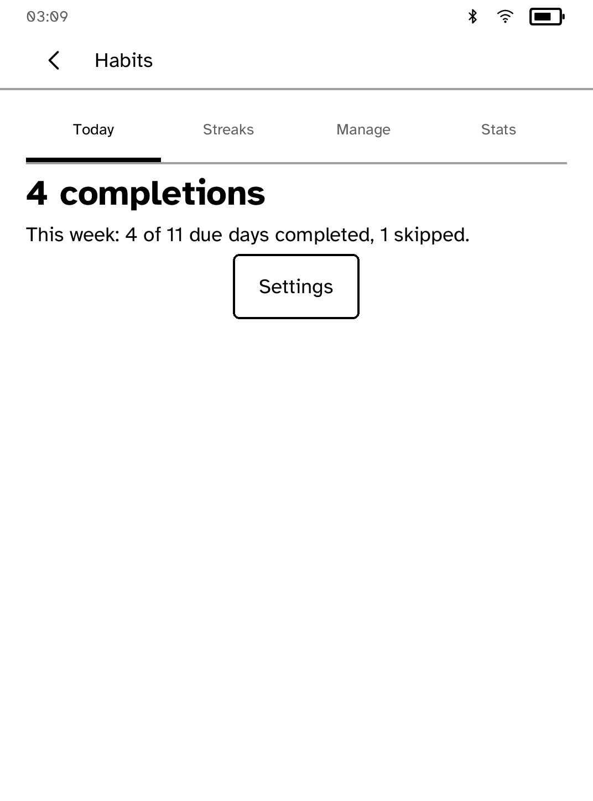
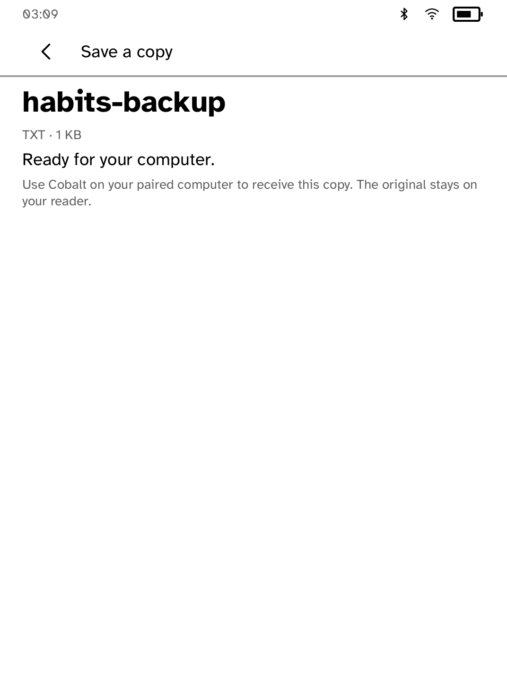

# Habits

An offline habit tracker with daily and weekday schedules and streaks.

<table>
<tr>
<td width="50%" valign="top"><br>Today, before any habits are added</td>
<td width="50%" valign="top"><br>A habit checked off for the day</td>
</tr>
<tr>
<td width="50%" valign="top"><br>Editing a habit's name and schedule</td>
<td width="50%" valign="top"><br>This week's completions on Stats</td>
</tr>
<tr>
<td width="50%" valign="top"><br>A backup ready for a paired computer</td>
</tr>
</table>

## Features

- Daily and weekday habits, with streaks and weekly statistics.
- Habits and completions stay on the reader. There is no account and nothing
  is uploaded.
- **Backup** exports a verified text copy for a paired computer.
- **Import** reads a backup from the shelf. **Replace** removes the habits on
  this reader first. **Merge** keeps them and adds days from the backup when a
  habit's name matches. Nothing changes until you confirm.

## Permissions

None. Habits runs offline.

## Development

```sh
cargo test -p kobo-habits
python3 scripts/check-apps-sim.py habits
```

The simulator check builds the app, opens it in a fresh simulator and plays
`drive.kobo`. The screenshots above come from `scripts/quality/check-habits-sim.py`.
