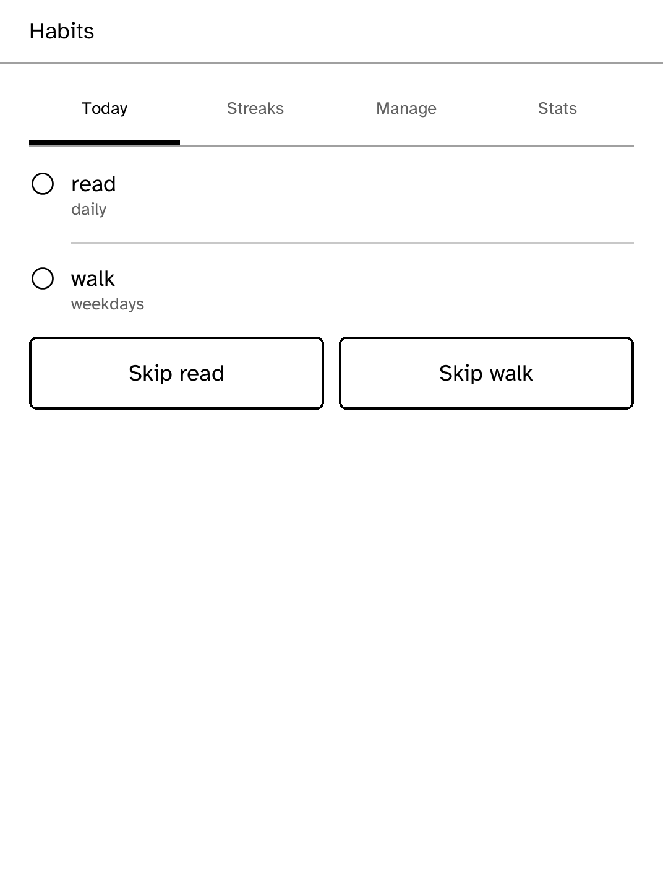

# Habits

A habit tracker whose streak wall can be the reader's sleep screen. Standalone
mode is fully offline and stores habits locally. Habitica mode is an unofficial
client: it uses `x-api-key` through the runtime secret named `habitica` and
sends `X-Client` on its task fetches. Set it with:

```sh
kobo secret set habitica --device <address>
```

No Habitica artwork or other HabitRPG-designed assets are included. Those assets
are CC-BY-NC-SA 3.0; this app uses its own typographic interface.



## Repaint policy

Tapping a habit repaints that row once for its checked state. A sync changes the
screen once when it resolves; empty polls do not repaint. The `sleep-screen`
capability is declared for the nightly streak wall, pending the SDK public call.
