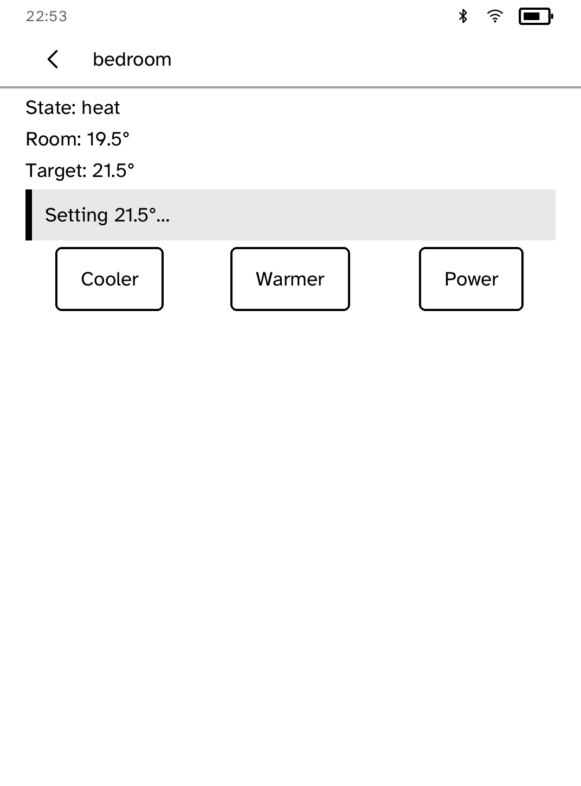
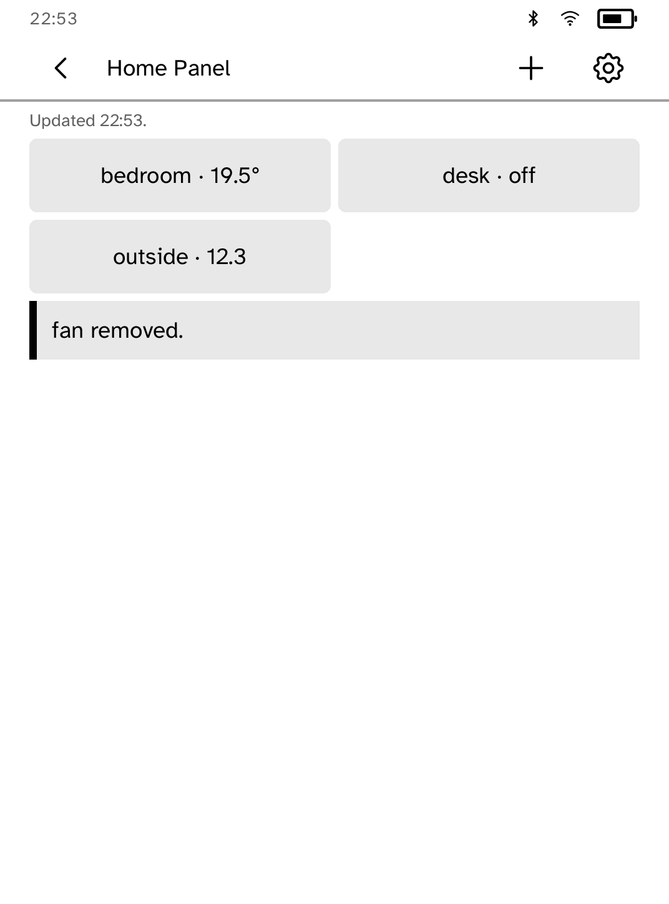
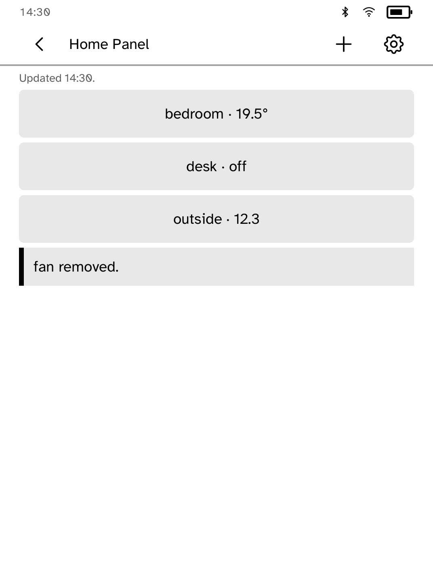

# Home Panel

Home Assistant controls on a Kobo, for a desk or a wall.

<table>
<tr>
<td width="50%" valign="top"><br>The tile grid</td>
<td width="50%" valign="top"><br>Climate controls</td>
</tr>
<tr>
<td width="50%" valign="top"><br>Editing tiles</td>
<td width="50%" valign="top"><br>The one-column wall layout</td>
</tr>
<tr>
<td width="50%" valign="top"><br>Connecting to Home Assistant</td>
</tr>
</table>

## Features

- Up to twelve tiles, refreshed every ten seconds while the app is open.
- Add tiles by browsing or searching devices by name, or by typing an entity
  ID.
- Lights, switches, scenes, scripts, automations and buttons act on a tap.
  Sensors and other entities open a detail screen.
- Climate tiles show room and target temperature, adjust the target in
  half-degree steps and switch the unit on or off.
- Each action shows a confirmation until the next one. Failures name the cause
  and the fix.
- If Home Assistant stops responding, the last readings stay on screen with
  the time of the last successful refresh.
- **Settings** removes and reorders tiles, and switches to a one-column layout
  for a wall-mounted reader.

## Setup

1. Enter your Home Assistant address in the app. It must use HTTPS: Nabu
   Casa, a reverse proxy with a real certificate, or a private certificate
   authority whose root you install with
   `kobo trust set homeassistant --from ROOT.pem --device <ip>`.
2. In Home Assistant, create a long-lived access token and install it on the
   reader:

   ```sh
   kobo secret set homeassistant --from TOKEN_FILE --device <ip>
   ```

The token never appears in a URL, request body, log or the app's storage.

## Permissions

- `network`: talks to your Home Assistant server.

## Development

```sh
cargo test -p kobo-homepanel
python3 scripts/check-apps-sim.py homepanel
```

The simulator check builds the app, opens it in a fresh simulator and plays
`drive.kobo`.

## Credits

Home Panel is an unofficial client, not affiliated with Home Assistant or
Nabu Casa.
