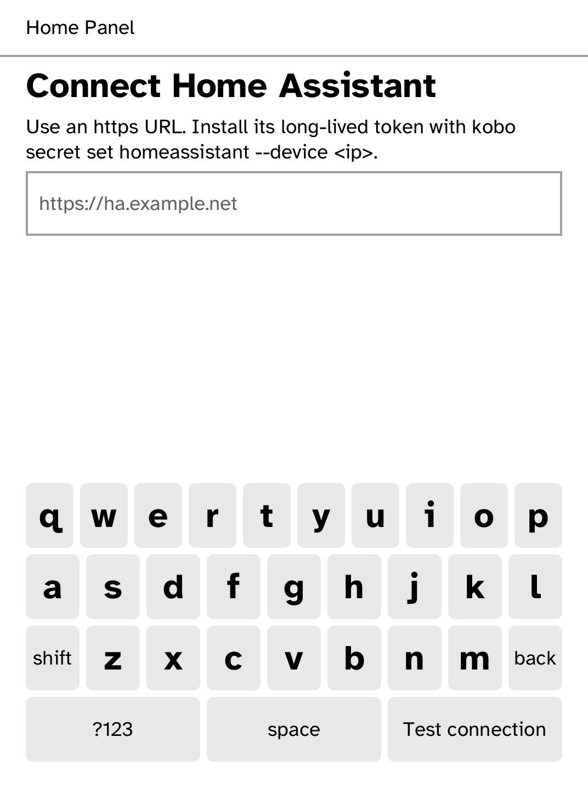

# Home Panel

Tiles for a Home Assistant installation, on a panel that costs nothing to
keep showing them. This is a client for Home Assistant; it is not affiliated
with Nabu Casa.

Set the URL once, then install the long-lived access token outside the app:

```sh
kobo secret set homeassistant --device <ip>
```

The URL must be HTTPS. Use Nabu Casa, a reverse proxy with a real
certificate, or install a private CA with `kobo trust set homeassistant
--device <ip>`. Home Panel posts one compact Jinja template per poll and
never puts the token in its URL, body, log, or local store. It keeps tile IDs
and the last visible grid locally; an unavailable server leaves the grid
readable and says how to recover.

Wall-panel mode, entity browsing, climate detail controls, and automatic
background polling remain follow-up work. The MVP supports stored tiles,
template polling, light/switch/service toggles, explicit setup validation,
and offline recovery.


