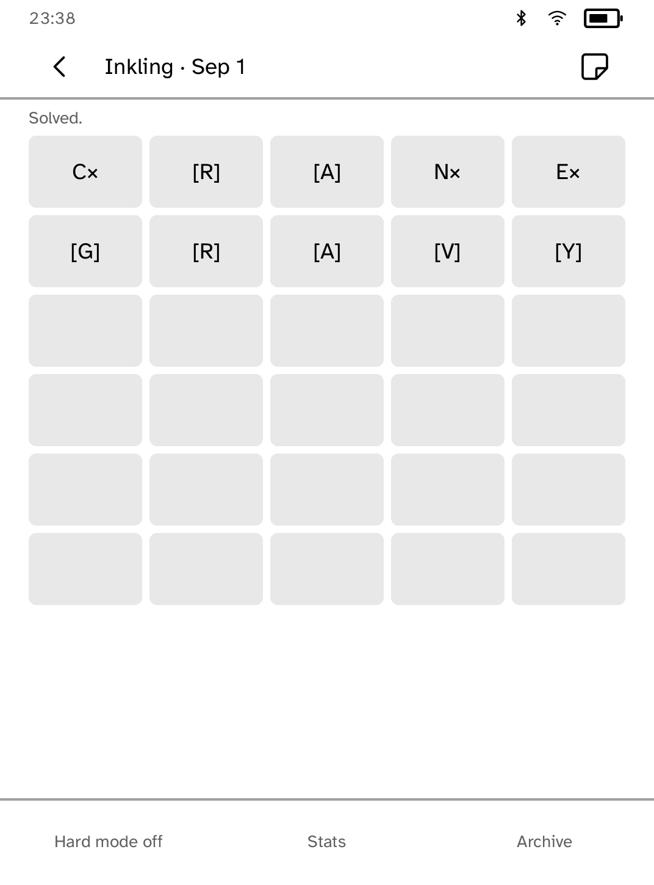
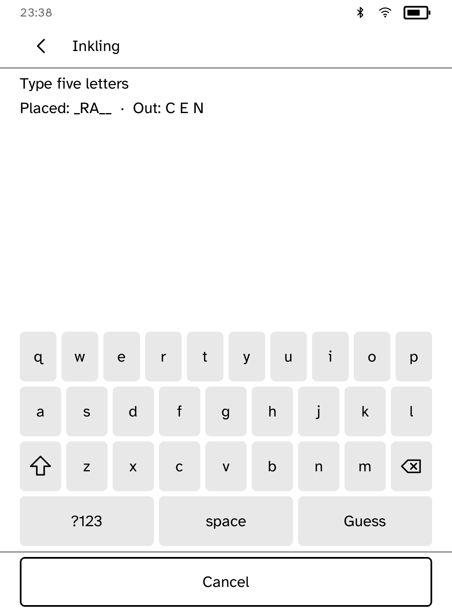
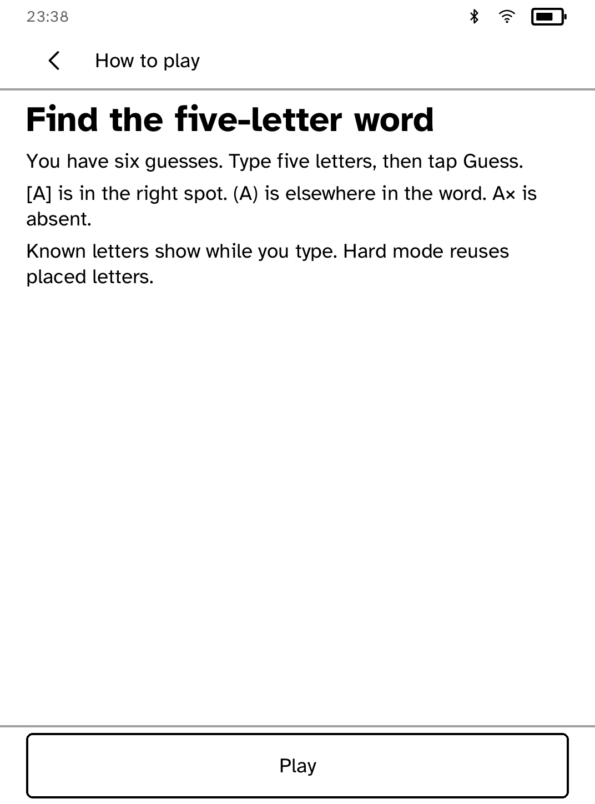

# Inkling

A five-letter word puzzle, new each day, that works offline.

<table>
<tr>
<td width="50%" valign="top"><br>A solved puzzle</td>
<td width="50%" valign="top"><br>Known letters shown while typing</td>
</tr>
<tr>
<td width="50%" valign="top"><br>Statistics and win distribution</td>
<td width="50%" valign="top"><br>The archive of past days</td>
</tr>
<tr>
<td width="50%" valign="top"><br>How to play</td>
</tr>
</table>

## Features

- Six guesses, with correct scoring for repeated letters and an optional hard
  mode.
- Letter states are shown in grayscale and always in uppercase: `[L]` is in
  the right place, `(L)` is elsewhere in the word, and `L×` is not in it.
- While you type, the letters your earlier guesses have already proven are
  listed.
- Saved daily progress, played and won totals, and a win distribution by
  number of guesses.
- **Export results** saves the day's board and statistics as
  `export-result.txt`, ready to fetch from a computer.
- The archive plays any of the past 365 days. Archive games do not count
  towards statistics and are not saved.

## How the daily word is chosen

The answer is picked from a hash of the UTC date, so every reader gets the
same puzzle each day without a server. The title shows the real date. For
simulator recordings, `KOBO_INKLING_DAY=YYYY-MM-DD` pins the day.

The word lists are hand-checked common English: 870 possible answers and
about 1,900 further accepted guesses. No commercial game's list is used.

## Permissions

None. Inkling runs offline.

## Development

```sh
cargo test -p kobo-inkling
python3 scripts/check-apps-sim.py inkling
```

The simulator check builds the app, opens it in a fresh simulator and plays
`drive.kobo`.
