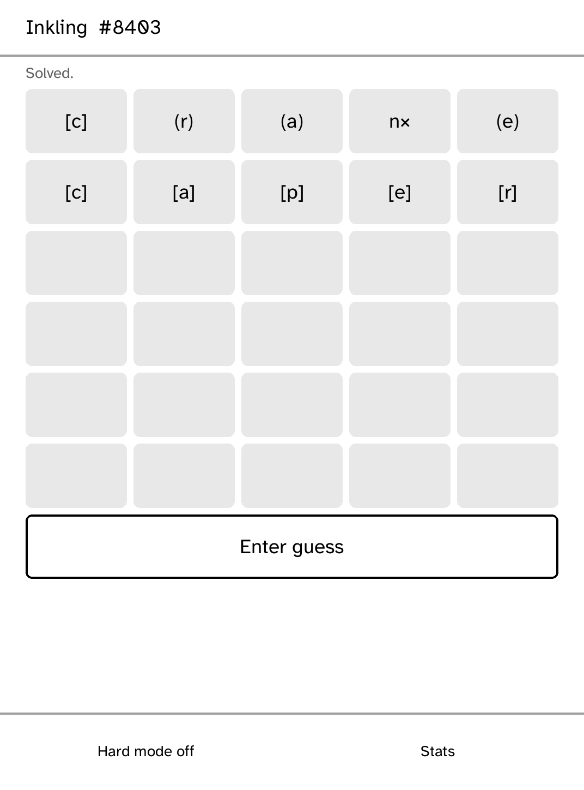

# Inkling

An offline daily five-letter puzzle. The answer is `answers[djb2(YYYY-MM-DD ++ salt) % len]`, so
one shipped build produces the same daily game everywhere without a network service. Shape states
are grayscale-first: `[letter]` is placed, `(letter)` is present, and `letter×` is absent.

The compact MVP includes six guesses, duplicate-correct scoring, hard-mode placed-letter checks,
and a stats summary. It ships a deliberately small common-word seed list rather than any copied
commercial answer list. No trademarked game name or source list is used. A production word asset
will retain public-domain ENABLE provenance and an explicit exclusion list.

## Capabilities

None. Inkling is offline forever.
