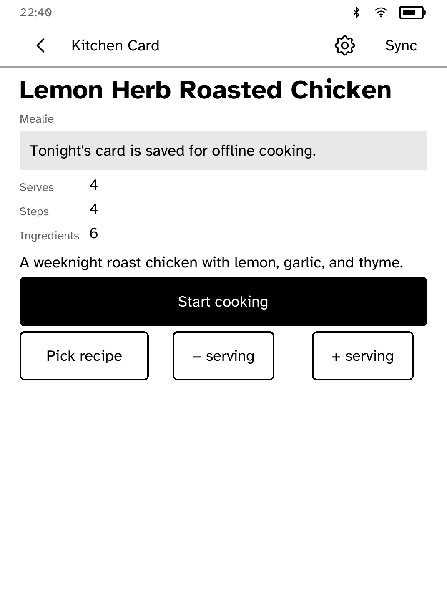
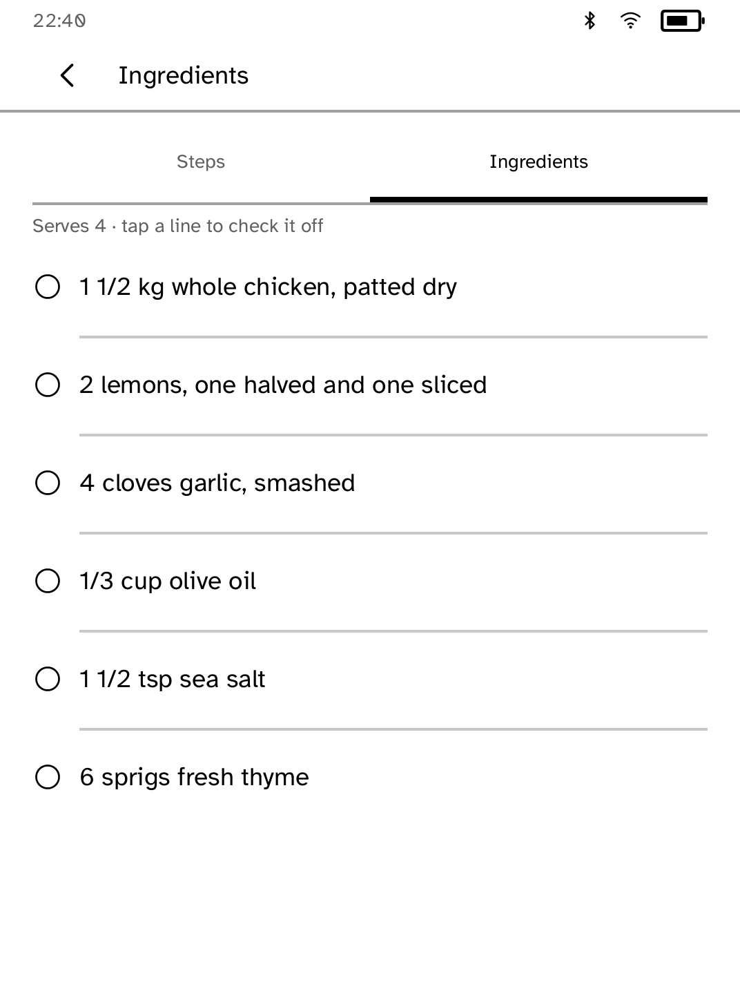
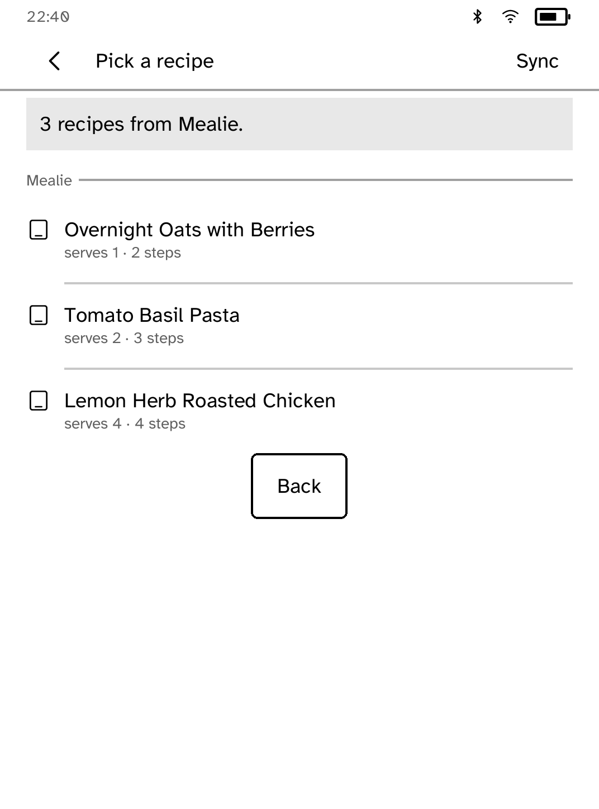

# Kitchen Card

A read-only [Mealie](https://mealie.io/) companion for cooking one step at a
time.

<table>
<tr>
<td width="50%" valign="top"><br>Tonight's recipe card</td>
<td width="50%" valign="top"><br>Cooking, one step at a time</td>
</tr>
<tr>
<td width="50%" valign="top"><br>Ingredients, one tap away</td>
<td width="50%" valign="top"><br>Every synced recipe, available offline</td>
</tr>
</table>

## Features

- Pick tonight's recipe and cook one large instruction at a time.
- Tap the left or right side of the screen to move between steps. The
  Ingredients tab is always one tap away.
- The chosen recipe and servings stay available offline.
- Read-only. Kitchen Card does not edit recipes, meal plans or shopping lists.

## Setup

1. In Mealie, create a long-lived API token.
2. Install it on the reader under the secret name `mealie`, with your Mealie
   server's address:

   ```sh
   kobo secret set mealie
   ```

The runtime attaches the token to requests itself, so the app never sees it.

## Permissions

- `network`: reads recipes from your Mealie server.
- `keep-awake`: keeps the screen on while you cook.

## Development

```sh
cargo test -p kobo-kitchencard
python3 scripts/check-apps-sim.py kitchencard
```

The simulator check builds the app, opens it in a fresh simulator and plays
`drive.kobo`.

## Credits

Kitchen Card is an unofficial client and is not affiliated with Mealie.
Mealie is licensed under AGPL-3.0. See [THIRD-PARTY.md](THIRD-PARTY.md).
