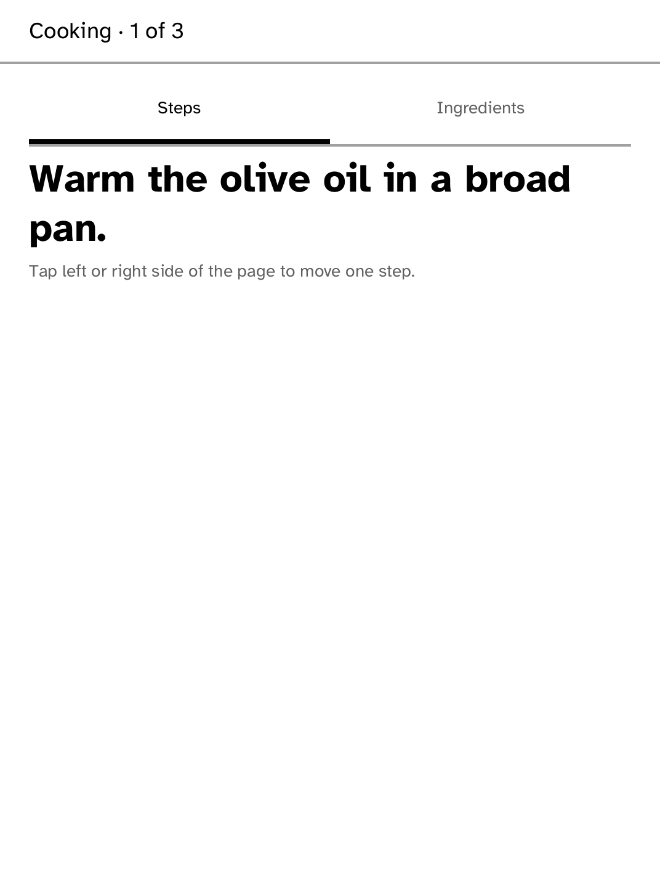

# Kitchen Card



Kitchen Card is an unofficial, read-only Mealie companion. Pick tonight's
recipe, then cook one large instruction at a time; the left and right page
zones move through steps and the Ingredients tab stays one tap away. The
selected card and servings survive offline use.

Set the Mealie LAN endpoint and its long-lived API token outside the app:

```sh
kobo secret set mealie
```

The app asks the runtime to attach that token as an `Authorization` header, so
it is never in app-visible state. Mealie is AGPL-3.0. This app is unofficial
and does not edit recipes, meal plans, or shopping lists.

`drive.kobo` opens a recipe, starts cooking, and captures the product screen.
