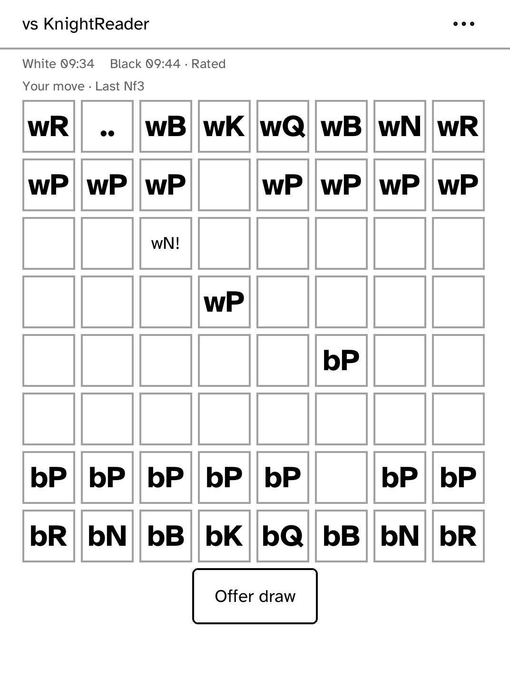
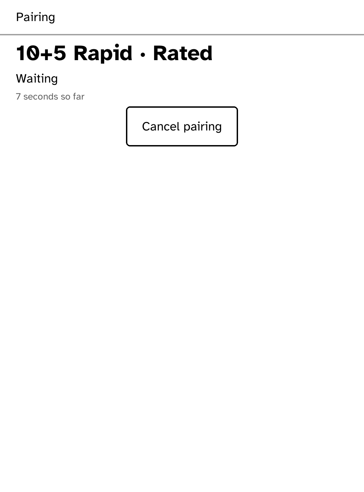
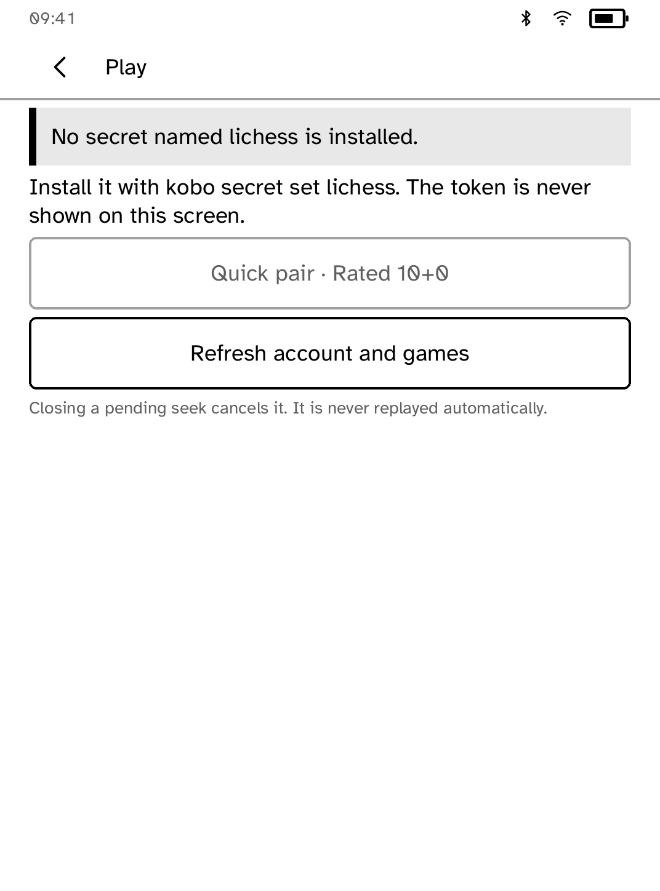
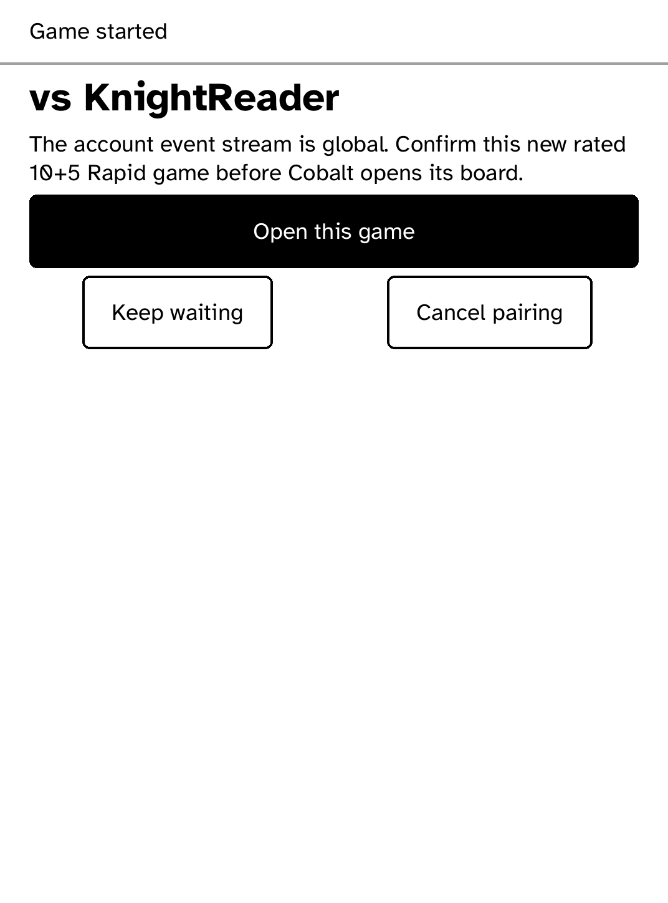

# Lichess

An unofficial, touch-first Lichess Board API client for Cobalt. It supports
rated 10+0 Rapid quick pairing, incoming standard-clock challenges, live
games, legal move entry, promotion, clocks, reconnect, draw actions, resign,
conservative abort, and opponent-gone victory claims.

| Live board | Correct seek lifecycle | Credential guidance |
| --- | --- | --- |
|  |  |  |

Account-global starts are confirmed explicitly before opening:


## Requirements

- Cobalt **0.3.4 or newer**, speaking protocol **11**. Cobalt 0.3.3 also
  speaks protocol 11, but does not provide the runtime-owned pull stream and
  cancellable seek behavior this app requires.
- A Lichess Personal Access Token with the `board:play` scope.
- Install the token under the exact secret name `lichess`:

  ```sh
  kobo secret set lichess --from <token-file> --device <address>
  ```

The application sends only the secret name. Cobalt resolves the value inside
the runtime and binds it to the exact HTTPS `lichess.org` Board API routes used
by the app. The token is never returned to the process, shown in UI, written to
state, or included in logs. Redirects carrying the token are denied, and POST
requests are never replayed.

Only the official Lichess origin is supported. This release deliberately does
not accept a custom server URL because Cobalt has no owner-scoped,
app-specific origin policy that could broaden the destination without also
broadening credential authority.

## Supported

- Account validation and clear missing/invalid/expired-token guidance
- Event stream opened before a single cancellable 10+0 seek; account-global
  game starts require on-device confirmation before that seek is closed
- `gameStart`, `gameFinish`, and incoming challenge events
- Board stream reconstruction from server-acknowledged UCI moves
- White/black orientation, castling, en passant, and four promotion choices
- Last move, check, result, turn, server clocks, and opponent-gone countdown
- Move, resign, abort during Lichess's first-two-ply window, draw offer/accept/decline, and
  claim-victory requests
- Restart/reconnect using only game ID, color, opponent label, rated flag, and
  a bounded server retry deadline
- Anonymous offline puzzle batches; local solves do not affect Lichess rating

## Deliberate boundaries

- No chat is requested, rendered, or persisted.
- Takeback controls are not offered. A takeback made elsewhere causes an
  authoritative stream reopen instead of guessing at local history.
- Only standard chess clock challenges are accepted.
- Abort is shown only before both players have moved; Lichess still makes the
  final API decision.
- No custom Lichess-compatible base URL is accepted.

## Validate

```sh
cargo test -p kobo-lichess
cargo test -p kobo-net --test lichess_stream_mock -- --test-threads=1
cargo run --locked -p kobo-cli -- app-check --registry apps/catalog.json \
  --package kobo-lichess
```

The HTTPS mock uses a generated test-only CA/key pair under
`crates/kobo-net/tests/fixtures`; it carries no owner credential and never
contacts Lichess.
