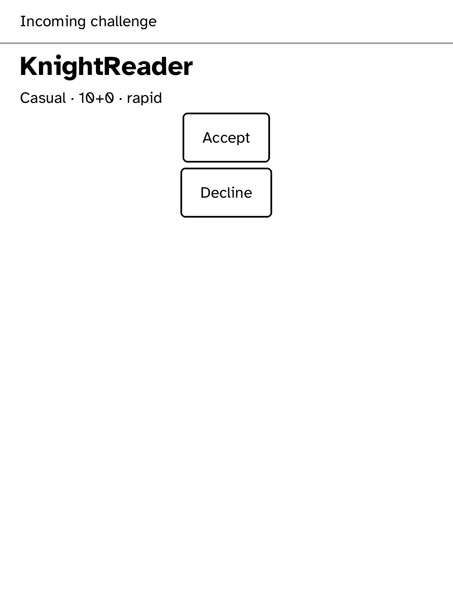
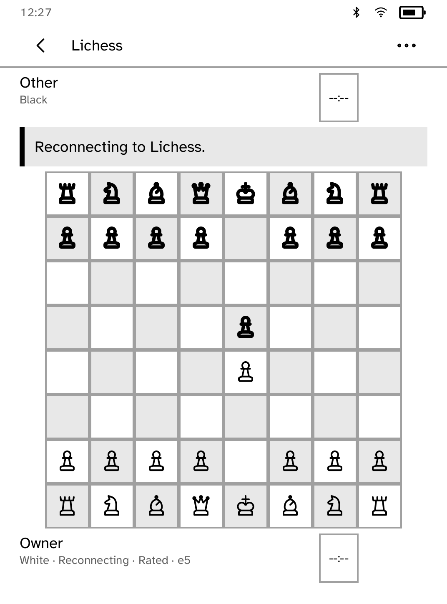

# Lichess

Play [Lichess](https://lichess.org/) on your Kobo, or play the computer
offline.

<table>
<tr>
<td width="50%" valign="top"><br>Time controls and puzzles</td>
<td width="50%" valign="top"><br>A live game</td>
</tr>
<tr>
<td width="50%" valign="top"><br>Offline play, with legal moves marked</td>
<td width="50%" valign="top"><br>Looking for a rated opponent</td>
</tr>
<tr>
<td width="50%" valign="top"><br>An incoming challenge</td>
<td width="50%" valign="top"><br>Reconnecting after the connection drops</td>
</tr>
</table>

## Features

- Rated games with a random colour at 10+0, 10+5, 15+10, 30+0 and 30+20.
- Casual challenges to a player by username, with time control and side.
- Accept or decline incoming challenges with standard clocks.
- Offline play against the computer, with no account needed. An unfinished
  game resumes from the home screen.
- Offline puzzles. Solving them does not affect your Lichess rating.
- Two-tap moves, castling, en passant and promotion. The board turns to your
  side.
- Clocks above and below the board. The filled clock shows whose turn it is.
- Offer, accept and decline draws, resign, claim victory when the opponent
  leaves, and abort before both players have moved.
- If a game starts without the reader being told, the app finds it within ten
  seconds. A seek is never sent twice.
- If the connection drops, the last confirmed position stays on screen, clocks
  show `--:--`, and moves are paused until the board reconnects.
- After a restart, **Resume current** reopens the game from Lichess without
  guessing the position.

## Setup

1. Create a Lichess
   [personal access token](https://lichess.org/account/oauth/token/create?scopes[]=board:play&description=Cobalt)
   with only the `board:play` scope.
2. Save it to a file and install it under the secret name `lichess`:

   ```sh
   kobo secret set lichess --from <token-file> --device <address>
   ```

The runtime keeps the token and attaches it only to the official Lichess Board
API over HTTPS. The app never sees it, and it is never shown, saved by the app
or logged.

Cobalt 0.3.18 or newer is required.

## Limits

- No chat.
- No takebacks. A takeback made elsewhere reloads the game from Lichess.
- Outgoing challenges are casual. Only standard clocks are accepted.
- Only lichess.org is supported, not other servers.
- The offline computer is modest: it searches four moves ahead.

## Permissions

- `network`: talks to the Lichess Board API.
- `hold-wifi`: keeps Wi-Fi connected during a game.
- `keep-awake`: keeps the screen on during a game.

## Development

```sh
cargo test -p kobo-lichess
cargo test -p kobo-net --test lichess_stream_mock -- --test-threads=1
python3 scripts/check-apps-sim.py lichess
```

The stream test uses a local HTTPS mock with a test-only certificate and
never contacts Lichess. Longer simulator checks, each taking `--output DIR`:

| Script | Covers |
| --- | --- |
| `scripts/quality/check-lichess-computer-sim.py` | Offline play, resuming and resigning |
| `scripts/quality/check-lichess-session-sim.py` | Pairing, moves, restart and draws against a local server. Add `--drop-start-event` or `--disconnect-board` for recovery cases, and `--scale 170` for large text |
| `scripts/quality/check-lichess-pairing-sim.py` | Pairing screens. Add `--scenario pairing-error` for failures |

## Credits

This is an unofficial client, not affiliated with Lichess.
