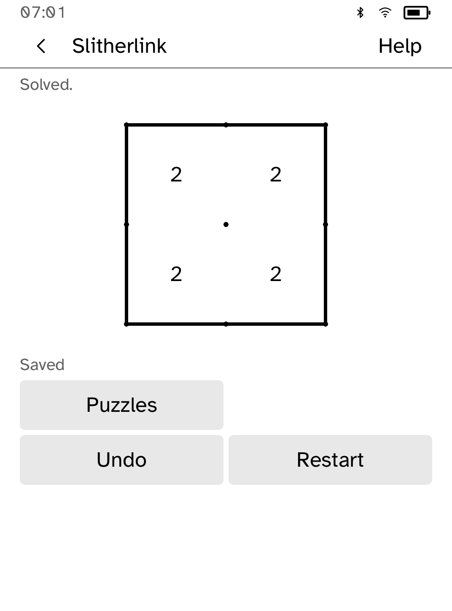
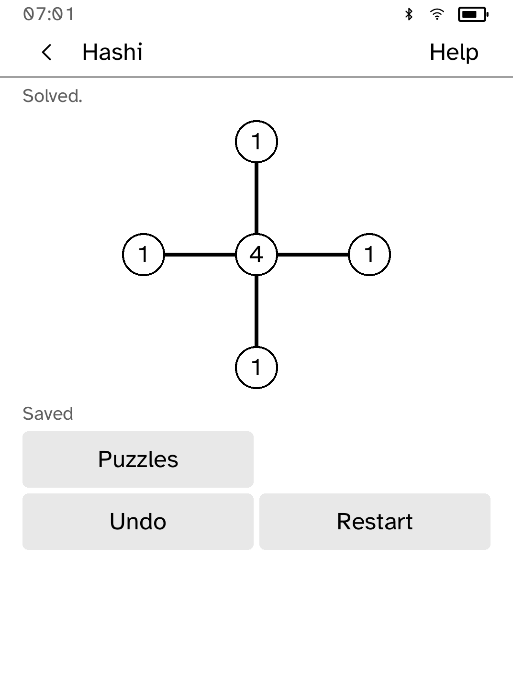
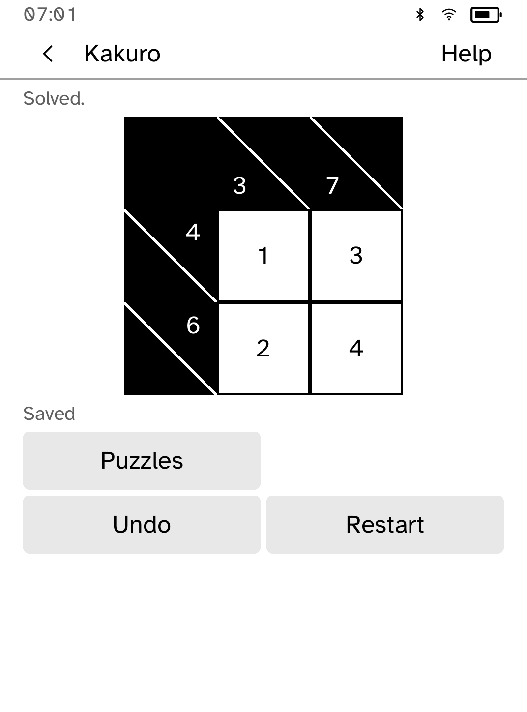

# Logic Pack

Twenty original offline puzzles: five each of Slitherlink, Hashi, Kakuro and
Minesweeper.

<table>
<tr>
<td width="50%" valign="top"><br>The puzzle picker</td>
<td width="50%" valign="top"><br>Slitherlink</td>
</tr>
<tr>
<td width="50%" valign="top"><br>Hashi, with single and double bridges</td>
<td width="50%" valign="top"><br>Kakuro</td>
</tr>
<tr>
<td width="50%" valign="top"><br>Entering a Kakuro digit, with both sums shown</td>
<td width="50%" valign="top"><br>Minesweeper</td>
</tr>
</table>

## Puzzles

- **Slitherlink**: 2×2 to 4×4 cells, including loops with omitted clues.
- **Hashi**: five to sixteen islands, with single and double bridges.
- **Kakuro**: irregular cross-sums and longer runs.
- **Minesweeper**: 4×4 to 7×7. The first reveal is always safe. Some fields
  need a guess.

Each game has Starter, Easy and Medium puzzles. Starter teaches the rules.
Difficulty is an editorial guide based on size and clue structure. Open
**Help**, then **Difficulty**, for the selected puzzle's guide.

## Features

- The picker shows each puzzle's difficulty and whether it is new, in progress
  or completed.
- Each puzzle keeps its own progress and up to 32 undo steps, which survive
  reopening.
- **Check** judges your marks without revealing the answer.
- In Kakuro, tapping a square opens a digit chooser that shows its row, column
  and both sums.
- **Restart** asks first, leaves other puzzles alone and can be undone.
- Progress shows **Saving…** until storage confirms it. If a save fails, keep
  the app open and choose **Retry save**.

## How the puzzles are made

The collection is generated from original definitions and fixed seeds. A
constraint solver confirms that every Slitherlink, Hashi and Kakuro puzzle has
exactly one solution, and separate rule checks verify the bundled answers. To
rebuild and verify the collection:

```sh
python3 scripts/quality/make-logicpack-collection.py --check
```

## Permissions

None. Logic Pack runs offline.

## Development

```sh
cargo test -p kobo-logicpack
python3 scripts/check-apps-sim.py logicpack
```

The simulator check builds the app, opens it in a fresh simulator and plays
`drive.kobo`. `scripts/quality/check-logicpack-sim.py --output /tmp/logicpack-check` also completes and reopens all twenty puzzles and checks saving and recovery.
