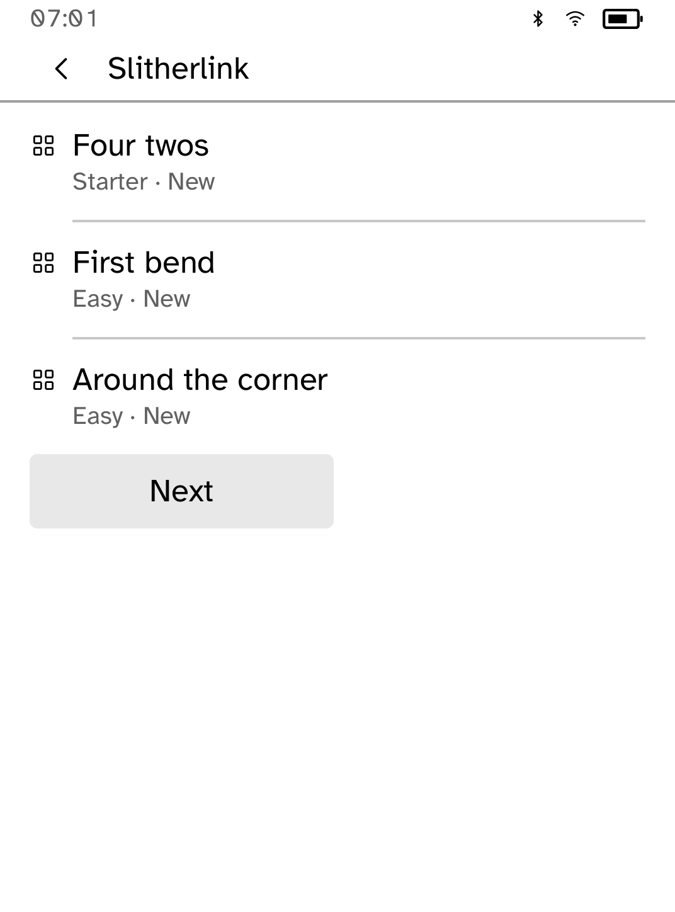
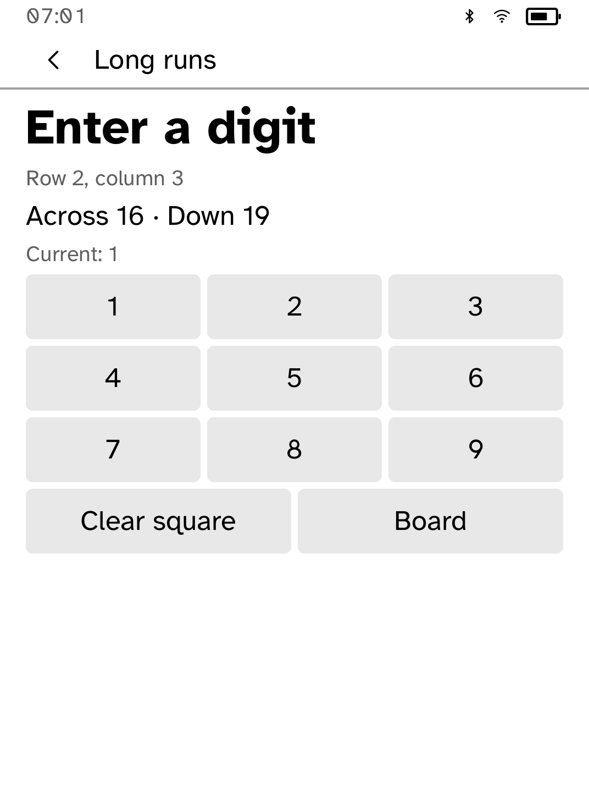
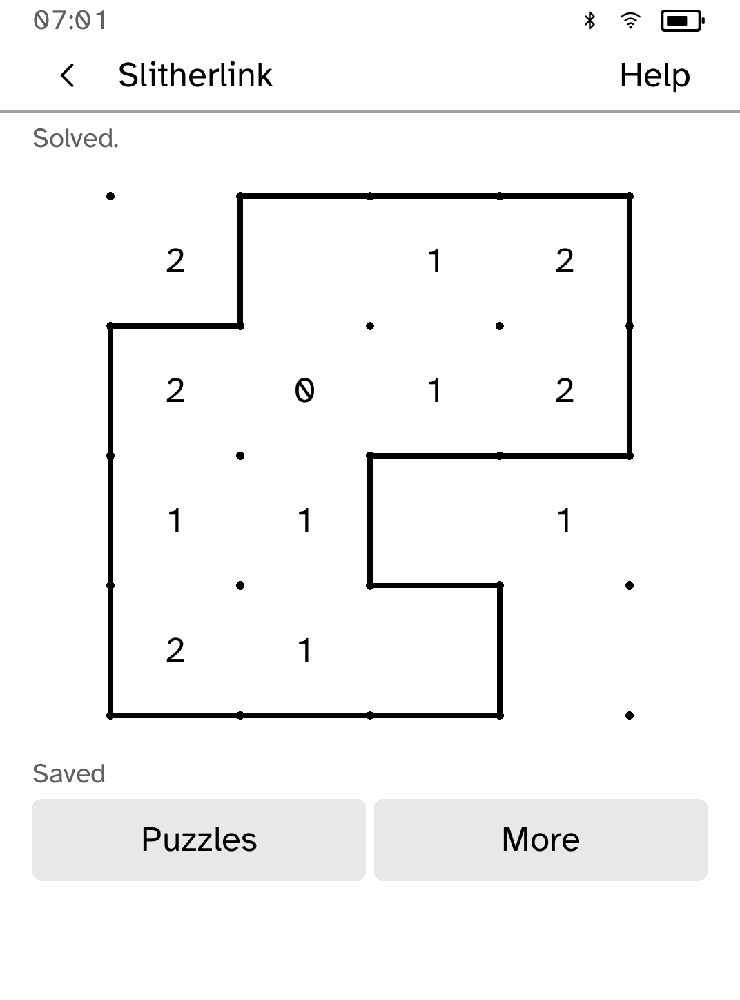

# Logic Pack

Twenty original offline puzzles: five each of Slitherlink, Hashi, Kakuro and
Minesweeper. Choose a game, then a puzzle. The picker shows difficulty and
whether a puzzle is new, in progress or completed. Each puzzle keeps its own
progress and up to 32 undo steps.



Slitherlink grows from 2 × 2 to 4 × 4 cells, including loops with omitted clues.
Hashi grows from five to sixteen islands, with single and double bridges.
Kakuro includes irregular cross-sums and longer runs. Minefields grow from
4 × 4 to 7 × 7. Starter introduces the rules; Easy and Medium are editorial
guides based on size and clue structure. Open Help, then Difficulty for the
selected puzzle’s guide. Minefields may require a guess; the first reveal is safe.

The collection is generated entirely from original definitions and fixed seeds.
A complete constraint solver checks uniqueness for every loop, bridge and
cross-sum puzzle. Separate Rust rule checks verify the bundled answers. Reproduce
and verify the collection from the repository root:

```sh
python3 scripts/quality/make-logicpack-collection.py --check
```

Kakuro opens a digit chooser when you tap an editable square. It shows the square’s
row, column, current value, and across/down sums. Choose 1–9 or Clear square;
printed digits stay fixed. Check judges the current marks without revealing the
answer. More holds undo, restart and the rules. Restart asks first, preserves
other puzzles, and can itself be undone.




Undo includes checks, flags, flood reveals and first-mine relocation, and survives
reopening. Progress shows Saving… until storage confirms it. An older write cannot
mark newer moves saved. If saving fails, keep the app open and choose Retry save;
your latest moves remain in memory. Unreadable or future-version records stay
untouched. Both the original single-game format and the four-game format migrate
without rewriting the old file until the next edit; earlier undo history is retained.

The app opens in portrait. Shared pencil-board geometry draws continuous loops,
circular islands and joined diagonal sum cells; fixed clues have no actions.
One row of contextual controls leaves room for larger boards. Layout checks use
the shipped fonts at all nine text sizes on Clara BW and a 758 × 1024 display.
The versioned save holds the complete collection within a 128 KiB bound.

After building `kobo-cli`, run this from the repository root:

```sh
python3 scripts/quality/check-logicpack-sim.py --output /tmp/logicpack-check
```

The actual SDK simulator completes and forcibly reopens all twenty puzzles,
checks independent progress, digit entry, persistent undo, storage recovery,
confirmed restart, both migrations and unreadable-record preservation. It uses
a private temporary store and asserts zero network effects. Physical Clara BW
acceptance follows the three quality PRs.

Logic Pack requests no capabilities and uses no external puzzle code or assets.
