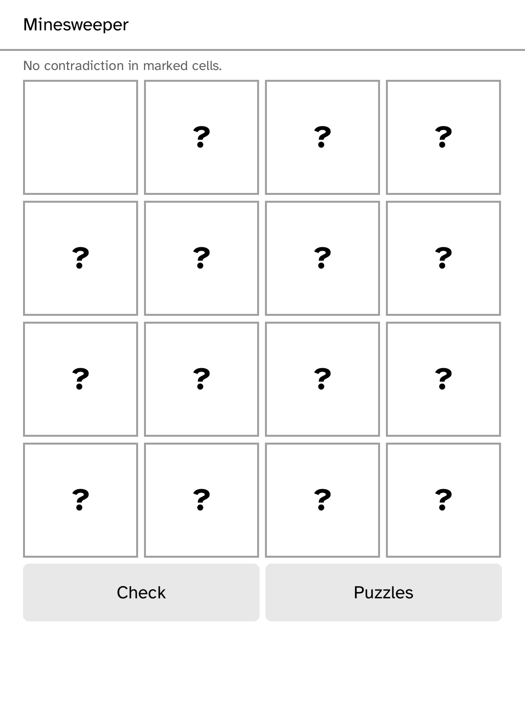

# Logic Pack

Four deterministic, touch-first pencil-puzzle MVPs: Slitherlink, Hashi, Kakuro, and Minesweeper.
Choose a genre, then tap cells to cycle its marks; **Check** reports contradictions only on request.
The fixed daily seed makes the initial set repeatable without a network capability.

This playable foundation supplies the interaction model and per-genre state cycles. Full generators,
logic-only uniqueness proofs, mine reseating, streaks, and persistence remain future work.

## Attribution and capabilities

The planned generator architecture is informed by Simon Tatham's Portable Puzzle Collection
(Loopy, Bridges, Mines), MIT licensed; this MVP contains no copied implementation. Logic Pack has
no capabilities and never phones home.
