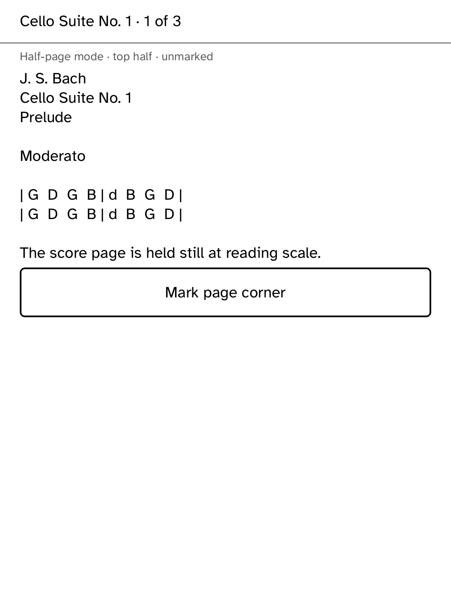

# Music Stand

Music Stand is a stable score reader for a Kobo on a folding stand. It keeps
the page awake, accepts left/right tap zones, and makes each score page a
two-stage half-page turn: first the bottom half, then the next page. Pieces
can sit in ordered rehearsal setlists, and a page-corner mark survives reboot.

Transfer is host-side: `kobo scores push concerto.pdf` uses MuPDF (AGPL-3.0)
to route born-digital scores to SVG and scans to grey raster pages. On-device
SVG rasterization is intended for panel-resolution crispness; a measured
pre-raster fallback is required for pages too dense to render promptly.

Download IMSLP works on a computer before transfer. Each IMSLP work is public
domain or Creative Commons according to that work's status. IMSLP browsing,
annotation, and audio are not v1 features. Dedicated readers are typically
listed around PadMu $1,600 and GVIDO $1,000; this is a factual comparison, not
a claim about their availability or feature parity.

`drive.kobo` enters stand mode and captures the simulator output.
