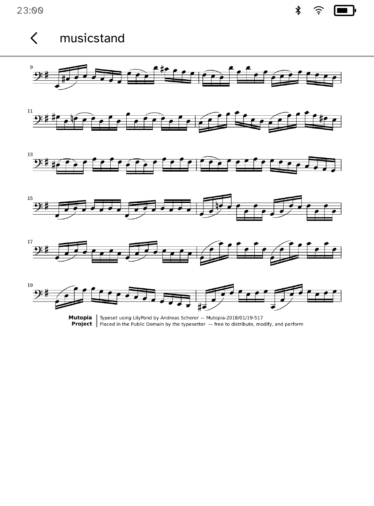
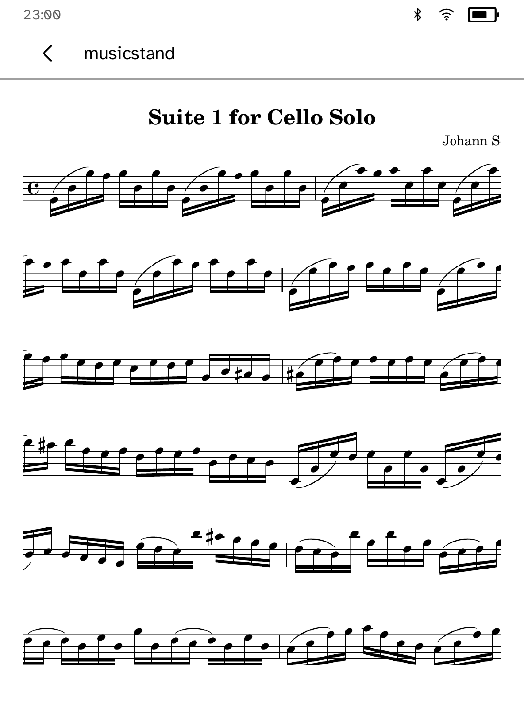
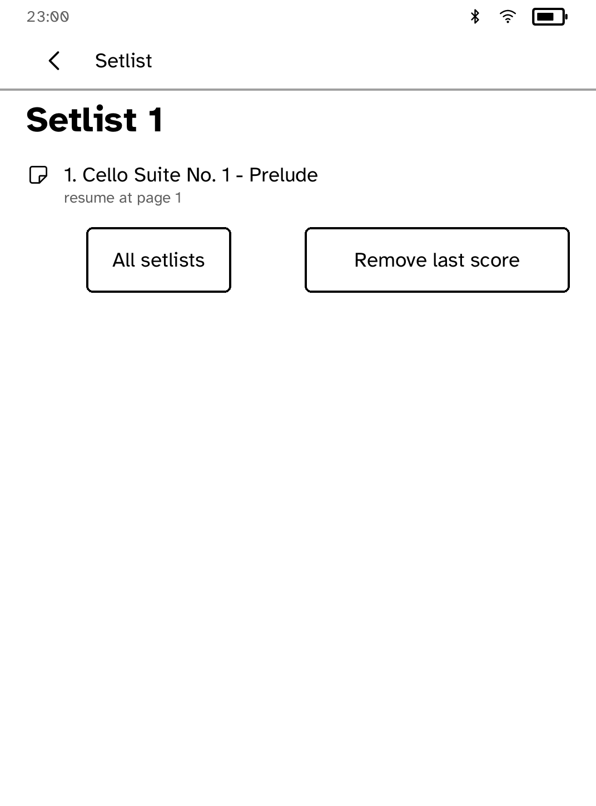

# Music Stand

A score reader for a Kobo on a music stand, with setlists and half-page
turns.

<table>
<tr>
<td width="50%" valign="top"><br>A full page at reading size</td>
<td width="50%" valign="top"><br>A half-page turn keeps the current line in view</td>
</tr>
<tr>
<td width="50%" valign="top"><br>Staff-width zoom for dense passages</td>
<td width="50%" valign="top"><br>A setlist resuming at its saved page</td>
</tr>
</table>

## Features

- Keeps the screen on while you play.
- Turn pages with the page buttons or by tapping the screen.
- Half-page turns: each page is split into two overlapping halves, so the line
  you are reading stays in view after a turn.
- Staff-width zoom for dense passages.
- Each score remembers its page, zoom and corner mark.
- Setlists keep rehearsal order and continue from one piece's last page to the
  next piece.

## Setup

Scores are prepared on your computer and sent over USB or SSH:

```sh
kobo musicstand init --device IP
kobo musicstand plan score.pdf --device IP   # what a push would send
kobo musicstand push score.pdf --device IP
kobo musicstand ls --device IP
kobo musicstand rm ID --device IP
```

Use `--sim` instead of `--device IP` for the simulator.

PDFs are rendered page by page with `pdftoppm`. Folders of PNG or JPEG images
are sent as they are. Only send scores you have the right to use.

## Permissions

- `keep-awake`: keeps the screen on while a score is open.

## Development

```sh
cargo test -p kobo-musicstand
python3 scripts/check-apps-sim.py musicstand
```

The simulator check builds the app, opens it in a fresh simulator and plays
`drive.kobo`. `scripts/quality/check-musicstand-shelf-sim.py` covers sending a score.

## Credits

The screenshots show Bach's Cello Suite No. 1 (BWV 1007), a public-domain
engraving from the Mutopia Project.
