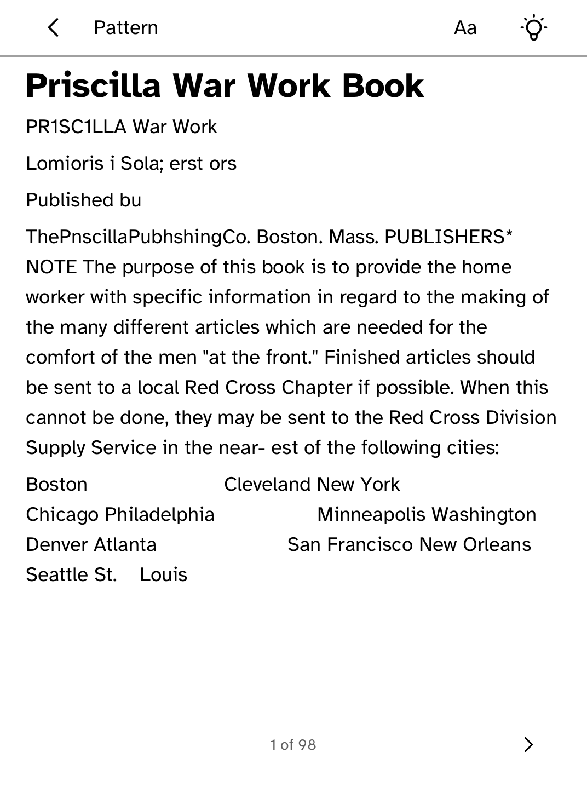
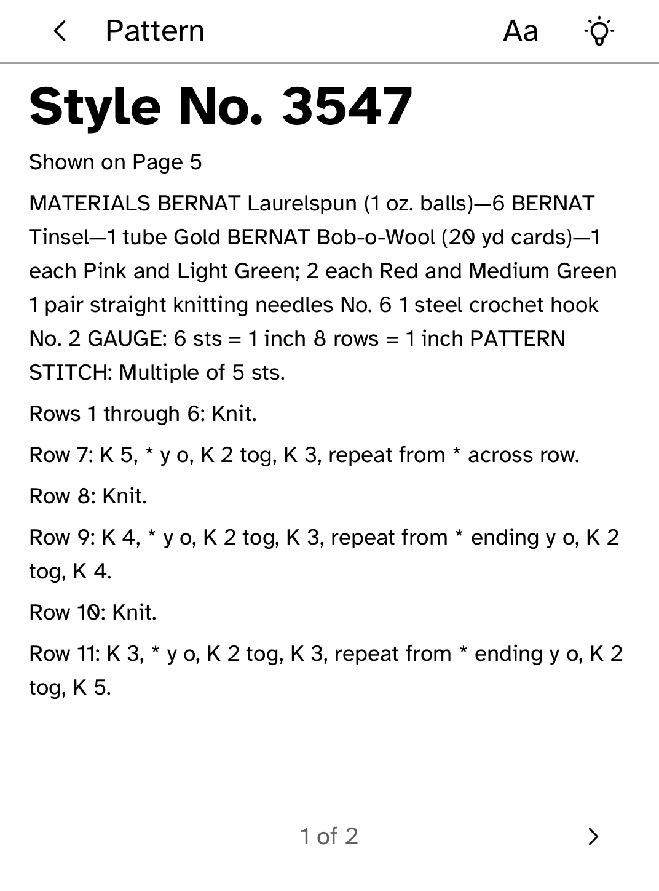

# Needles

Row counters and your Ravelry library, with patterns you own readable offline.

<table>
<tr>
<td width="50%" valign="top"><br>A section's row counter</td>
<td width="50%" valign="top"><br>Reading a pattern sent from the computer</td>
</tr>
<tr>
<td width="50%" valign="top"><br>A pattern opened at its section</td>
</tr>
</table>

## Features

- A separate row and repeat counter for each section of a project.
- **+1 row** saves on every tap. **Undo -1 row** reverses the last count.
- Following a project keeps the screen on.
- Browse your Ravelry Library, Queue and Favorites.
- Counters, Ravelry details and patterns stay available offline.

## Setup

Install your Ravelry credential on the reader:

```sh
kobo secret set ravelry --device <address>
```

Needles can only use it for Ravelry's read-only Library, Queue and Favorites
endpoints, and never sees it.

## Adding a pattern you own

`kobo needles` converts a pattern to Markdown and sends it to the reader:

```sh
kobo needles preview PATTERN.pdf                     # outline, charts and first lines
kobo needles prepare PATTERN.pdf --out PATTERN.md    # keep the Markdown to review
kobo needles push PATTERN.pdf --device <address>     # send it to the reader
kobo needles push PATTERN.md --sim                   # or to the simulator
```

PDFs are converted with Poppler's `pdftotext`, which `kobo needles setup`
installs. Scanned, encrypted or damaged PDFs are refused with a reason, and
pages that hold only a chart or photo are listed in the report.

Charts travel as PNG files next to the pattern. A pattern that refers to
`chart-lace.png` picks up that file and shows it inline.

## Limits

- Charts are not extracted from PDFs. Export them as PNG files and keep them
  next to the pattern.
- Project notes cannot be written back to Ravelry. Edit them on ravelry.com.

## Permissions

- `network`: reads your Ravelry library.
- `keep-awake`: keeps the screen on while you follow a project.

## Development

```sh
cargo test -p kobo-needles
python3 scripts/check-apps-sim.py needles
```

The simulator check builds the app, opens it in a fresh simulator and plays
`drive.kobo`.

## Credits

Needles is not affiliated with Ravelry. It reads metadata from your own
account only and does not redistribute patterns.

PDF conversion uses Poppler's `pdftotext`, a separately installed tool licensed
under the GPL. Needles runs it on your computer and does not bundle it.
