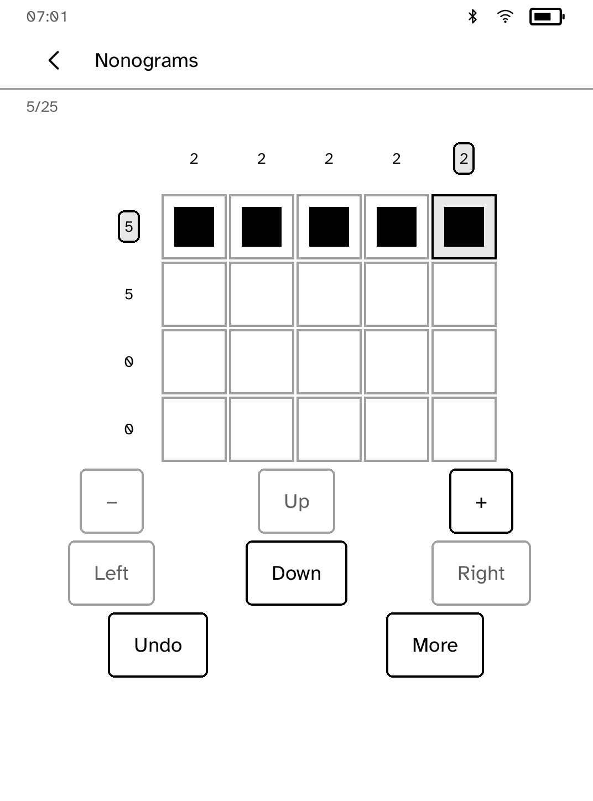
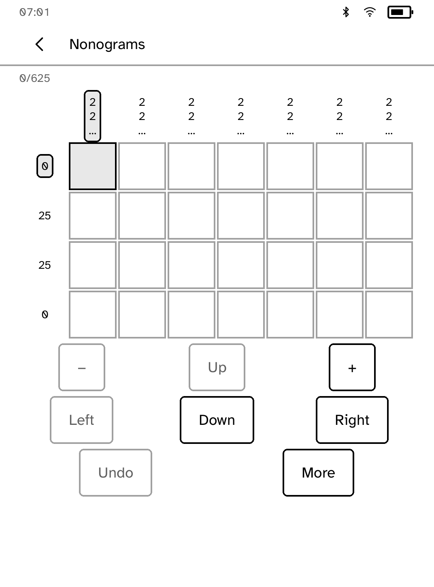
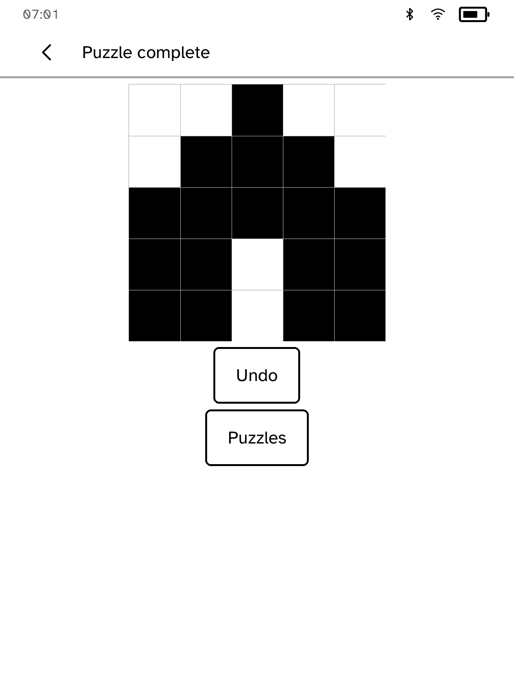
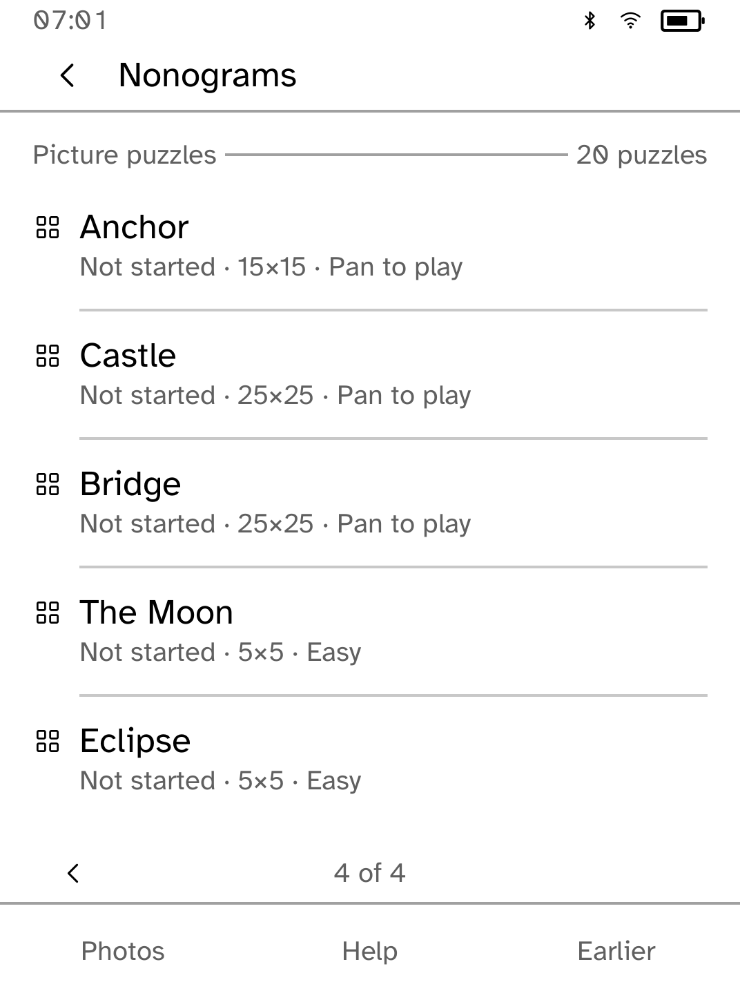

# Nonograms

Eighteen original picture puzzles, from 5×5 to 25×25, plus puzzles made from
your own photos.

<table>
<tr>
<td width="50%" valign="top"><br>Marking a run on the board</td>
<td width="50%" valign="top"><br>A 25×25 board, zoomed</td>
</tr>
<tr>
<td width="50%" valign="top"><br>A finished picture</td>
<td width="50%" valign="top"><br>Photo puzzles listed by name</td>
</tr>
</table>

## Features

- Tap a square to cycle through blank, filled and crossed out. The puzzle is
  finished when every square is filled or crossed correctly.
- The selected square's row and column clues are highlighted. Tap a clue to
  read all of it. **…** means there are more numbers than fit.
- Large boards show a movable window instead of shrinking the squares. Use the
  arrow controls to move it and **−** and **+** to change the square size.
- **Run on** fills a straight run between two taps.
- **Guided** mode names a row or column whose marks contradict its clues. It
  never changes your marks. **Free** mode gives no warnings.
- **Undo** reverses one square, a run or a restart. The last 64 steps survive
  reopening. **Restart** asks first.
- **Earlier** opens the previous 60-puzzle pack, with existing progress kept.

Each puzzle saves separately. If a save fails, your moves stay in memory and
**More → Retry save** tries again. Finish saving before switching puzzles or
closing the app.

## Photo puzzles

Turn a photo into a puzzle from your computer:

```sh
kobo nonograms push IMAGE --size N --device READER
```

On the reader, choose the same size in **Photos**, then **Import**. Sizes from
5×5 to 25×25 are supported. Sending several photos at once writes an
`imported.txt` list, and each photo arrives as a named puzzle. Re-importing an
unchanged photo keeps its progress.

A photo is accepted only if it makes a puzzle with exactly one solution. The
difficulty shown (Easy, Medium or Hard) reflects how many solving passes it
needs, not measured human solving time.

## The drawings

The eighteen pictures are original. `scripts/quality/make-nonogram-pictures.py`
builds them, confirms each has a single solution and writes
[assets/pictures.txt](assets/pictures.txt).

## Permissions

None. Nonograms runs offline.

## Development

```sh
cargo test -p kobo-nonograms
python3 scripts/check-apps-sim.py nonograms
```

The simulator check builds the app, opens it in a fresh simulator and plays
`drive.kobo`. `scripts/quality/check-nonograms-sim.py --output /tmp/nonograms-check --scale extra-large` runs a longer check, including the last square of a 25×25 board and failed saves. See [screenshots/README.md](screenshots/README.md) for how the screenshots were made.
