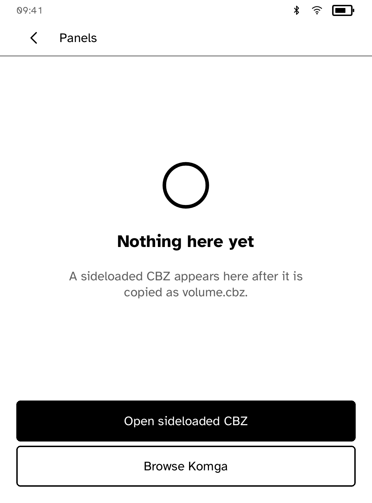
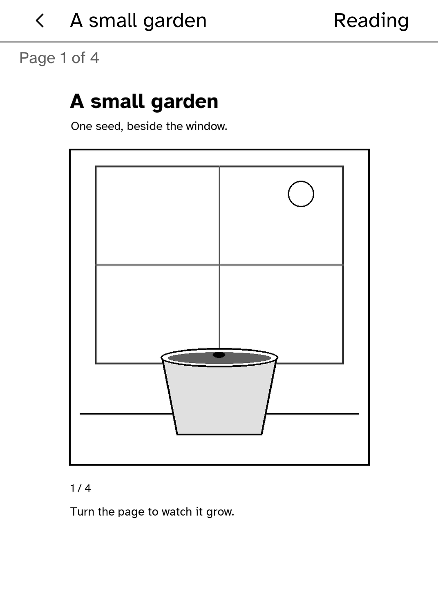
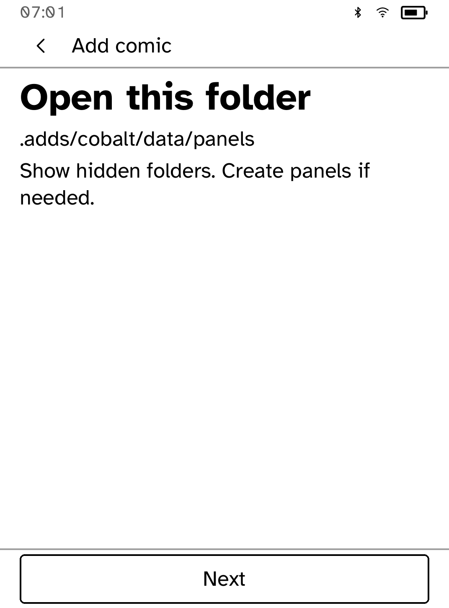
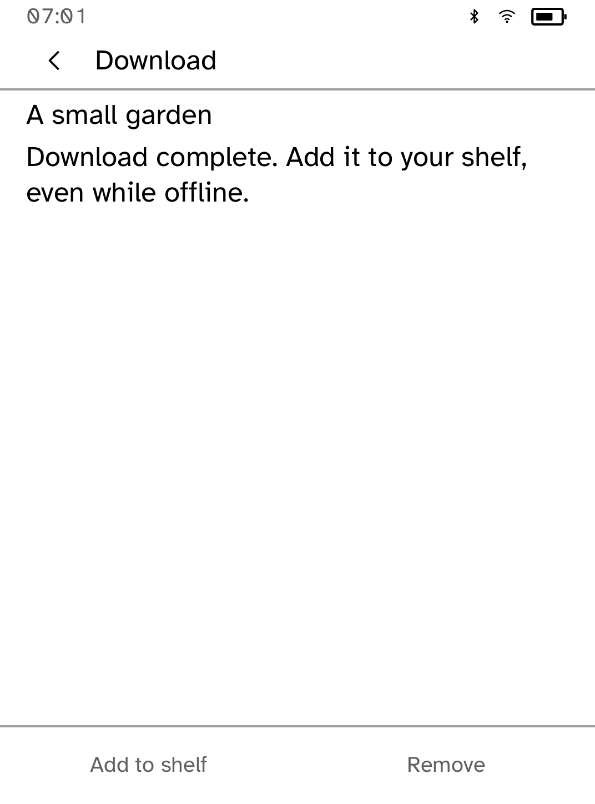

# Panels

Panels reads local CBZ comics and catalogs from your own Komga library. Comic
archive inspection, page decoding and reading controls are shared Cobalt
components. ZIP decoding uses the pinned MIT-licensed `zip` crate with default
features disabled. There is no RAR decoder or CBR dependency. CBR and PDF comics
are outside the current supported formats; obtain a CBZ copy of a CBR comic.

## Add and read a local comic

Choose **Try a sample comic** to read the bundled four-page *A small garden*
offline. Its artwork and text are original to Cobalt, and its import follows the
same confirmation and receipt flow as any other CBZ.

To add your own file, choose **Add comic** for the USB guide. Connect the reader
by USB, open its drive on your computer, and copy your CBZ as `volume.cbz` under
`.adds/cobalt/data/panels` (show hidden folders and create `panels` if needed).
Eject the drive safely, unplug the cable, reopen Panels and choose **Add comic**. Check its title, format and size, then choose **Add to library**. Panels
keeps a content-addressed copy and verifies its bytes before saving a receipt
and the comic list. **Available on this reader** appears only after both saves
succeed. Choose **Open** to read, or return to the shelf to read later.

A repeated import reuses an intact copy. Replacing the incoming `volume.cbz`
does not replace previous content-addressed imports. The shelf supports up to
64 comics, with measured pages and stable selection at each interface size.
Unreadable, corrupt and newer-version comic lists remain distinct from an
empty shelf. Failed saves offer a retry and retain the pending data.

Reading controls include fit, zoom, pan, thumbnails, page jump, rotation,
spreads and right-to-left reading. Position changes wait for a storage
acknowledgement; a failed save remains visible until a retry succeeds. New
position records use bounded content-derived keys, with legacy positions read
when available. The library accepts the previous tab-separated format through
an acknowledged migration.

## Connect your Komga library

Choose **Browse Komga**, add your HTTPS server address, then open **Account
details** and enter your username and password. Cobalt stores the account in
Panels' private runtime namespace, bound to that server and its base path.
A reverse-proxy path is supported, for example `https://books.example/komga`.
The connection check requests `/opds/v1.2/catalog` beneath that address and opens
the library only after a valid OPDS response. Login pages and generic server
errors are refused. An address save failure offers a retry; reopening restores
the last acknowledged address. Changing servers requires entering account
details for the new server.

Browsing paginates each server response at the active interface size, including
its navigation and next/previous links. Search filters the current response while
preserving each original title action. Back restores the previous local page and
search; cancelled or late requests cannot replace that restored view. Catalog
history is bounded to 16 entries. Cover art and CBZ downloads up to 32 MiB are
supported. Shelf thumbnails and reading-progress summaries remain in progress.

## Continue an interrupted download

Open **Download** from the shelf to continue or remove a paused download.
Panels checks its saved bytes before using them. When continuing, it first
compares the saved part with your server, then downloads the remaining pages.
If the server's comic has changed, remove the paused download and start again.
Your previously saved comics stay on the shelf.

Once a complete download is saved, **Add to shelf** works offline. The same
verified copy, receipt and comic-list saves used for USB imports must finish
before **Available on this reader** appears. A failed save offers Retry; it
keeps the recovery copy. Repeating a download of an unchanged comic reuses its
verified copy. A different file at the same server URL gets a separate copy.

Downloads keep one acknowledged checkpoint while writing the next. Restarting
uses the last acknowledged checkpoint, which may be behind the last progress
shown before interruption. Removal waits for outstanding storage replies and
removes only the download's recovery files. An unreadable, older-format or
newer-format recovery record is preserved until you explicitly remove it;
older paused downloads must be downloaded again.

Resuming checks the existing prefix again because the current network API does
not expose a server version token. This uses additional network data. Archive
checks still apply before import. The automated checks use original fixture
bytes and real SDK/storage paths; live Komga transfer and physical-reader
validation remain part of acceptance.

## Screenshots

These are actual Clara BW simulator captures at the largest interface size,
using Cobalt's original sample comic. They show ideal rendered output, not
measured e-ink appearance. Capture provenance is in [screenshots](screenshots/README.md).

| Shelf | Reader |
| --- | --- |
|  |  |

| USB guide | Download recovery |
| --- | --- |
|  |  |


```sh
cargo test -p kobo-panels
kobo dev
```

The sample can be rebuilt with `python3 scripts/quality/make-panels-sample.py`.
It uses original drawing geometry and the repository's existing licensed font.
The source, PNG pages and CBZ use the repository license; no external artwork
or comic text is embedded.

Run `kobo dev` from this app directory. The repository's
`scripts/quality/check-comics-sim.py` uses original geometric fixtures in private
simulator storage and checks imports, reading, save failure, retry and restart.
Physical Clara BW validation follows the combined three-PR acceptance run.
