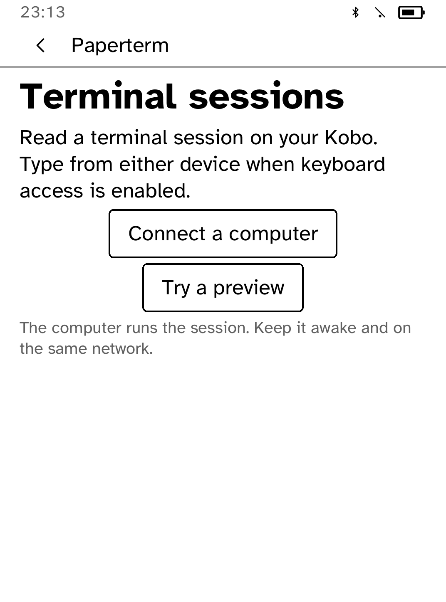
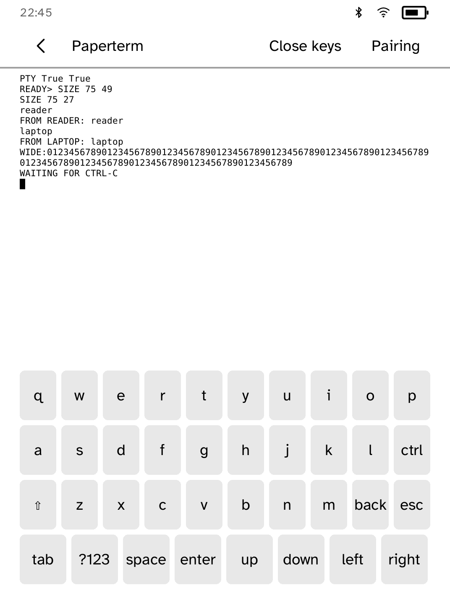
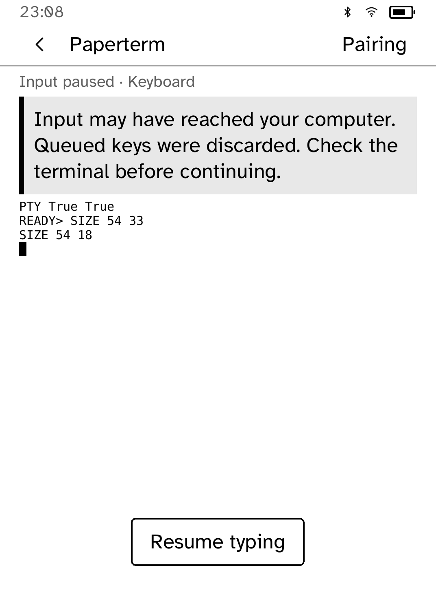
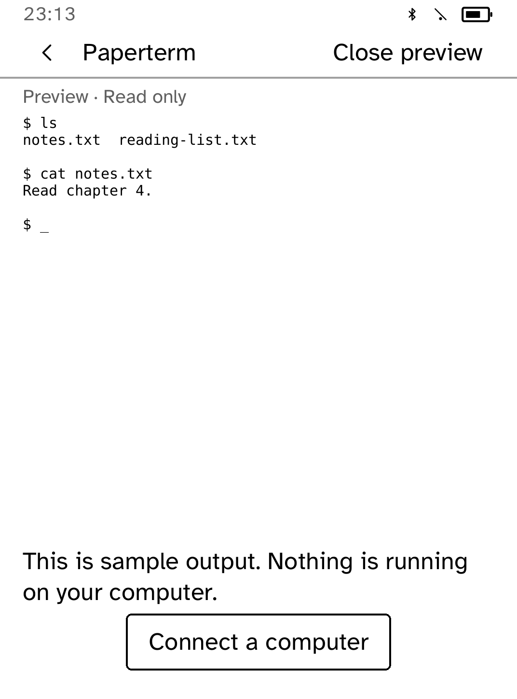
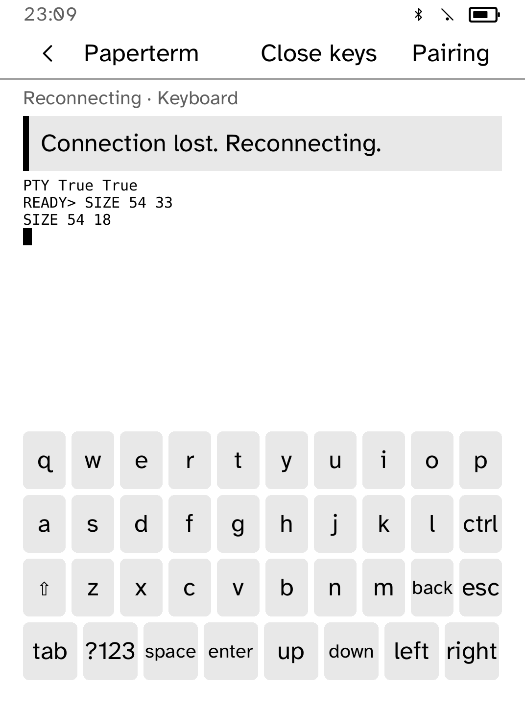
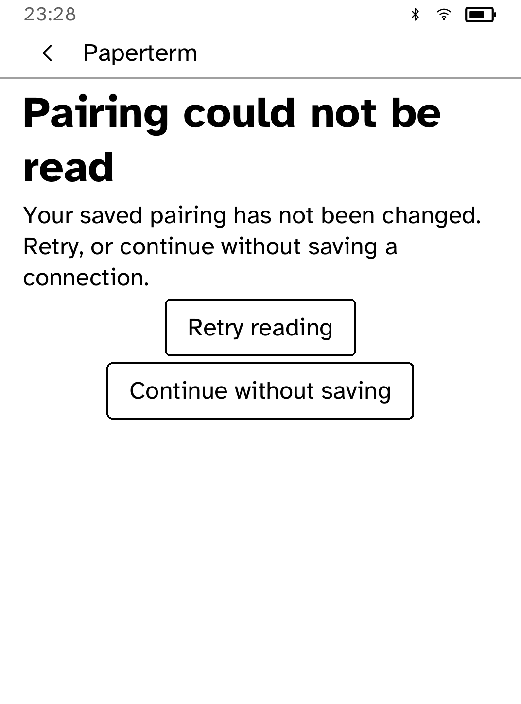
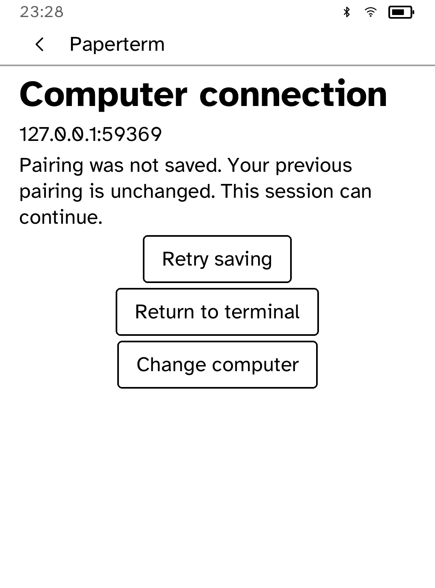
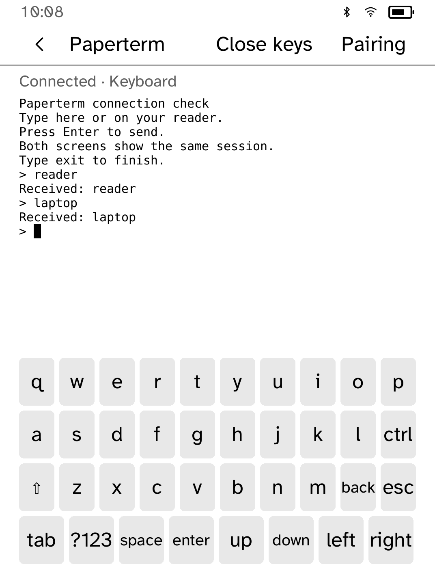

# Paperterm

Paperterm is the reader half of `kobo stream`: a terminal session rendered on
e-ink while its pty, shell, command, and credentials remain on the computer.
The app has only the `network` capability; it cannot run a shell and does not
store terminal content.



On first launch, **Try a preview** shows original sample output without making
network requests or saving changes. **Connect a computer** walks through host
setup, trust installation and starting a session, one command per page. Run
`kobo devices` on the computer to find the reader's address for trust installation.

The address accepts a host name, IPv4 or bracketed IPv6, with port 9332 as the
default. Invalid entries remain editable. Codes require six letters or numbers;
uppercase entry is normalized to the lowercase printed by the host. **Help**
returns to the steps, and **Address** lets you revise the address without losing
an unfinished code. Unreadable saved pairing is left untouched.

Start the host once with `kobo stream init`, install its root with
`kobo trust set stream --device READER_IP`, then run:

```sh
kobo stream --interactive -- /bin/sh
```

Paperterm uses portrait on every supported reader. The shared terminal uses
a smaller monospace size than interface labels, scaled by the panel's physical
resolution and the owner's text setting. On Clara BW at Default, the measured
grid is **75 columns × 47 rows**, or **75 × 25** with the keyboard open. Larger
text settings reduce the column count instead of compressing the glyphs. Other
readers negotiate their own measured grid; 80 columns is not forced.

A line above the terminal shows connection state and the reader's mode: Read only,
Controls or Keyboard. Reconnect notices remain above the retained output, and
the keyboard can be opened or closed while reconnecting.

The app sends this grid in `/hello`,
and holds the last received rows behind a `Connection lost. Reconnecting.` banner when the host
cannot be reached. The banner paints once on the offline transition; unchanged
retries do not repaint, and the first successful response clears it once.
Read-only sessions show no terminal input. Controls mode
offers only arrows, Enter, Esc, y, n, and Ctrl-C; full mode also exposes the
terminal keyboard. Full sessions start with the keyboard hidden so the terminal
uses the whole content area. **Keyboard** in the top bar opens a compact
four-row keyboard; **Close keys** hides it without replacing the
session, rows, or cursor. Each change renegotiates the terminal grid in place.
After the host reports its input mode, Paperterm repeats `/hello` only when the
measured controls require a different grid. The host accepts at most 64 input
bytes per request and checks that control-mode input is in this same closed
list.

The mirror uses the platform terminal node and its measured grid. Received
deltas update only changed rows; an empty poll paints nothing. Text styling is
discarded except for the cursor. Unsupported glyphs become neutral
width-preserving marks, while VT box drawing, alternate-screen transitions,
and cursor-only changes retain their terminal structure. The responsive
terminal layout clips excess rows before layout, so controls and every enabled
keyboard key remain visible.


The laptop and reader share the same session: either can type while the other
watches the output. Use `--controls` for the limited navigation keys or omit
both input flags for a read-only reader. The computer must remain awake and
reachable. Closing the keyboard keeps the session and gives its space back to
the terminal.



The screenshots and live test use an original local Python fixture, a real
host PTY and private trusted TLS credentials. They verify both input directions,
resizing, wide output, Ctrl-C and restoring the laptop terminal settings.
Physical readability and refresh behavior await Clara BW hardware acceptance.


If a key request times out, Paperterm cannot know whether the computer received
it. It discards queued keystrokes and pauses input. Check the terminal, then
choose **Resume typing**; successful background polling never resumes typing
for you. The same pause applies if the computer falls behind and the bounded
queue fills. Read-only sessions cannot send input.



Malformed screen deltas leave the last output intact and trigger reconnect.
The live simulator route includes an injected input timeout, explicit resume
and successful typing in both directions afterward.





The live fixture's `--pair-on-reader` option enters the address and private code
through the actual keyboard and verifies the saved pairing before exercising
the terminal. Hardware trust transfer and physical acceptance remain separate checks.

If saved pairing cannot be read, choose **Retry reading** or **Continue without
saving**. The latter keeps the stored data untouched for the entire run. A new
connection is saved only after the computer confirms pairing. If saving fails,
the terminal remains usable and its status shows **Not saved**. Open **Pairing**
to choose **Retry saving**, return to the session, or change computers.
Reconnecting and resizing do not retry a failed save automatically.




The live fixture supports `--load-failure --save-failure` for explicit recovery,
or `--load-failure --temporary-pairing` to verify a temporary connection. Both
require `--pair-on-reader` and exercise the same two-way terminal journey.

## First connection check

After setting up the computer identity and installing its trust certificate,
run `kobo stream demo` on the computer. Connect from Paperterm, type a short
message and press Enter. The message appears on both screens. Type a second
message on the computer to check input in the other direction.

This built-in check does not run typed text as commands. Type `exit` on either
screen to finish; the final screen remains for one minute. Keep the computer
awake while sharing. Once the check works, use `kobo stream --interactive --
COMMAND` to share a terminal program you choose.


