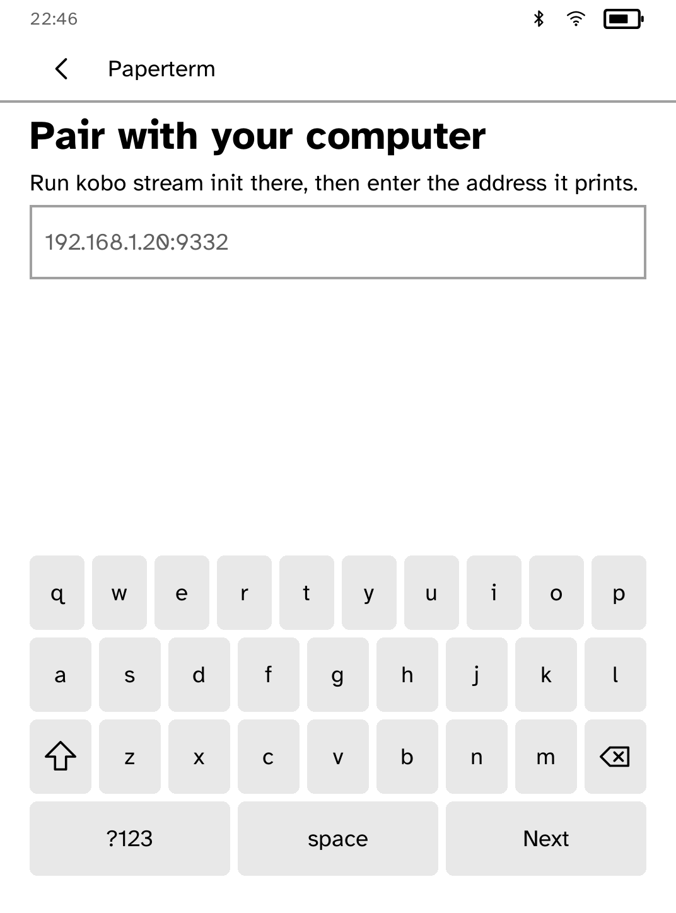

# Paperterm

Paperterm is the reader half of `kobo stream`: a terminal session rendered on
e-ink while its pty, shell, command, and credentials remain on the computer.
The app has only the `network` capability; it cannot run a shell and does not
store terminal content.



Start the host once with `kobo stream init`, install its root with
`kobo trust set stream --device READER_IP`, then run:

```sh
kobo stream --controls -- claude
```

The app sends its measured portrait grid in `/hello`, long-polls `/screen`,
and holds the last received rows behind an `off the air` banner when the host
cannot be reached. Read-only sessions show no terminal input. Controls mode
offers only arrows, Enter, Esc, y, n, and Ctrl-C; full mode also exposes the
platform terminal keyboard. The host accepts at most 64 input bytes per
request and checks that control-mode input is in this same closed list.

The mirror uses the platform terminal node and its measured grid. Received
deltas update only changed rows; an empty poll paints nothing. Text styling is
discarded except for the cursor, so the panel earns its repaints rather than
pretending to be an LCD terminal.
