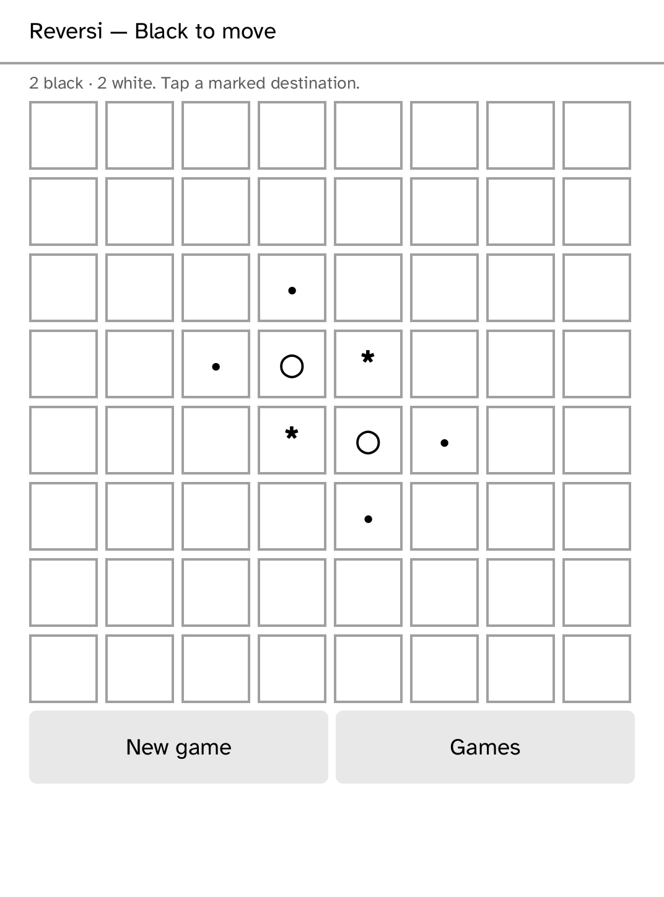

# Parlor

Parlor is a pass-and-play board-game shelf. Its first playable game is
standard **Reversi**, with legal destinations marked and each move flipping
only the affected discs. The board tells players when to pass the reader.

The menu reserves Draughts, Nine Men's Morris, and Kalah(6,4), but this
app-only MVP does not pretend those rule engines exist yet. It makes no
network requests and holds no capabilities. The source is original; the
third-party engine ledger is empty. “Othello” is not used because it is a
Megahouse/Mattel trademark.

The Reversi board is intentionally a simple platform board node so each tap is
reachable on the Clara BW. A full production version will add saved matches,
rotation, rule-set selection, and the remaining tested engines.
