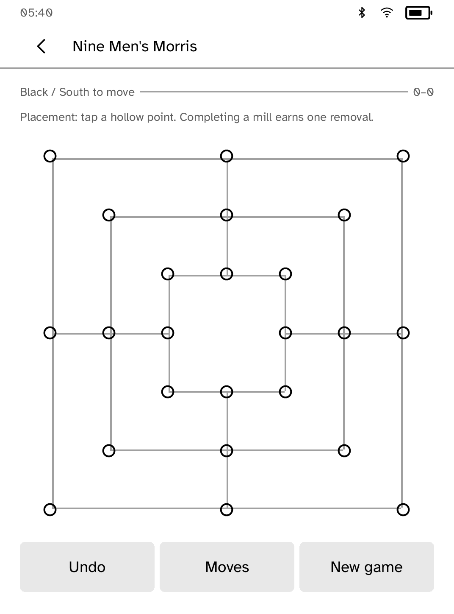

# Parlor

Four classic board games for two players on one Kobo, or against the reader.

<table>
<tr>
<td width="50%" valign="top"><br>The game table</td>
<td width="50%" valign="top"><br>Reversi, with the board turned for White</td>
</tr>
<tr>
<td width="50%" valign="top"><br>A draughts opening</td>
<td width="50%" valign="top"><br>Nine Men's Morris</td>
</tr>
</table>

## Games

- **Reversi**
- **Draughts**: Anglo-American 8×8 rules, with forced captures and capture
  chains.
- **Nine Men's Morris**: placing, mills, protected pieces, moving and flying
  with three pieces.
- **Kalah 6,4**: sowing, captures, extra turns and endgame collection.

## Features

- Pass-and-play turns the board 180° for the player to move. A fixed
  orientation is available for side-by-side play.
- Solo play against three computer levels: Casual, Club and Strong. The same
  position and level always produce the same move.
- Legal destinations are marked with hollow rings.
- Every move is saved, and reopening offers to resume the exact position.
- In pass-and-play, undo needs the other player's confirmation.

## Rules references

- Reversi: [World Othello Federation](https://www.worldothello.org/about/about-othello/othello-rules/official-rules/english)
- Draughts: [World Checkers/Draughts Federation](https://www.wcdf.net/rules/rules_of_checkers_english.pdf)
- Nine Men's Morris: [Board Game Arena](https://en.boardgamearena.com/doc/GamehelpnineMensMorris)
- Kalah: [Mancala World](https://mancala.fandom.com/wiki/Kalah)

International 10×10 draughts is implemented in the engine
([FMJD rules](https://www.fmjd.org/docs/Annex_1.pdf)) but stays disabled until
the reader's board size limit of 81 cells is raised.

## Permissions

None. Parlor runs offline.

## Development

```sh
cargo test -p kobo-parlor
python3 scripts/check-apps-sim.py parlor
```

The simulator check builds the app, opens it in a fresh simulator and plays
`drive.kobo`.

## Credits

The game engines and computer players are original code. "Othello" is a
trademark of MegaHouse and Mattel, so Parlor calls the game Reversi.
