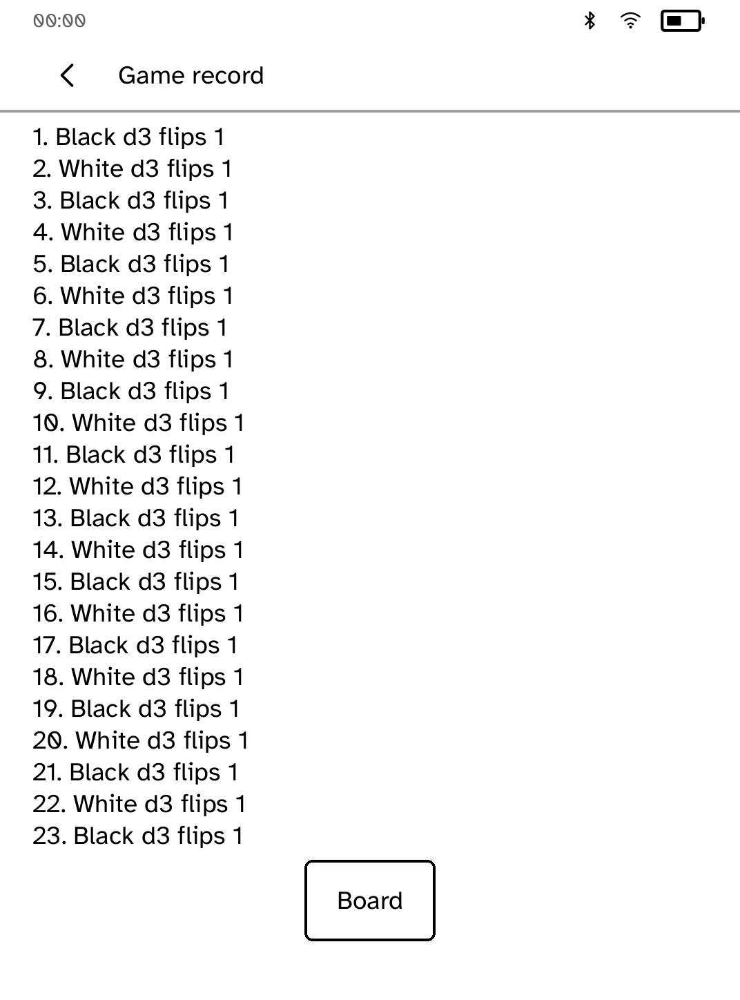
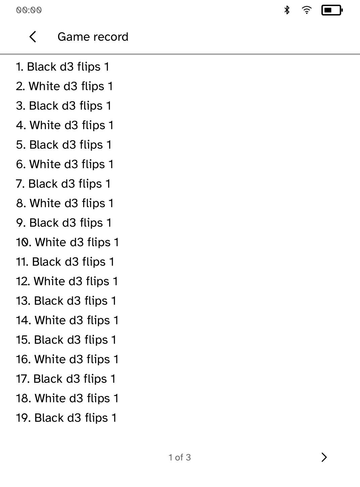
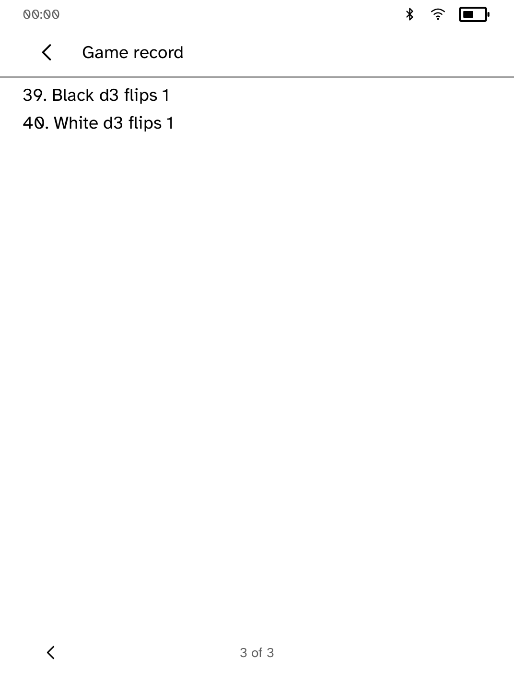
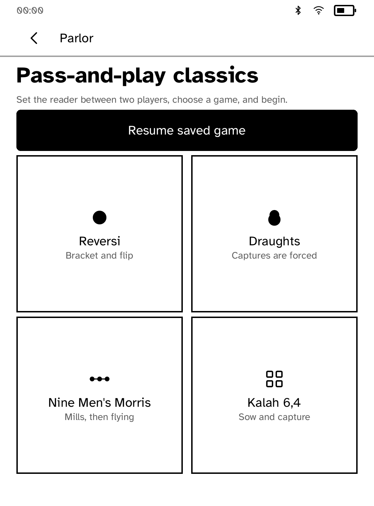
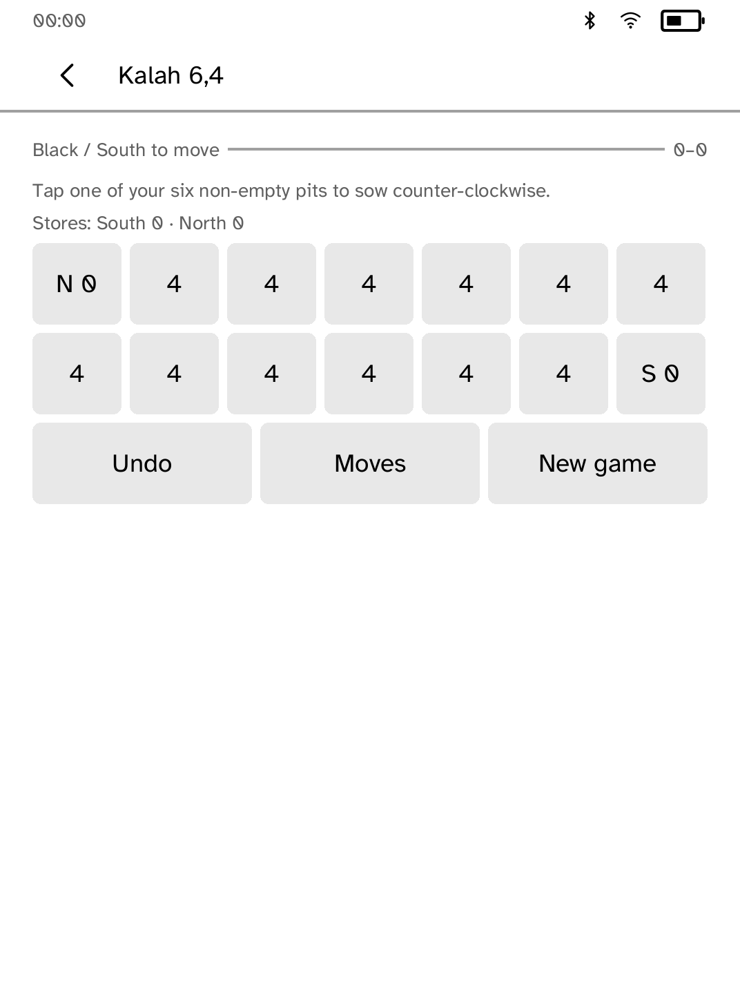

# Parlor move-record review

These are actual in-process Cobalt renderer snapshots, **not interactive
simulator captures or hardware photographs**. The before implementation is
Beta `9715304831eae95566758fd0aa6b8e6fc87ee3ee`, captured before the matching
app changes. Only test fixtures were added to that baseline.

## Long records

The layout fixture supplies forty numbered move descriptions. It is a
synthetic forty-entry history for UI review, not a completed match.
The original single text node clips after entry 23 at the default text size
and reports `TextOverflow`. The record now uses measured pages, keeps each
entry as a separate paragraph, and exposes standard page arrows.

| Before | After |
| --- | --- |
|  |  |



## Back returns to the board

Originally the record's runtime Back opened the game menu, while a separate
Board button returned to play. The standard Back control now returns directly
to the unchanged board. A second Back still returns to the game menu.

| Original result of Back | New result of Back |
| --- | --- |
|  |  |

Tests verify that this preserves the serialized game for all four games.
Turning record pages does not resave or change the board.

## Provenance and limitations

- App-owned screen builders/callbacks and `kobo_ui::render_all`
- Installed Cobalt font; Clara BW 1072 × 1448, 300 ppi, default text size
- `Chrome::for_screen` and `ensure_way_back`; the 00:00 clock, radios, and
  50% battery are synthetic measurement values
- Raw grey8 pixels saved as PGM, then converted losslessly to PNG with Pillow;
  no compositing or retouching

The executor refuses the simulator AF_UNIX socket with `Operation not
permitted`, including a reviewed elevated launch. Interactive drive and
physical reader verification remain pending. No simulator or runtime transport
was changed.

## Reproduce after snapshots

```sh
COBALT_REVIEW_OUT="$PWD/target/ui-review" COBALT_REVIEW_PHASE=after \
  cargo test -p kobo-parlor capture_review_screens -- --ignored
python3 - <<'PY'
from pathlib import Path
from PIL import Image
for source in Path('target/ui-review/parlor/after').glob('*.pgm'):
    Image.open(source).save(source.with_suffix('.png'))
PY
```

The ignored fixture is `src/review_capture.rs`; its renderer helper is
`render.rs` in this directory. Normal tests write no screenshots. Tests cover
all forty entries at all nine interface sizes in both Clara BW poses, repeated
page turns at the edges, physical page buttons, Back hit testing, and retained
game state.
