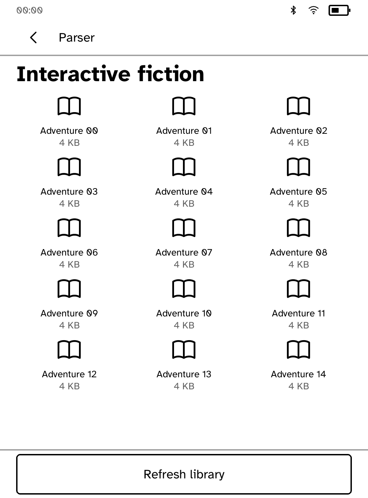
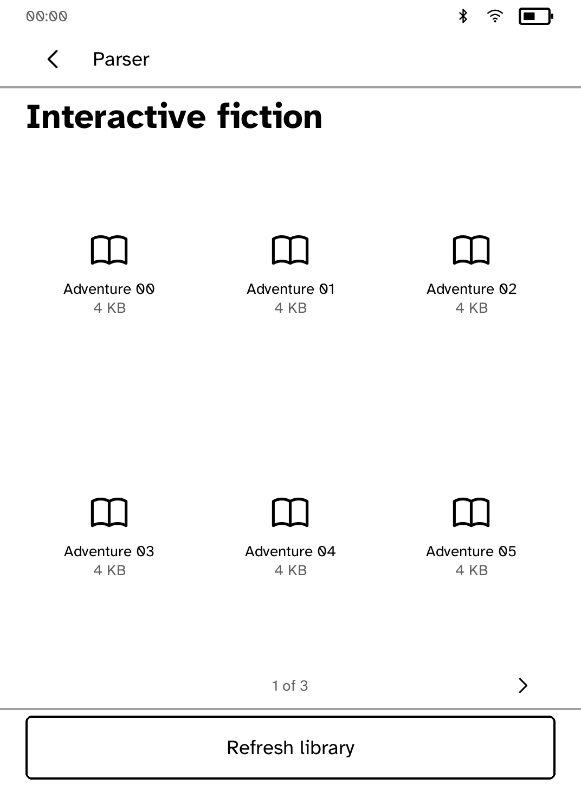
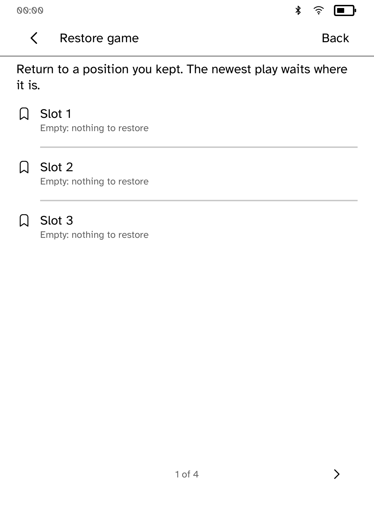
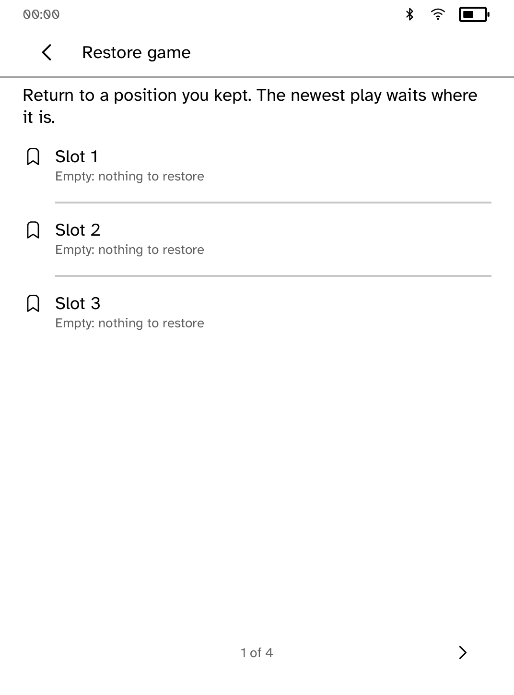
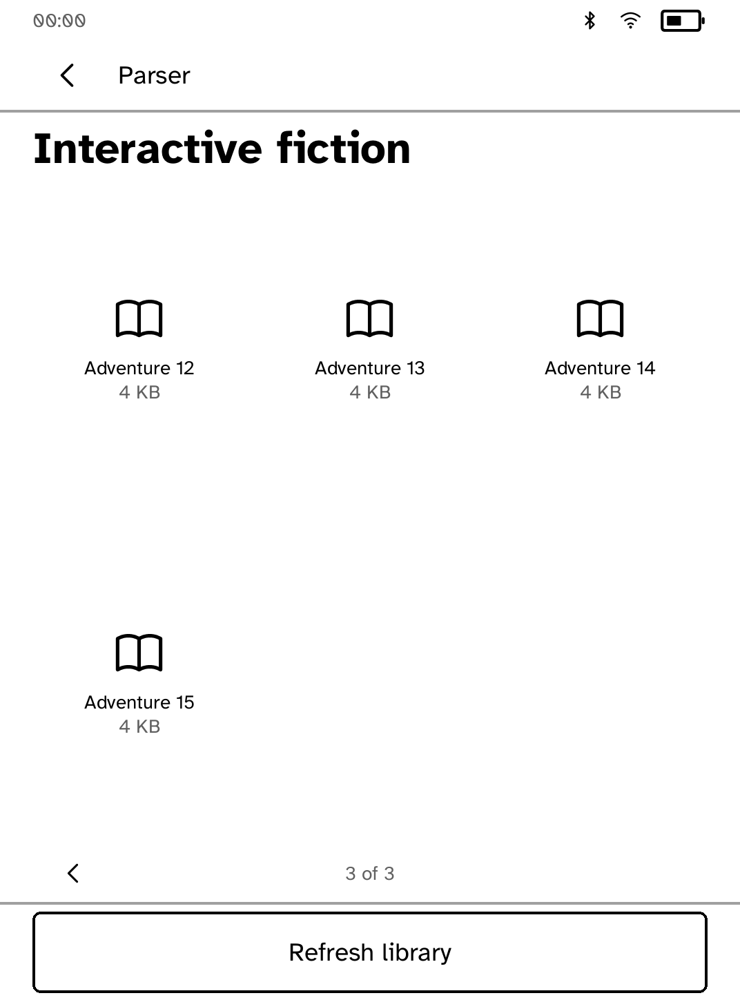

# Parser library and navigation review

These are real in-process `kobo-ui` renderer snapshots, **not interactive
simulator captures or hardware photographs**. The app's own builders and
callbacks produced the screens, then `kobo_ui::render_all` rasterized them with
the installed Cobalt font. The pixel bytes were saved as PGM and converted
losslessly to PNG, without compositing or retouching.

- Before implementation: Beta `9715304831eae95566758fd0aa6b8e6fc87ee3ee`
- Panel: Clara BW, 1072 × 1448, 300 ppi, default interface text size
- Runtime chrome: `Chrome::for_screen` and `ensure_way_back`; the 00:00 clock,
  Wi-Fi, Bluetooth, and 50% battery strip are synthetic measurement values
- Story: the repository's original Lamplight `.z3` fixture
- Library: sixteen fixture filenames, `story-adventure-00.z3` through `15.z3`
- Before captures were made before changing the app implementation, with only
  the opt-in capture test added

`kobo dev` and `scripts/check-apps-sim.py parser` could not launch because this
executor denies the simulator's AF_UNIX socket (`Operation not permitted`),
including a reviewed elevated launch. No simulator or runtime transport was
changed. Interactive `kobo drive` and physical Kobo verification remain pending.

## What changed

| Before | After |
| --- | --- |
|  |  |
|  |  |

The original library reports `InteractiveOffscreen` and loses the sixteenth
story. The measured library has three pages; the final page is below. Every
story's visible rectangle is tested through layout hit testing at all nine text
sizes in portrait and landscape. Error-banner space is included in pagination.



The restore picker now has one Back control. It cancels a story-requested
restore safely. In the story, Back closes the keyboard first, then returns to
the library; reopening the same story retains its current transcript and draft
command rather than reloading an older saved position.

## Reproduce the after snapshots

From the repository root:

```sh
COBALT_REVIEW_OUT="$PWD/target/ui-review" COBALT_REVIEW_PHASE=after \
  cargo test -p kobo-parser capture_review_screens -- --ignored
python3 - <<'PY'
from pathlib import Path
from PIL import Image
for source in Path('target/ui-review/parser/after').glob('*.pgm'):
    Image.open(source).save(source.with_suffix('.png'))
PY
```

The ignored test is `src/review_capture.rs`; its small renderer helper is
`render.rs` in this directory. Normal tests write no screenshots. The capture
also saves diagnostics and layout text alongside each PGM.
