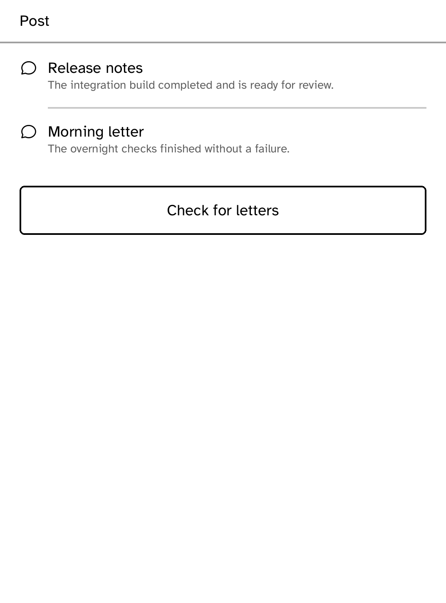

# Post

Post is a delivery channel for [Hermes Agent](https://github.com/NousResearch/hermes-agent):
finished correspondence on the reader, rather than a streaming chat screen.
Hermes runs on hardware you control; this app only fetches its completed
letters and posts replies.

Put the HTTPS gateway URL into Post and install the gateway bearer token
outside the app:

```sh
kobo secret set hermes-post --device <ip>
```

The named secret is attached by the runtime and never enters the app's local
state, URLs, request bodies, or logs. While the gateway is unavailable, the
cached inbox remains readable with an off-the-air notice. The MVP implements
the VPS bearer-token transport; LAN pairing, scheduled wake/sleep screen, and
the upstream `hermes-channel-kobo` plugin are follow-up work.

Hermes Agent is MIT-licensed by Nous Research. Post is an independent
AGPL-3.0-only Cobalt application and uses Hermes solely as a nominative name.


