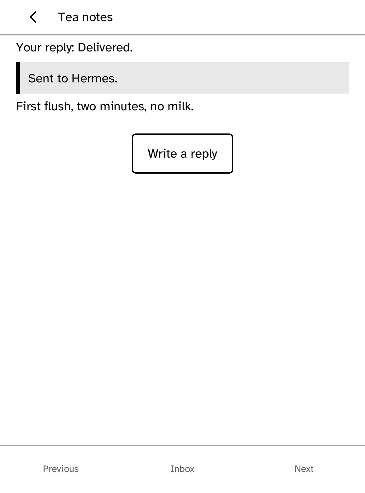
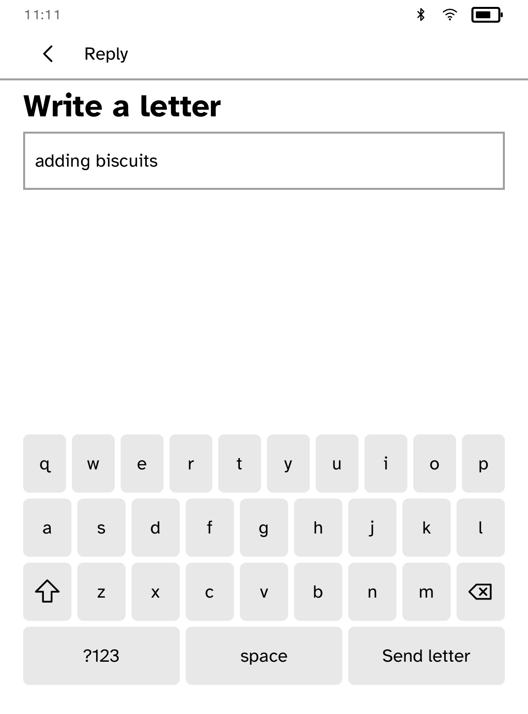

# Post

Read and reply to letters from [Hermes Agent](https://github.com/NousResearch/hermes-agent)
on your Kobo.

<table>
<tr>
<td width="50%" valign="top"><br>The inbox, newest first</td>
<td width="50%" valign="top"><br>A letter with its reply state</td>
</tr>
<tr>
<td width="50%" valign="top"><br>An unsent draft restored after a restart</td>
</tr>
</table>

Hermes runs on hardware you control. Post fetches its finished letters and
sends your replies.

## Features

- A paged inbox of finished letters.
- Write replies on the reader. Drafts survive a restart.
- While the gateway is unreachable, the inbox and drafts stay readable and
  replies wait in a queue with their state shown.

## Setup

From your computer:

```sh
kobo post login --gateway <https-address> --token-file <path> --device <reader>
```

This installs a token that only works with that gateway. The runtime attaches
it, so it never appears in the app's storage, URLs, requests or logs.
`kobo secret set hermes-post --device <reader>` also works.

## Gateway API

A compatible gateway serves two routes under its base address:

- `GET /letters?page=<n>&per_page=<m>` returns
  `{"total": N, "items": [{"id", "title", "body"}]}`.
- `POST /replies` takes `{"letter_id", "body", "reply_id"}` and returns
  `{"status": "accepted"}`. `reply_id` is an idempotency key: a repeated key
  returns `{"status": "duplicate"}` and must not deliver the reply twice.

## Limits

Only a bearer-token gateway reachable over HTTPS is supported. Local network
pairing and scheduled wake are not available yet.

## Permissions

- `network`: fetches letters and sends replies.

## Development

```sh
cargo test -p kobo-post
python3 scripts/check-apps-sim.py post
```

The simulator check builds the app, opens it in a fresh simulator and plays
`drive.kobo`.

## Credits

Hermes Agent is MIT-licensed by Nous Research. Post is an independent app.
