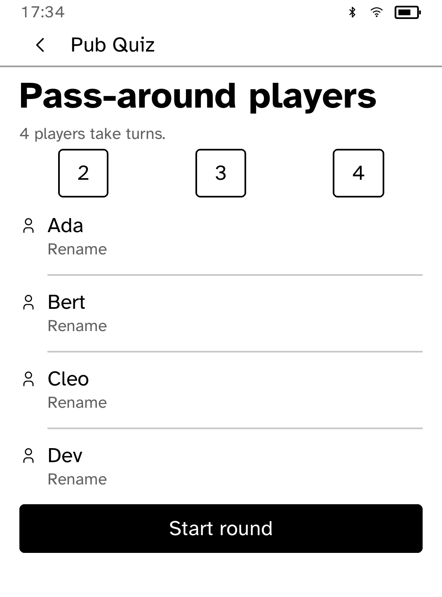

# Pub Quiz

Trivia rounds for one player, or for a group passing one Kobo around.

<table>
<tr>
<td width="50%" valign="top"><br>Four players in pass-around mode</td>
<td width="50%" valign="top"><br>Renaming a player</td>
</tr>
<tr>
<td width="50%" valign="top"><br>The player list after renaming</td>
<td width="50%" valign="top"><br>A question naming whose turn it is</td>
</tr>
</table>

## Features

- Question packs download while online and play offline.
- Solo rounds of ten questions.
- Pass-around mode rotates named players and shows a hand-over screen between
  locking an answer and revealing it, so the next player cannot see it.
- Streaks and pack counts are kept on the reader.
- Up to ten packs are cached. The oldest is removed first.

## Permissions

- `network`: downloads question packs from Open Trivia DB.

## Development

```sh
cargo test -p kobo-pubquiz
python3 scripts/check-apps-sim.py pubquiz
```

The simulator check builds the app, opens it in a fresh simulator and plays
`drive.kobo`.

## Credits

Questions come from [Open Trivia DB](https://opentdb.com/) under CC BY-SA 4.0.
Cached packs stay under that licence, and an attribution and licence file is
stored with them. See [QUESTION-DATA-LICENSE.md](QUESTION-DATA-LICENSE.md).
